<style>
img {
    border-style: solid;
    border-color: black;
    border-width: 1px;
    width: 80%;
    margin-top: 40px;
    margin-bottom: 40px;    
}
</style>

# 1. Johdanto

Web-sovellusten toiminta perustuu HTTP-protokollaan, jossa selain lähettää palvelimelle pyyntöjä ja palvelin vastaa pyyntöihin. Selain voi pyytää palvelimelta esimerkiksi HTML-tiedoston, joka kuvaa nettisivun sisällön. Tiedoston saatuaan selain näyttää sitten sivun sisällön käyttäjälle.

Esimerkiksi seuraavassa kuvassa selain pyytää HTML-tiedostoa `index.html`. Palvelin lähettää tiedoston sisällön HTTP-koodilla 200 (OK), mikä tarkoittaa, että pyyntö onnistui.

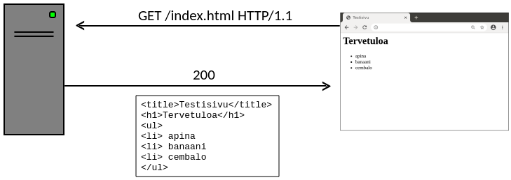

Perinteinen tapa toteuttaa nettisivusto on luoda HTML-tiedostot käsin ja sijoittaa ne palvelimella olevaan hakemistoon. Tämän rajoituksena on kuitenkin, että palvelimella olevat sivut ovat _staattisia_ eli aina kun käyttäjä lataa tietyn sivun, se näyttää samalta.

Tällä kurssilla opimme toteuttamaan web-sovelluksia, jotka luovat _dynaamisia_ sivuja tietokannan sisällön perusteella ja tallentavat käyttäjien antamaa tietoa tietokantaan. Tämä antaa valtavasti lisää mahdollisuuksia verrattuna staattisiin sivuihin.

Kurssin materiaali on laadittu olettaen, että käytössä on Linux-ympäristö. Jos käytät muuta käyttöjärjestelmää, voit käyttää materiaalia soveltaen.

## Ensimmäinen sovellus

Aloitamme ensimmäisen web-sovelluksen tekemisen komentoikkunassa luomalla sovellusta varten hakemiston `sovellus` ja siirtymällä sinne:

```console
$ mkdir sovellus
$ cd sovellus
```

Jotta voimme kätevästi hallinnoida sovelluksen tarvitsemia kirjastoja, luomme hakemistoon Pythonin virtuaaliympäristön seuraavalla komennolla:

```console
$ python3 -m venv venv
```

Tämä komento luo hakemiston `venv`, jonka sisällä on Pythonin suoritusympäristö sovellusta varten. Saamme virtuaaliympäristön käyntiin suorittamalla aktivointikomennon näin:

```console
$ source venv/bin/activate
```

Tämän seurauksena komentorivin alkuun ilmestyy tunnus `(venv)` merkkinä siitä, että olemme virtuaaliympäristössä. 
Kun olemme virtuaaliympäristössä, voimme asentaa Python-kirjastoja paikallisesti niin, että ne ovat käytettävissä vain kyseisessä virtuaaliympäristössä emmekä tarvitse asennukseen pääkäyttäjän oikeuksia. Asennamme ensin `flask`-kirjaston:

```console
(venv) $ pip install flask
```

Nyt meillä on pystyssä ympäristö, jossa voimme toteuttaa ja käynnistää web-sovelluksen. Tehdään testiksi yksinkertainen sovellus tiedostoon `app.py`:

{: .code-title }
app.py
```python
from flask import Flask

app = Flask(__name__)

@app.route("/")
def index():
    return "Heipparallaa!"
```

Sovelluksen ideana on, että se näyttää tekstin "Heipparallaa!", kun käyttäjä menee sovelluksen etusivulle. Saamme sovelluksen käyntiin näin:

```console
(venv) $ flask run
 * Debug mode: off
WARNING: This is a development server. Do not use it in a production deployment. Use a production WSGI server instead.
 * Running on http://127.0.0.1:5000
Press CTRL+C to quit
```

Tämä komento käynnistää sovelluksen ja palvelinympäristön, jonka kautta selain pystyy tekemään sivupyyntöjä.
Viimeisellä rivillä näkyy osoite, jonka kautta voimme käyttää sovellusta nettiselaimella. Kun menemme sivulle `http://127.0.0.1:5000`, näemme sovelluksen:

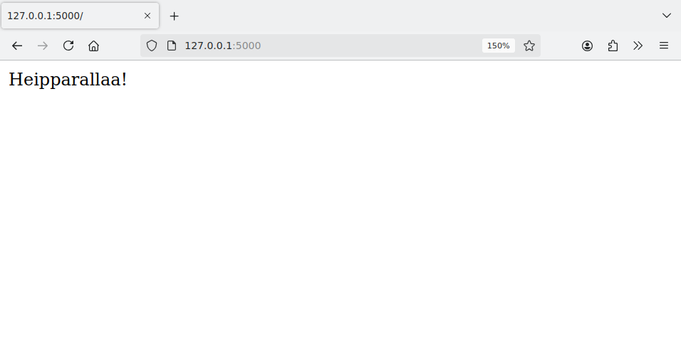

Sovellus sulkeutuu painamalla Control+C komentoikkunassa, jolloin voimme tehdä jotain muuta komentorivillä tai käynnistää sovelluksen uudestaan.

Komento `deactivate` lopettaa virtuaaliympäristön käyttämisen ja palauttaa komentorivin takaisin tavalliseen tilaan:

```console
(venv) $ deactivate
$ 
```

Huomaa, että sovellusta ei voi käynnistää tavalliselta komentoriviltä, koska Flask-kirjasto on asennettu vain virtuaaliympäristöön. Voimme käynnistää sovelluksen vain virtuaaliympäristössä, minkä tunnistaa siitä, että rivin alussa lukee `(venv)`.

## Sivupyynnöt

Flask-kirjaston ideana on, että määrittelemme ohjelmassa funktioita, jotka käsittelevät sivupyyntöjä. Ennen funktion määrittelyä oleva _dekoraattori_ `@app.route` ilmaisee, mikä on sivun osoite. Funktio palauttaa merkkijonon, jossa on sivun sisältö.

Esimerkiksi voisimme laajentaa sovellusta niin, että siinä on kolme sivua:

```python
@app.route("/")
def index():
    return "Heipparallaa!"

@app.route("/page1")
def page1():
    return "Tämä on sivu 1"

@app.route("/page2")
def page2():
    return "Tämä on sivu 2"
```

Tässä sovelluksessa on etusivu, kuten ennenkin, sekä kaksi muuta sivua, joiden osoitteet ovat `page1` ja `page2`. Uudet sivut näyttävät tältä:

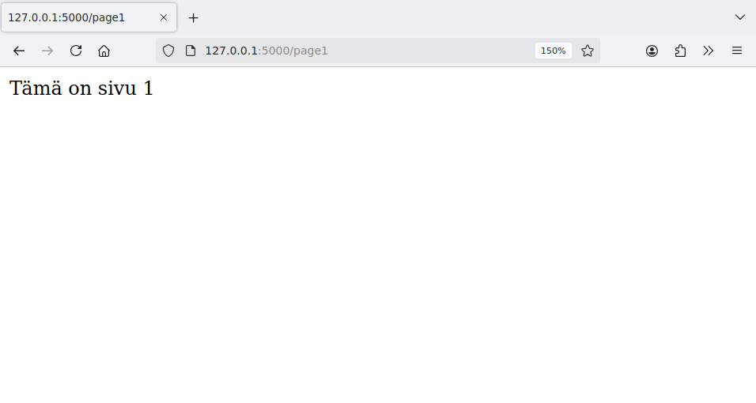


Huomaa, että sivun osoite ja funktion nimi ovat kaksi eri asiaa. Sivun osoite annetaan dekoraattorissa, jonka jälkeen tulee sivupyynnön käsittelevä funktio, jolla voi olla muu nimi. Kuitenkin usein toimiva käytäntö on, että sivun osoite ja funktion nimi ovat samat, kuten yllä olevassa koodissa `page1` ja `page2`.

Koska sivun sisältö luodaan Pythonilla, voimme käyttää sivun luomisessa mitä tahansa ohjelmoinnin keinoja. Esimerkiksi seuraava funktio tuottaa sivun, jonka sisältönä on luvut 1–100:

```python
@app.route("/test")
def test():
    content = ""
    for i in range(100):
        content += str(i + 1) + " "
    return content
```

Funktion tuloksena on seuraava sivu:

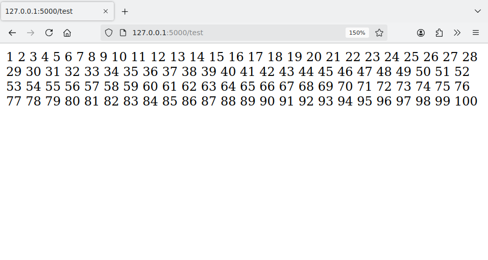

Voimme myös määritellä sivun osoitteen niin, että siinä on _parametri_. Parametrin avulla samalla sivulla voi olla eri sisältö parametrista riippuen. Esimerkiksi seuraava funktio käsittelee sivuja, joiden osoitteessa on `int`-tyyppinen parametri `id`:

```python
@app.route("/page/<int:id>")
def page(id):
    return "Tämä on sivu " + str(id)
```

Sivun osoitteessa annettu parametri välittyy funktiolle, joka voi käyttää sitä haluamallaan tavalla sivun luomisessa. Tässä tapauksessa funktio näyttää sivulla viestin "Tämä on sivu _id_", missä _id_ on annettu parametri. Esimerkiksi osoitteessa `page/123` oleva sivu näyttää tältä:

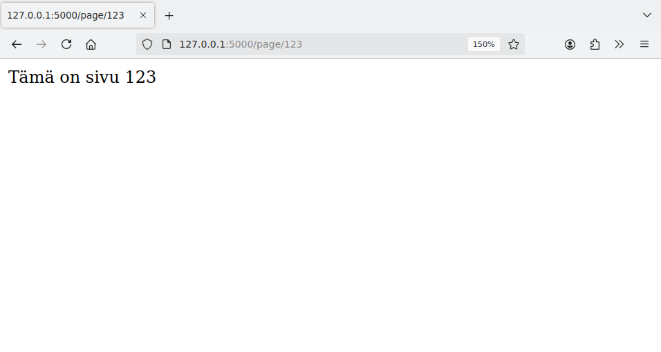

### HTML ja sivupohjat

Tähän mennessä olemme tuottaneet sivuja, joissa on pelkkää tekstiä,
mutta tarkemmin ottaen voimme käyttää sivuilla HTML-koodia. HTML on kieli, jolla määritellään nettisivun sisältö.

Esimerkiksi seuraava sivu käyttää HTML-komentoja:

```python
@app.route("/")
def index():
    return "<b>Tervetuloa</b> <i>sovellukseen</i>!"
```

Tässä tapauksessa sana "Tervetuloa" näkyy lihavoituna ja sana "sovellukseen" näkyy kursivoituna:

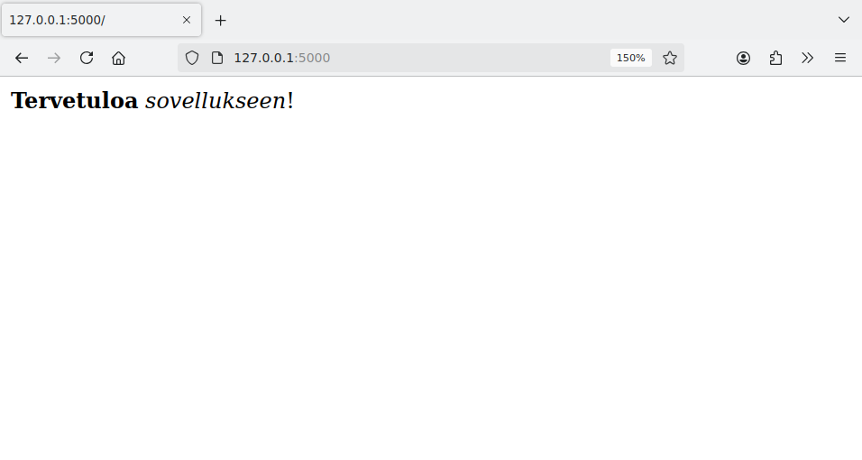

Periaatteessa voisimme luoda sovelluksen sivujen HTML:n suoraan funktioissa, mutta  tämä olisi vaivalloista, kun sivulla on enemmän sisältöä. Parempi tapa on määritellä _sivupohjia_, joita funktiot käyttävät. Sivupohjat tallennetaan `templates`-hakemistoon.

Luodaan testiksi sivupohja `index.html`:

{: .code-title }
index.html
```html
<!DOCTYPE html>
<html>

<head>
  <title>Etusivu</title>
</head>

<body>
  <h1>Etusivu</h1>
  <p>
    <b>Tervetuloa</b> <i>sovellukseen</i>!
  </p>
</body>

</html>
```

Tämän jälkeen saamme näytettyä sivupohjan sisällön etusivulla näin:

{: .code-title }
app.py
```python
from flask import Flask
from flask import render_template

app = Flask(__name__)

@app.route("/")
def index():
    return render_template("index.html")
```

Funktio `render_template` lukee sivupohjan annetusta tiedostosta ja palauttaa sen sivun sisältönä. Jotta funktiota voi käyttää, se tulee ottaa mukaan `import`-rivillä. Flask-kirjastossa on monia muitakin funktioita ja olioita, joihin tutustumme pikkuhiljaa materiaalissa.

Yllä oleva esimerkki tuottaa seuraavan sivun:

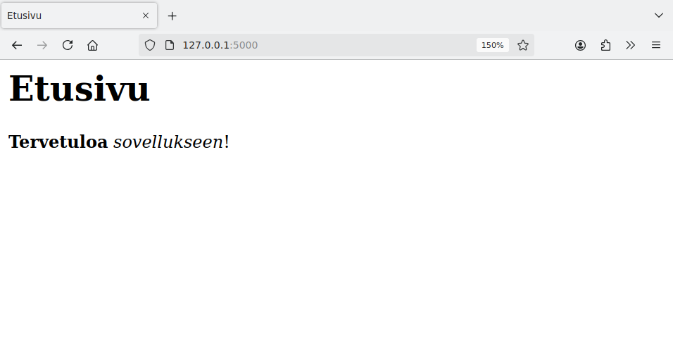

Flask käyttää sivujen luomisessa Jinja-sivupohjia, minkä avulla sivun osaksi voi välittää tietoa Python-koodista. Ideana on lisätä HTML-koodiin Jinja-komentoja, jotka kirjoitetaan aaltosulkujen `{` ja `}` sisään. Voimme tehdä esimerkiksi näin:

{: .code-title }
index.html
```jinja
<!DOCTYPE html>
<html>

<head>
  <title>Etusivu</title>
</head>

<body>
  <h1>Etusivu</h1>
  <p>{{ message }}</p>
  <ul>
    
    <li>{{ item }}</li>
    
  </ul>
</body>

</html>
```

Tässä `{{ message }}` tarkoittaa, että sivun osaksi tulee parametrin `message` sisältö. Silmukka `` puolestaan käy läpi parametrina annetun listan `items` alkiot ja lisää sivulle jokaisen alkion kohdalla silmukan sisällä olevan rivin. Voimme kutsua sivupohjaa vaikkapa näin:

{: .code-title }
app.py
```python
from flask import Flask
from flask import render_template

app = Flask(__name__)

@app.route("/")
def index():
    words = ["apina", "banaani", "cembalo"]
    return render_template("index.html", message="Tervetuloa!", items=words)
```

Tässä tapauksessa Jinja-komennot tuottavat sivun sisällöksi:

```jinja
  <p>Tervetuloa!</p>
  <ul>
    <li>apina</li>
    <li>banaani</li>
    <li>cembalo</li>
  </ul>
```

Selaimessa sivu näyttää tältä:

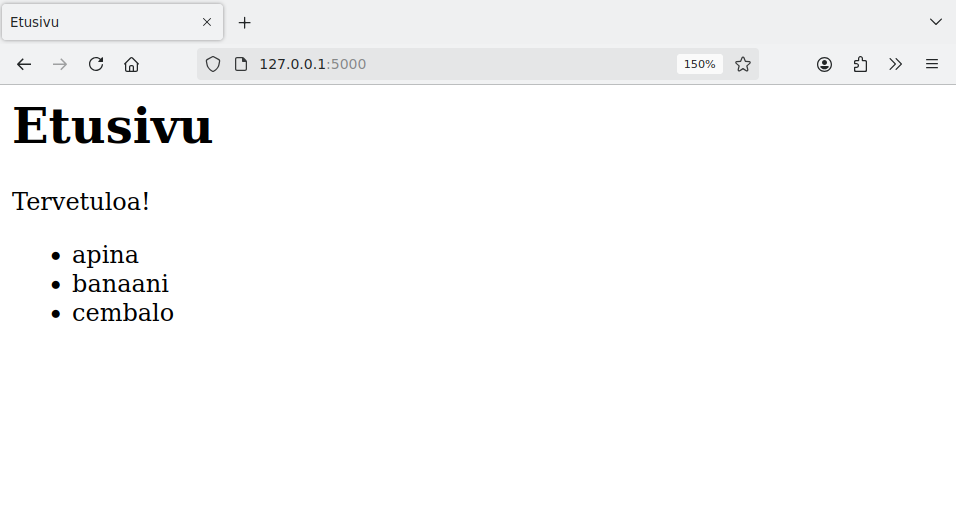

### Staattiset tiedostot

Staattiset tiedostot ovat sivuston osana olevia tiedostoja, joita ei luoda ohjelmallisesti. Tavallisia staattisia tiedostoja ovat kuvatiedostot ja tyylitiedostot (CSS).

Flaskissa suositeltu paikka sijoittaa staattiset tiedostot on hakemisto `static`. Esimerkiksi seuraava HTML-koodi näyttää hakemistossa olevan kuvan `kuva.png`:

```html

```

Huomaa, että tiedoston polun alussa on merkki `/`, mikä tarkoittaa, että tiedostoon viitataan sovelluksen hakemiston juuresta alkaen. Tämä on hyvä tapa toteuttaa viittaus niin, että se toimii luotettavasti sovelluksen eri sivuilla.

## Lomakkeiden käsittely

_Lomake_ on HTML-sivun osa, jonka kautta käyttäjä pystyy lähettämään tietoa sovellukselle. Lomakkeessa voi olla esimerkiksi tekstikenttiä ja elementtejä, joiden avulla käyttäjä voi valita yhden tai useamman vaihtoehdon.

Tehdään ensimmäisenä esimerkkinä lomake, joka kysyy käyttäjältä nimeä. Määrittelemme lomakkeen seuraavasti sivupohjassa `form.html`:

{: .code-title }
form.html
```html
<!DOCTYPE html>
<html>

<head>
  <title>Lomake</title>
</head>

<body>
  <form action="/result" method="post">
    <p>
      Anna viesti:
      <input type="text" name="message">
    </p>
    <input type="submit" value="Lähetä">
  </form>
</body>

</html>
```

Tämä lomake lähettää tietoa sivulle `result` metodilla `POST`. Lomakkeessa on tekstikenttä, jonka nimi on `message`, sekä lähetysnappi.

Kun käyttäjä lähettää lomakkeen, hän siirtyy toiselle sivulle, joka näyttää viestin nimen perusteella. Tässä on sivupohja `result.html` tätä sivua varten:

{: .code-title }
result.html
```jinja
<!DOCTYPE html>
<html>

<head>
  <title>Viesti</title>
</head>

<body>
  <p>Annoit seuraavan viestin:</p>
  <p>{{ message }}</p>
</body>

</html>
```

Seuraava sovellus toteuttaa sivupohjien avulla sivut `form` ja `result`:

{: .code-title }
app.py
```python
from flask import Flask
from flask import render_template, request

app = Flask(__name__)

@app.route("/form")
def form():
    return render_template("form.html")

@app.route("/result", methods=["POST"])
def result():
    message = request.form["message"]
    return render_template("result.html", message=message)
```

Sivu `result` ottaa vastaan `POST`-metodilla lähetetyn lomakkeen, mikä näkyy dekoraattorin parametrissa `methods`. Lomakkeen kautta lähetetty tieto on saatavilla olion `request` kautta. Koska lomakkeen tekstikentän nimi on `name`, siihen viitataan `request.form["name"]`.

Lomakkeen käyttäminen voi näyttää tältä:

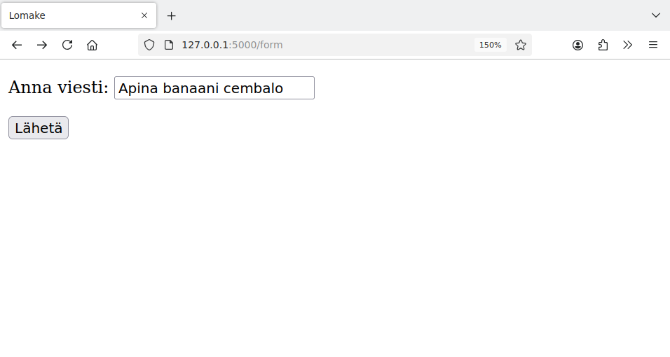

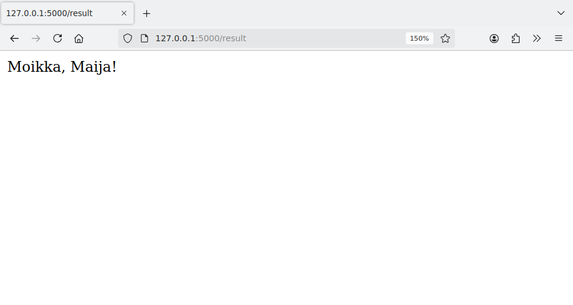

{: .note-title }
Metodit `GET` ja `POST`
<div class="note" markdown="1">
Tavallisimmat HTTP-metodit ovat `GET` ja `POST`. Flaskin sivupyynnöissä oletuksena on metodi `GET`, joka on tavallinen sivun sisällön hakemiseen käytettävä metodi. Metodia `POST` käytetään usein silloin, kun sivupyynnön tehtävänä on käsitellä lomakkeen kautta lähetetyt tiedot. Tutustumme tarkemmin näihin metodeihin myöhemmin kurssin aikana.
</div>

### Lomakkeen elementit

Tavallisia lomakkeen elementtejä ovat tekstikentät ja valintaelementit. Jokainen elementti määritellään tietyllä tavalla HTML-koodissa ja sen kautta lähetettyyn tietoon pääsee käsiksi tietyllä tavalla `request`-olion kautta.

Tehdään seuraavaksi esimerkki, jossa käyttäjä voi tilata pizzan. Sivupohja `order.html` näyttää tilaukseen liittyvät valinnat:

{: .code-title }
order.html
```html
<!DOCTYPE html>
<html>

<head>
  <title>Tilaus</title>
</head>

<body>
  <form action="/result" method="post">
    <p>Valitse pizza:</p>
    <p>
      <input type="radio" name="pizza" value="1"> Frutti di Mare
      <input type="radio" name="pizza" value="2"> Margherita
      <input type="radio" name="pizza" value="3"> Quattro Formaggi
      <input type="radio" name="pizza" value="4"> Quattro Stagioni
    </p>
    <p>Valitse lisät:</p>
    <p>
      <input type="checkbox" name="extra" value="A"> oregano
      <input type="checkbox" name="extra" value="B"> valkosipuli
    </p>
    <p>Erikoistoiveet: <br />
      <textarea name="message" rows="3" cols="50"></textarea>
    </p>
    <input type="submit" value="Lähetä">
  </form>
</body>

</html>
```

Elementtien `radio` ja `checkbox` erona on, että samannimisistä elementeistä vain yksi `radio` voi olla valittuna mutta yksi tai useampi `checkbox` voi olla valittuna.

Sivupohja `result.html` näyttää tilauksen tiedot lähetyksen jälkeen:

{: .code-title }
result.html
```jinja
<!DOCTYPE html>
<html>

<head>
  <title>Valinta</title>
</head>

<body>
  <p>Valitsit pizzan {{ pizza }}</p>
  <p>
    Seuraavat lisät:
    <ul>
      
      <li>{{ extra }}</li>
      
    </ul>
  </p>
  <p>
    Erikoistoiveet: <br />
    {{ message }}
  </p>
</body>

</html>
```

Seuraava sovellus käsittelee lomakkeen kautta lähetetyt tiedot:

{: .code-title }
app.py
```python
from flask import Flask
from flask import render_template, request

app = Flask(__name__)

@app.route("/order")
def order():
    return render_template("order.html")

@app.route("/result", methods=["POST"])
def result():
    pizza = request.form["pizza"]
    extras = request.form.getlist("extra")
    message = request.form["message"]
    return render_template("result.html", pizza=pizza, extras=extras, message=message)
```

Koska `extra`-nimen alla voi olla useita valintoja, ne haetaan listana `getlist`-metodilla.

Lomakkeen käyttäminen voi näyttää tältä:

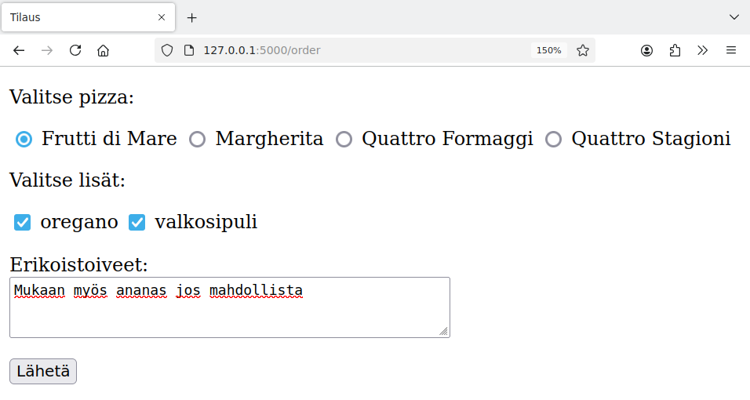

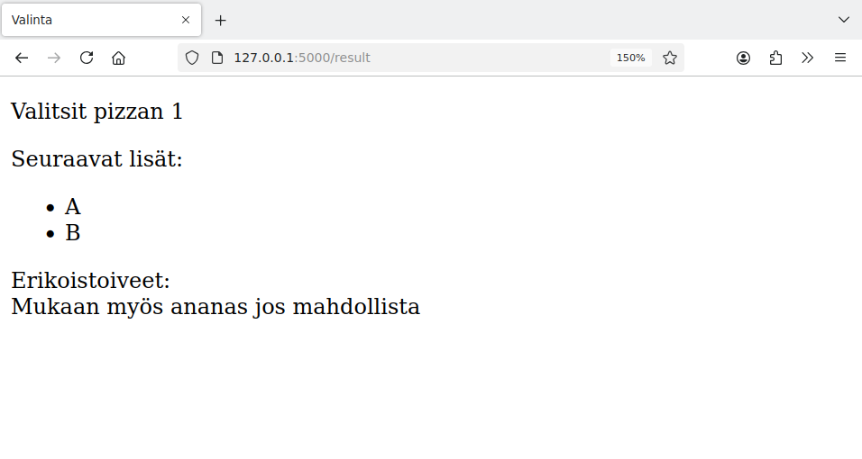

## Sovelluksen toiminta

Nyt kun meillä on perustiedot web-sovelluksen tekemisestä, on hyvä hetki katsoa vähän tarkemmin, mitä tapahtuu, kun sovellusta käytetään selaimessa. Tarkastellaan esimerkkinä seuraavaa sovellusta:

{: .code-title }
app.py
```python
from flask import Flask

app = Flask(__name__)

@app.route("/")
def index():
    return "Miten tämä <i>toimii</i>?"
```

Sovellus näyttää selaimessa seuraavalta:

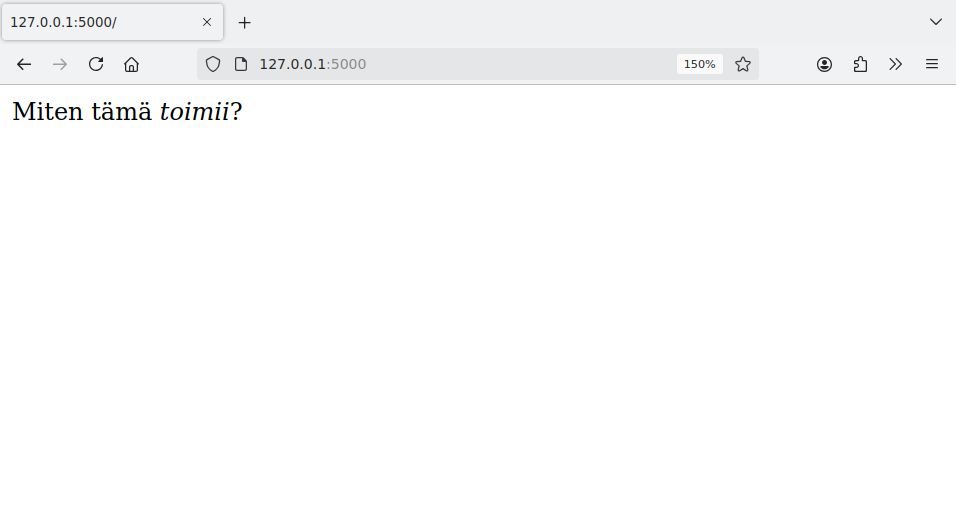

Kun menemme sovellukseen selaimessa, komentoikkunaan ilmestyvät samanaikaisesti seuraavat rivit:

```console
127.0.0.1 - - [30/Oct/2024 13:29:59] "GET / HTTP/1.1" 200 -
127.0.0.1 - - [30/Oct/2024 13:29:59] "GET /favicon.ico HTTP/1.1" 404 -
```

Komentoikkuna näyttää sovelluksen lokin, josta selviää esimerkiksi, mitä sivupyyntöjä on tehty sovelluksen suorituksen aikana.

Ensimmäinen rivi tarkoittaa, että selain pyysi sivun osoitteesta `/` eli sovelluksen etusivun. Tämän pyynnön yhteydessä näkyy HTTP-koodi 200 (OK), mikä tarkoittaa, että pyyntö oli onnistunut eli selain sai sovelluksen etusivun palvelimelta.

Toinen rivi tarkoittaa, että selain pyysi lisäksi palvelimelta tiedostoa `favicon.ico`. Tämän niminen tiedosto määrittelee kuvakkeen, joka näytetään yleensä nettiselaimessa otsikkorivin alussa. Koska sovelluksessamme ei ole tällaista tiedostoa, pyynnön yhteydessä HTTP-koodi 404 ilmaisee, ettei tiedostoa löytynyt.

Voimme katsoa selaimessa sivun lähdekoodin, jonka selain on saanut palvelimelta. Lähdekoodissa näkyy HTML-koodi, jonka perusteella selain esittää sivun sisällön. Esimerkiksi Firefoxissa näemme lähdekoodin painamalla Control + U:

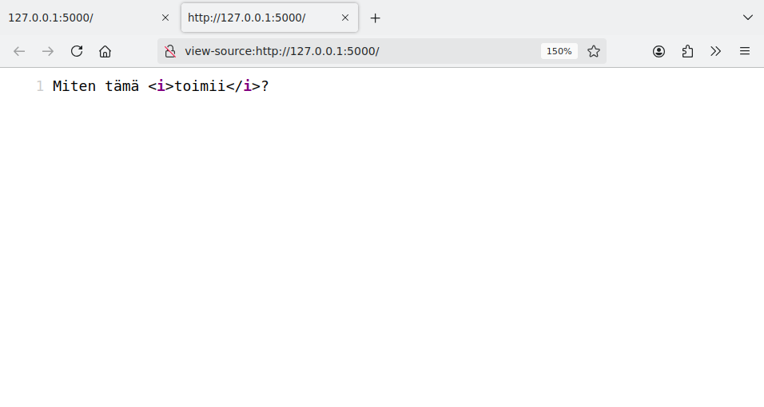

Selaimissa on myös kehittäjän työkaluja, joiden avulla voi tarkastella esimerkiksi selaimen ja palvelimen välistä liikennettä. Firefoxissa painamalla Control + Shift + I avautuu kehittäjän näkymä. Välilehti Network näyttää, miten selain viestii palvelimen kanssa:

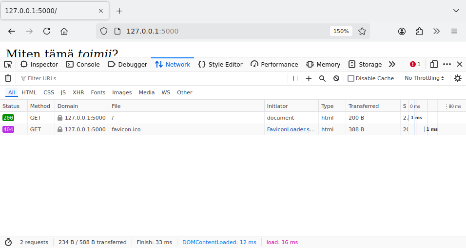

### Sovellus ja sivupyynnöt

Kun Flask-sovellus käynnistetään komennolla `flask run`, sovellus suorittaa ensin alkutoimet ja jää sitten odottamaan käsiteltäviä sivupyyntöjä. Sovellus käsittelee jokaisen sivupyynnön omassa säikeessään erillään muista.

Jotkin asiat sovelluksessa ovat yhteisiä kaikille sivupyynnöille ja jotkin taas ovat sivupyyntökohtaisia. Esimerkiksi seuraavassa koodissa muuttuja `value` on globaali, joten muuttuja saa satunnaisen arvon sovelluksen käynnistyessä ja tämän jälkeen sama muuttujan arvo näkyy aina etusivun latautuessa.

```python
value = random.randint(100)

@app.route("/")
def index():
    return "Satunnainen luku: " + str(value)
```

Seuraavassa koodissa puolestaan muuttuja `value` saa arvon paikallisesti sivupyynnön yhteydessä ja etusivun latautuessa näkyy vaihtuva satunnainen luku:

```python
@app.route("/")
def index():
    value = random.randint(100)
    return "Satunnainen luku: " + str(value)
```

Jotkin Flaskin sisäiset oliot _näyttävät_ globaaleilta mutta ovat todellisuudessa sivupyyntökohtaisia. Esimerkki tästä on olio `request`, joka sisältää sivupyynnön tietoja, kuten lomakkeen kautta lähetetyn kentän sisällön.

```python
@app.route("/result", methods=["POST"])
def result():
    name = request.form["name"]
    ...
```

Vaikka oliota `request` voidaan käyttää globaalin muuttujan tavoin, se on kuitenkin sivupyyntökohtainen. Jos näin ei olisi, eri sivupyyntöjen tiedot voisivat mennä sekaisin. Esimerkiksi yllä oleva koodi toimii, koska olion `request` kautta saadaan nimenomaan kyseiseen sivupyyntöön liittyvä käyttäjän nimi.
