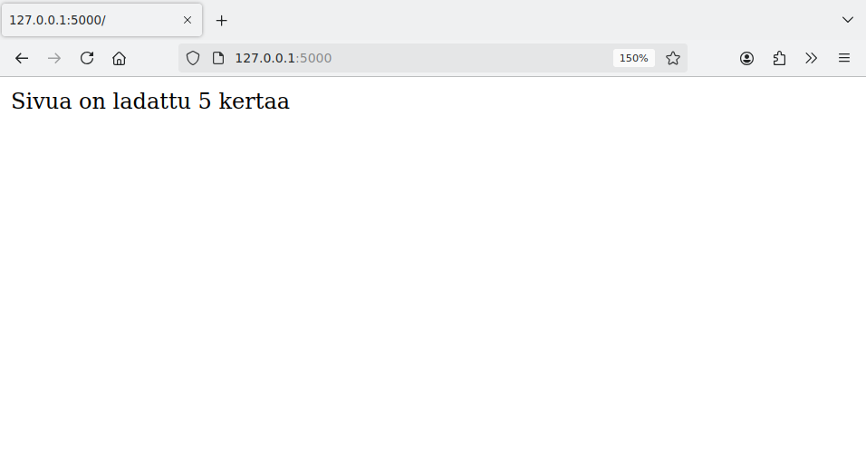

<style>
img {
    border-style: solid;
    border-color: black;
    border-width: 1px;
    width: 80%;
    margin-top: 40px;
    margin-bottom: 40px;    
}
</style>

# 2. Tietokannan käyttäminen

Tietokannan avulla web-sovellus voi tallentaa palvelimelle tietoa ja näyttää sivuilla tallennettua tietoa. Ideana on, että sovellus muodostaa sivupyynnön tullessa yhteyden tietokantaan ja suorittaa tietokantakomentoja.

Tällä kurssilla käytämme sovelluksissa SQLite-tietokantaa, jota on käytetty myös kurssilla _Tietokantojen perusteet_. SQLite-tietokannan käyttäminen on helppoa, koska tietokanta tallennetaan yhteen tiedostoon ja Pythonin standardikirjastossa on valmis moduuli tietokannan käsittelemiseen.

## Tietokanta sovelluksessa

Voimme käyttää SQLite-tietokantaa web-sovelluksessa luomalla ensin tietokannan, jossa on sovelluksen tarvitsemat taulut. Tämän jälkeen voimme yhdistää tietokantaan ja suorittaa tietokantakomentoja sovelluksen koodissa.

Tutustumme seuraavaksi tietokannan käyttämiseen kahden esimerkin kautta.

### Kävijälaskuri

Ensimmäinen tietokantaa käyttävä sovelluksemme on kävijälaskuri, joka tallentaa tietokantaan rivin tietoa aina, kun käyttäjä lataa sovelluksen etusivun. Lisäksi sovellus hakee tietokannasta taulun rivien määrän ja näyttää sen avulla tiedon, montako kertaa sivu on ladattu.

Luodaan ensin tietokanta tiedostoon `database.db`. Sovellus käyttää taulua `visits`, jossa on kaksi saraketta: `id` on käyttäjän id-numero ja `visited_at` sisältää vierailun ajankohdan. Voimme luoda tietokannan seuraavasti:

```console
$ sqlite3 database.db
sqlite> CREATE TABLE visits (
   ...>     id INTEGER PRIMARY KEY,
   ...>     visited_at TEXT
   ...> );
sqlite> .quit
```

Koska SQLite ei sisällä erillistä tietotyyppiä päivämäärän ja kellonajan tallentamiseen, sarakkeessa `visited_at` on käytetty tietotyyppiä `TEXT`.

Sovelluksen koodi on seuraava:

```python
from flask import Flask
import sqlite3

app = Flask(__name__)

@app.route("/")
def index():
    db = sqlite3.connect("database.db")
    db.execute("INSERT INTO visits (visited_at) VALUES (datetime('now'))")
    db.commit()
    count = db.execute("SELECT COUNT(*) FROM visits").fetchone()
    db.close()
    return "Sivua on ladattu " + str(count[0]) + " kertaa"
```

Kun sovelluksen etusivu ladataan, sovellus muodostaa yhteyden tietokantaan. Sovellus suorittaa ensin `INSERT`-komennon, joka lisää tietokantaan uuden rivin. Käytössä on SQLite-funktio `datetime`, jonka avulla riville saadaan haettua nykyinen päivämäärä ja kellonaika. Komennon suorituksen jälkeen kutsutaan vielä metodia `commit`, jolloin lisätty rivi siirtyy pysyvästi tietokantaan.

Tämän jälkeen sovellus suorittaa `SELECT`-komennon, joka hakee tietokannasta taulun `visits` rivien määrän. Tämä määrä ilmaisee, montako kertaa sivu on ladattu. Metodi `fetchone` palauttaa tuloksen muuttujaan `count` tuplena, minkä takia lauseke `count[0]` antaa rivien määrän.

Sovellus näyttää seuraavalta, kun sivua on ladattu viisi kertaa:



Voimme mennä myös sovelluksen käyttämisen jälkeen katsomaan tietokannasta, mitä tietoa sovellus on tallentanut. Voimme katsoa esimerkiksi kaikki taulussa `visits` olevat rivit:

```console
$ sqlite3 database.db
sqlite> SELECT * FROM visits;
1|2024-10-31 08:45:05
2|2024-10-31 08:45:06
3|2024-10-31 08:45:06
4|2024-10-31 08:45:06
5|2024-10-31 08:45:07
```

Tästä näkee, että sovelluksen etusivu on ladattu viisi kertaa. Taulussa jokainen lataus näkyy yhtenä rivinä, jossa on id-numero ja ajankohta. Huomaa, että id-numeroita ja ajankohtia ei tällä hetkellä näytetä sovelluksessa mutta ne jäävät kuitenkin tietokantaan talteen mahdollista myöhempää käyttöä varten.

Jos haluamme nollata laskurin, voisimme myös suorittaa seuraavan komennon:

```console
sqlite> DELETE FROM visits;
```

Tämän komennon suorittamisen jälkeen taulu `visits` on tyhjä ja kävijöiden laskeminen alkaa alusta.

### Keskustelupalsta

## Tietokantamoduuli

## Istunnot ja kirjautuminen

## Virheiden etsiminen
