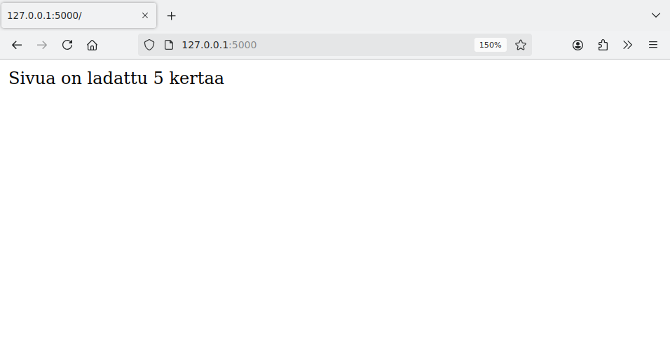
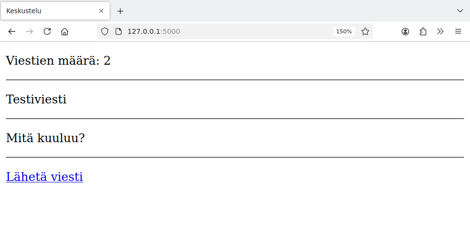
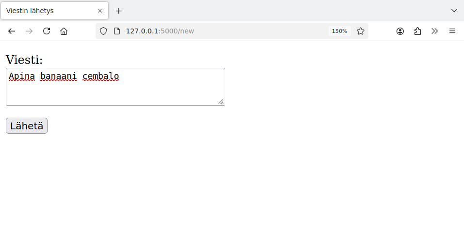
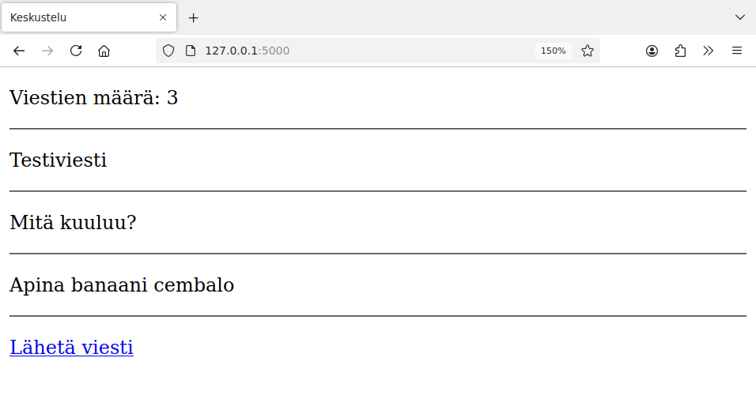
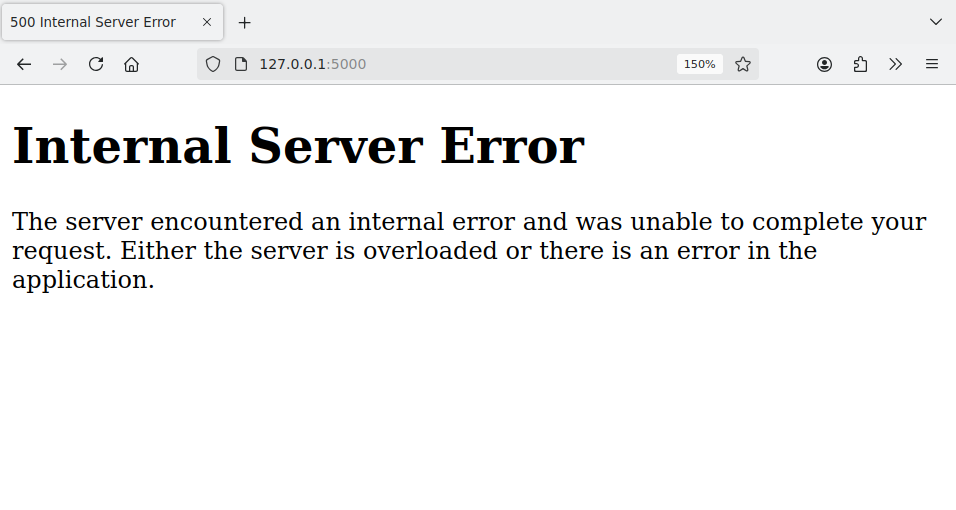

# 2. Tietokanta käyttöön

Tietokannan avulla web-sovellus voi tallentaa palvelimelle tietoa ja näyttää sivuilla tallennettua tietoa. Ideana on, että sovellus muodostaa sivupyynnön tullessa yhteyden tietokantaan ja suorittaa tietokantakomentoja.

Tällä kurssilla käytämme sovelluksissa SQLite-tietokantaa, jota on käytetty myös kurssilla _Tietokantojen perusteet_. SQLite-tietokannan käyttäminen on helppoa, koska tietokanta tallennetaan yhteen tiedostoon ja Pythonin standardikirjastossa on valmis moduuli tietokannan käsittelemiseen.

## Tietokanta sovelluksessa

Voimme käyttää SQLite-tietokantaa web-sovelluksessa luomalla ensin tietokannan, jossa on sovelluksen tarvitsemat taulut. Tämän jälkeen voimme yhdistää tietokantaan ja suorittaa tietokantakomentoja sovelluksen koodissa.

Tutustumme seuraavaksi tietokannan käyttämiseen kahden esimerkin kautta.

### Kävijälaskuri

Ensimmäinen tietokantaa käyttävä sovelluksemme on kävijälaskuri, joka tallentaa tietokantaan rivin tietoa aina, kun käyttäjä lataa sovelluksen etusivun. Lisäksi sovellus hakee tietokannasta taulun rivien määrän ja näyttää sen avulla tiedon, montako kertaa sivu on ladattu.

Luodaan ensin tietokanta tiedostoon `database.db`. Sovellus käyttää taulua `visits`, jonka rakenne on seuraava:

```sql
CREATE TABLE visits (
    id INTEGER PRIMARY KEY,
    visited_at TEXT
);
```

Sarake `id` on automaattisesti kasvava id-numero, ja sarake `visited_at` sisältää vierailun ajankohdan. Koska SQLite ei sisällä erillistä tietotyyppiä päivämäärän ja kellonajan tallentamiseen, tässä on käytetty tietotyyppiä `TEXT`.

Voimme luoda tietokannan käytännössä seuraavasti:

```console
$ sqlite3 database.db
sqlite> CREATE TABLE visits (id INTEGER PRIMARY KEY, visited_at TEXT);
sqlite> .quit
```

Sovelluksen koodi on seuraava:

{: .code-title }
app.py
```python
from flask import Flask
import sqlite3

app = Flask(__name__)

@app.route("/")
def index():
    db = sqlite3.connect("database.db")
    db.execute("INSERT INTO visits (visited_at) VALUES (datetime('now'))")
    db.commit()
    result = db.execute("SELECT COUNT(*) FROM visits").fetchone()
    count = result[0]
    db.close()
    return "Sivua on ladattu " + str(count) + " kertaa"
```

Kun sovelluksen etusivu ladataan, sovellus muodostaa yhteyden tietokantaan. Sovellus suorittaa ensin `INSERT`-komennon, joka lisää tietokantaan uuden rivin. Käytössä on SQLite-funktio `datetime`, jonka avulla riville saadaan haettua nykyinen päivämäärä ja kellonaika. Komennon suorituksen jälkeen kutsutaan vielä metodia `commit`, jolloin lisätty rivi siirtyy pysyvästi tietokantaan.

Tämän jälkeen sovellus suorittaa `SELECT`-komennon, joka hakee tietokannasta taulun `visits` rivien määrän. Tämä määrä ilmaisee, montako kertaa sivu on ladattu, koska jokainen lataus lisää yhden rivin. Metodi `fetchone` palauttaa tuloksen muuttujaan `result` tuplena, minkä takia lauseke `result[0]` antaa rivien määrän.

Sovellus näyttää seuraavalta, kun sivua on ladattu viisi kertaa:



Voimme mennä myös sovelluksen käyttämisen jälkeen katsomaan tietokannasta, mitä tietoa sovellus on tallentanut. Voimme hakea esimerkiksi kaikki taulussa `visits` olevat rivit:

```console
$ sqlite3 database.db
sqlite> SELECT * FROM visits;
1|2024-10-31 08:45:05
2|2024-10-31 08:45:06
3|2024-10-31 08:45:06
4|2024-10-31 08:45:06
5|2024-10-31 08:45:07
```

Tästä näkee, että sovelluksen etusivu on ladattu viisi kertaa. Taulussa jokainen lataus näkyy yhtenä rivinä, jossa on id-numero ja ajankohta. Huomaa, että id-numeroita ja ajankohtia ei tällä hetkellä näytetä sovelluksessa mutta ne jäävät kuitenkin tietokantaan talteen mahdollista myöhempää käyttöä varten.

Jos haluamme nollata laskurin, voisimme myös suorittaa seuraavan komennon:

```console
sqlite> DELETE FROM visits;
```

Tämän komennon suorittamisen jälkeen taulu `visits` on tyhjä ja kävijöiden laskeminen alkaa alusta.

### Keskustelualue

Seuraava sovelluksemme on yksinkertainen keskustelualue. Sovelluksen etusivu näyttää lähetetyt viestit, ja uuden viestin voi lähettää lomakkeen avulla. Sovellus olettaa, että tietokannassa on seuraava taulu `messages`:

```sql
CREATE TABLE messages (
    id INTEGER PRIMARY KEY,
    content TEXT
);
```

Sovelluksen koodi on seuraava:

{: .code-title }
app.py
```python
from flask import Flask
from flask import redirect, render_template, request
import sqlite3

app = Flask(__name__)

@app.route("/")
def index():
    db = sqlite3.connect("database.db")
    messages = db.execute("SELECT content FROM messages").fetchall()
    db.close()
    return render_template("index.html", count=len(messages), messages=messages)

@app.route("/new")
def new():
    return render_template("new.html")

@app.route("/send", methods=["POST"])
def send():
    content = request.form["content"]
    db = sqlite3.connect("database.db")
    db.execute("INSERT INTO messages (content) VALUES (?)", [content])
    db.commit()
    db.close()
    return redirect("/")
```

Etusivulla sovellus hakee kaikki viestit tietokannasta ja välittää sivupohjalle viestien määrän sekä niiden sisällöt. Tällä sivulla on linkki sivulle `/new`, jonka kautta pystyy lähettämään uuden viestin.

Sivulla `/new` oleva lomake ohjaa sivulle `send`, joka lähettää viestin. Viestin lähetyksen käsittelevä funktio tallentaa viestin tietokantaan ja ohjaa sitten käyttäjän takaisin etusivulle funktiolla `redirect`.

{: .note-title }
Post/Redirect/Get
<div class="note" markdown="1">
Tavallinen tapa muuttaa tietokantaa lomakkeen tietojen perusteella tunnetaan nimellä Post/Redirect/Get: lomake lähettää tiedot `POST`-metodilla, minkä jälkeen käsittelijä ohjaa käyttäjän toiselle sivulle, joka hakee tiedot `GET`-metodilla.

Esimerkiksi yllä olevassa koodissa sivu `/send` käsittelee `POST`-metodilla lähetetyt tiedot ja ohjaa käyttäjän etusivulle, joka haetaan `GET`-metodilla.

Tässä ohjaus toiselle sivulle on hyödyllinen, koska sen jälkeen ei haittaa, vaikka käyttäjä lataisi sivun uudestaan. Jos ohjausta toiselle sivulle ei olisi, sivun lataaminen uudestaan voisi aiheuttaa sen, että lomakkeella lähetetyt tiedot lisättäisiin kahteen kertaan tietokantaan.
</div>


Sovellus käyttää kahta sivupohjaa, jotka on tallennettu hakemistoon `templates`:

{: .code-title }
index.html
```jinja
<!DOCTYPE html>
<html>

<head>
  <title>Keskustelu</title>
</head>

<body>
  <p>
    Viestien määrä: {{ count }}
  </p>
  <hr />
  
  <p>
    {{ message[0] }}
  </p>
  <hr />
  
  
  <p>
    <a href="/new">Lähetä viesti</a>
  </p>
</body>

</html>
```

{: .code-title }
new.html
```jinja
<!DOCTYPE html>
<html>

<head>
  <title>Viestin lähetys</title>
</head>

<body>
  <form action="/send" method="post">
    <p>
      Viesti: <br />
      <textarea name="content" rows="3" cols="40"></textarea>
    </p>
    <p>
      <input type="submit" value="Lähetä" />
    </p>
  </form>
</body>

</html>
```

Sovelluksen käyttäminen voi näyttää seuraavalta:







## Tietokantamoduuli

Kun sovelluksessa on useita sivuja, olisi käytännössä vaivalloista toteuttaa tietokannan käsittely niin, että joka sivulla on erillinen koodi, joka muodostaa yhteyden tietokantaan, suorittaa halutut tietokantakomennot ja sulkee yhteyden.

Parempi ratkaisu on tehdä tietokannan käsittelyä varten moduuli, jonka kautta sovelluksen koodissa voi suorittaa mukavammin tietokantakomentoja. Voimme toteuttaa tällaisen moduulin vaikkapa seuraavasti tiedostoon `db.py`:

{: .code-title }
db.py
```python
import sqlite3
from flask import g

def get_connection():
    con = sqlite3.connect("database.db")
    con.execute("PRAGMA foreign_keys = ON")
    con.row_factory = sqlite3.Row
    return con

def execute(sql, params=[]):
    con = get_connection()
    result = con.execute(sql, params)
    con.commit()
    g.last_insert_id = result.lastrowid
    con.close()

def last_insert_id():
    return g.last_insert_id    
    
def query(sql, params=[]):
    con = get_connection()
    result = con.execute(sql, params).fetchall()
    con.close()
    return result
```

Funktio `get_connection` muodostaa ja palauttaa yhteyden tietokantaan. Tätä funktiota kutsutaan muissa funktioissa ennen tietokannan käyttämistä.

Yhteyden avaamisen jälkeen koodi suorittaa `PRAGMA`-komennon, jonka vaikutuksesta SQLite valvoo tauluissa olevien viittausten eheyttä. Tämän ansiosta tauluun ei ole mahdollista lisätä viittausta toisen taulun olemattomaan riviin, kun taulujen luonnissa on käytetty `REFERENCES`-viittausta.

Koodi asettaa myös kentälle `row_factory` arvon `sqlite3.Row`, minkä ansiosta kyselyn tulostaulun sarakkeisiin pystyy viittaamaan sarakkeiden nimien avulla. Esimerkiksi jos kyselyn tulosrivi on muuttujassa `result` ja haluamme viitata ensimmäiseen sarakkeeseen `name`, voimme käyttää syntaksia `result["name"]` aiemmin käytetyn syntaksin `result[0]` lisäksi.

Funktio `execute` on tarkoitettu suorittamaan komento, joka muuttaa tietokantaa (kuten `INSERT`, `UPDATE` tai `DELETE`). Funktiolle annetaan parametrina mahdolliset komentoon tulevat parametrit. Funktio kutsuu metodia `commit`, jolloin muutos viedään pysyvästi tietokantaan.

Funktio `execute` tallentaa myös tiedon siitä, mikä on viimeksi lisätyn rivin id-numero. Tästä on hyötyä silloin, kun suoritetaan `INSERT`-komento ja halutaan käyttää rivin lisäyksen jälkeen rivin id-numeroa. Viimeksi lisätyn rivin id-numeron saa haettua funktiolla `last_insert_id`. Näemme materiaalin myöhemmissä osissa, miten tätä funktiota pystyy hyödyntämään käytännössä.

Funktio `query` on tarkoitettu suorittamaan tietoa hakeva `SELECT`-komento. Funktio hakee kaikki kyselyn tulokset metodilla `fetchall` ja palauttaa ne.

{: .note-title }
Toinen toteutustapa
<div class="note" markdown="1">

Tässä toteutuksessa jokaiselle sivupyynnössä suoritettavalle SQL-komennolla luodaan erillinen yhteys tietokantaan. Toinen tapa olisi avata yhteys sivupyynnön alussa, suorittaa kaikki komennot ja sulkea yhteys sivupyynnön lopussa.

Vaihtoehtoisen tavan etuna olisi, että peräkkäisten SQL-komentojen suorittaminen on kevyempää, jos jokaisen komennon kohdalla ei tarvitse avata uutta yhteyttä. Monissa web-sovelluksissa ero on kuitenkin käytännössä pieni.

Lisätietoa vaihtoehtoisesta tavasta käyttää SQLite-tietokantaa on [Flaskin dokumentaatiossa](https://flask.palletsprojects.com/en/stable/patterns/sqlite3/).

</div>

Katsotaan seuraavaksi, miten voimme toteuttaa tämän luvun aiemmat esimerkit uudestaan moduulin `db.py` avulla. Käytämme materiaalissa jatkossa moduulia `db.py` tietokannan käsittelyyn.

### Kävijälaskuri

Rivi `import db` lisää moduulin `db.py` mukaan sovellukseen. Tämän jälkeen voimme lisätä vierailun funktiolla `db.execute` ja hakea vierailujen määrän funktiolla `db.query`.

{: .code-title }
app.py
```python
from flask import Flask
import db

app = Flask(__name__)

@app.route("/")
def index():
    db.execute("INSERT INTO visits (visited_at) VALUES (datetime('now'))")
    result = db.query("SELECT COUNT(*) FROM visits")
    count = result[0][0]
    return "Sivua on ladattu " + str(count) + " kertaa"
```

Tässä `result` on lista, jonka jokainen alkio on tuple. Koska kysely hakee vain yhden luvun, käytännössä listalla on yksi tuple, jossa on yksi alkio. Tämän takia haetaan listan ensimmäinen tuple ja tuplen ensimmäinen alkio syntaksilla `[0][0]`.

### Keskustelualue

Tässä sovelluksessa voimme käyttää funktiota `db.query` viestien hakemiseen ja funktiota `db.execute` uuden viestin lisäämiseen.

{: .code-title }
app.py
```python
from flask import Flask
from flask import redirect, render_template, request
import db

app = Flask(__name__)

@app.route("/")
def index():
    messages = db.query("SELECT content FROM messages")
    return render_template("index.html", count=len(messages), messages=messages)

@app.route("/new")
def new():
    return render_template("new.html")

@app.route("/send", methods=["POST"])
def send():
    content = request.form["content"]    
    db.execute("INSERT INTO messages (content) VALUES (?)", [content])
    return redirect("/")
```

Sivulla `index.html` voimme viitata mukavammin viestin sisältöön syntaksilla `message.content` aiemman syntaksin `message[0]` sijasta:

{: .code-title }
index.html
```jinja
  
  <p>
    {{ message.content }}
  </p>
  <hr />
  
```

Huomaa, että Python-koodissa syntaksi on `message["content"]` mutta sivupohjassa Jinjan kautta syntaksi on `message.content`.

## Sovelluksen debuggaus

Tietokantaa käyttävässä web-sovelluksessa on monta komponenttia, jotka ovat yhteydessä toisiinsa: sovelluksen koodi, tietokanta, palvelinympäristö ja nettiselain. Tällaisen sovelluksen debuggaus voi olla aluksi vaikeaa, mutta siinä auttaa tietää pari hyödyllistä menetelmää.

### Lokin tutkiminen

Tavallinen tilanne sovelluksen kehittämisen aikana on, että selain näyttää virhesivun "Internal Server Error":



Tämän virheilmoituksen perusteella on usein vaikeaa selvittää virheen syytä, koska virheestä ei näytetä tarkempaa tietoa. Yleensä kuitenkin virheen syy selviää tutkimalla lokia, jonka sovellus on tulostanut komentoikkunaan.

Tarkastellaan esimerkkinä tilannetta, jossa koetamme käyttää kävijälaskuria mutta tietokannassa ei ole taulua `visits`. Tämän seurauksena sovellus antaa ilmoituksen "Internal Server Error". Kun menemme katsomaan lokia komentoikkunasta, sovellus on tulostanut sinne seuraavat rivit:

```console
[2024-10-31 15:09:33,661] ERROR in app: Exception on / [GET]
Traceback (most recent call last):
  File "/tmp/venv/lib/python3.8/site-packages/flask/app.py", line 1473, in wsgi_app
    response = self.full_dispatch_request()
  File "/tmp/venv/lib/python3.8/site-packages/flask/app.py", line 882, in full_dispatch_request
    rv = self.handle_user_exception(e)
  File "/tmp/venv/lib/python3.8/site-packages/flask/app.py", line 880, in full_dispatch_request
    rv = self.dispatch_request()
  File "/tmp/venv/lib/python3.8/site-packages/flask/app.py", line 865, in dispatch_request
    return self.ensure_sync(self.view_functions[rule.endpoint])(**view_args)  # type: ignore[no-any-return]
  File "/tmp/app.py", line 8, in index
    db.execute("INSERT INTO visits (visited_at) VALUES (datetime('now'))")
  File "/tmp/db.py", line 12, in execute
    result = con.execute(sql, params)
sqlite3.OperationalError: no such table: visits
```

Yleensä lokin lopussa on hyödyllistä tietoa virheen pohjimmaiseen syyhyn liittyen. Näin on myös tässä tapauksessa: loki kertoo, että virhe tapahtuu tiedostossa `app.py` rivillä 8, jossa suoritetaan komento `db.execute`:

```console
  File "/tmp/app.py", line 8, in index
    db.execute("INSERT INTO visits (visited_at) VALUES (datetime('now'))")
```

Lisäksi lokin lopussa on kuvaus virheestä:

```console
sqlite3.OperationalError: no such table: visits
```

Tästä näkee melko suoraan virheen syyn: sovellus keskeytyi virheeseen, koska tietokannassa ei ole taulua `visits`.

Yleisemminkin lokista kannattaa yrittää saada selville yllä olevan kaltaisia tietoja: millä rivillä virhe tapahtui ja onko jotain virheilmoitusta, joka kertoo virheen syyn.

### Debug-tulostus

Sovelluksen debuggaukseen soveltuu hyvin myös komento `print`. Flaskia käytettäessä komennon `print` tulostus ohjautuu sovelluksen lokiin. Tämä tekniikka on hyödyllinen esimerkiksi silloin, kun halutaan selvittää, mitä tietoa jossain muuttujassa on sovelluksen suorituksen aikana.

Voimme esimerkiksi lisätä keskustelualueeseen seuraavan debug-tulostuksen, joka näyttää lokissa, missä muodossa tietokannasta tulee tietoa:

```python
@app.route("/")
def index():
    messages = db.query("SELECT content FROM messages")
    print(messages)
    return render_template("index.html", count=len(messages), messages=messages)
```

Sovelluksen tulostus lokissa voi näyttää seuraavalta:

```console
[('Testiviesti',), ('Mitä kuuluu?',), ('Apina banaani cembalo',)]
```

Tästä näkee, että muuttujassa `messages` on lista, jossa on kolme alkiota. Jokainen alkio on puolestaan tuple, jonka ainoa alkio on viestin sisältö.

Kun debug-tulostuksen avulla on saatu selville haluttu asia, tulostus kannattaa kuitenkin poistaa koodista. Ei olisi hyvä, että sovelluksen lokiin tulee ylimääräistä tietoa, jota ei tarvita enää sovelluksen kehityksessä.
