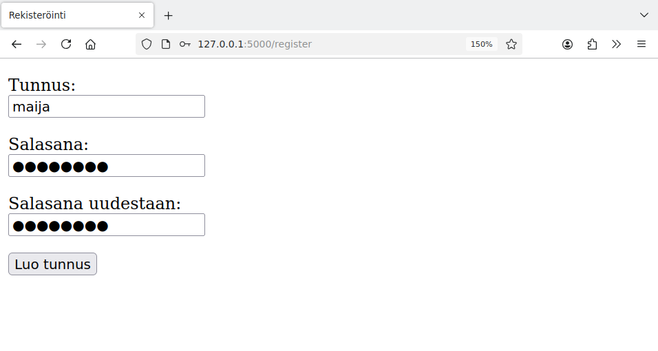
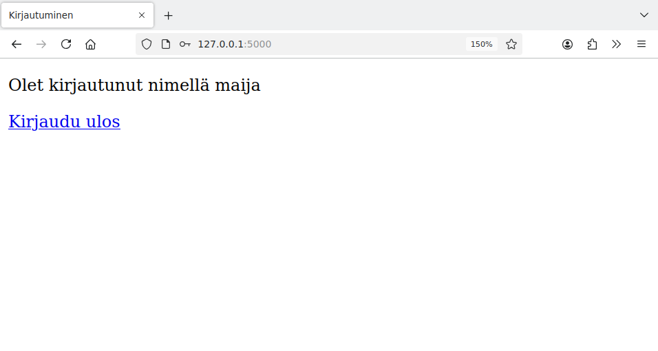

# 3. Kirjautuminen

Monissa web-sovelluksissa on tarvetta tunnistaa sovelluksen käyttäjä. Tavallinen ratkaisu on, että käyttäjä pääsee käyttämään tiettyjä sovelluksen toimintoja kirjauduttuaan ensin sisään antamalla tunnuksen ja salasanan.

Tutustumme tässä osassa käyttäjien rekisteröinnin ja kirjautumisen toteuttamiseen.

## Tunnuksen luonti

Luodaan käyttäjiä varten sovelluksen seuraava taulu `users`:

```sql
CREATE TABLE users (
    id INTEGER PRIMARY KEY,
    username TEXT UNIQUE,
    password_hash TEXT
)
```

Sarake `username` sisältää käyttäjän tunnuksen. Sarakkeessa on lisäehto `UNIQUE`, mikä tarkoittaa, että kahdella käyttäjällä ei voi olla samaa tunnusta.

Sarake `password_hash` sisältää salasanan hash-arvon. Salasanojen tallentamineen sellaisenaan tietokantaan ei olisi hyvä ratkaisu, koska jos joku pääsisi käsiksi tietokannan sisältöön, hän saisi heti selville käyttäjien salasanat. Parempi ratkaisu on tallentaa salasanat tietokantaan hash-muodossa.

{: .note-title }
Salasanan hash-arvo
<div class="note" markdown="1">

Salasanan hash-arvo on salasanan perusteella muodostettava merkkijono. Hyvin valitulla algoritmilla muodostetusta hash-arvosta ei voi helposti selvittää alkuperäistä salasanaa, mutta vertaamalla kahden salasanan hash-arvoja voi selvittää, ovatko salasanat samat.

Vaikka salasanasta olisi tiedossa vain hash-arvo, alkuperäisen salasanan palauttaminen on helppoa, jos salasana on lyhyt. Tällöin voidaan käydä läpi kaikki mahdolliset lyhyet salasanat, laskea niiden hash-arvot ja verrata niitä tiedossa olevaan hash-arvoon.

</div>

Seuraavassa sovelluksessa käyttäjä pystyy luomaan sovellukseen tunnuksen, joka tallennetaan tietokantaan:

{: .code-title }
app.py
```python
import sqlite3
from flask import Flask
from flask import redirect, render_template, request
from werkzeug.security import generate_password_hash
import db

app = Flask(__name__)

@app.route("/register")
def register():
    return render_template("register.html")

@app.route("/create", methods=["POST"])
def create():
    username = request.form["username"]
    password1 = request.form["password1"]
    password2 = request.form["password2"]
    if password1 != password2:
        return "VIRHE: salasanat eivät ole samat"
    password_hash = generate_password_hash(password1)

    try:
        sql = "INSERT INTO users (username, password_hash) VALUES (?, ?)"
        db.execute(sql, [username, password_hash])
    except sqlite3.IntegrityError:
        return "VIRHE: tunnus on jo varattu"

    return "Tunnus luotu"
```

{: .code-title }
register.html
```jinja
<!DOCTYPE html>
<html>

<head>
  <title>Rekisteröinti</title>
</head>

<body>
  <form action="/create" method="post">
    <p>
      Tunnus: <br />
      <input type="text" name="username" />
    </p>
    <p>
      Salasana: <br />
      <input type="password" name="password1" />
    </p>
    <p>
      Salasana uudestaan: <br />
      <input type="password" name="password2" />
    </p>
    <input type="submit" value="Luo tunnus" />
  </form>
</body>

</html>
```

Tunnuksen luonti voi näyttää seuraavalta:




Lomakkeessa käyttäjän tulee kirjoittaa salasana kahdesti, mikä vähentää väärin kirjoitetun salasanan riskiä. Jos käyttäjä antaa kaksi eri salasanaa, sovellus antaa tästä virheilmoituksen.

Koodissa käytetään salasanan hash-arvon luomiseen funktiota `generate_password_hash`, joka kuuluu Flaskin mukana tulevaan Werkzeug-kirjastoon. Tämä on turvallinen tapa muodostaa salasanaa vastaava hash-arvo. Tällä tavalla saatu hash-arvo tallennetaan tietokantaan.

Voimme katsoa tietokannasta, miltä salasanan hash-arvo näyttää:

```console
sqlite> SELECT * FROM users;
1|maija|scrypt:32768:8:1$dZXAZyabb4YyxUnu$aa28f00271ce049f6e59773bee70b4555b3d671c63dcbf9ec3e53c467196df1841f1f232aaf9b05788e73d5692e48707b2112b29a44cd3547cb917701b17fb91
```

Tästä näkee, että salasana on tallennettu satunnaiselta näyttävänä merkkijonona. Funktio `generate_password_hash` on toteutettu niin, että salasanan selvittäminen hash-arvon perusteella on vaikeaa.

Koodi hyödyntää sarakkeessa `username` olevaa `UNIQUE`-ehtoa. Jos käyttäjä koettaa luoda tunnuksen, joka on jo olemassa, tietokanta estää komennon `INSERT` suorittamisen. Koodi tunnistaa tämän tilanteen `try`-rakenteen avulla ja näyttää asiaan liittyvän virheilmoituksen.

## Istunnon käyttäminen

Kun käyttäjä kirjautuu sisään sovellukseen, tieto kirjautumisesta tulisi säilyä sovelluksen eri sivuilla. Tavallinen tapa toteuttaa tämä on käyttää istuntoa, joka on toteutettu Flaskissa `session`-oliona.

Seuraava koodi näyttää esimerkin istunnon käyttämisestä:

{: .code-title }
app.py
```python
from flask import Flask
from flask import session
import config

app = Flask(__name__)
app.secret_key = config.secret_key

@app.route("/page1")
def page1():
    session["test"] = "aybabtu"
    return "Istunto asetettu"

@app.route("/page2")
def page2():
    return "Tieto istunnosta: " + session["test"]
```

Istunnon käyttäminen vaatii, että sovelluksessa on määritelty salainen avain (`app.secret_key`). Salaisen avaimen avulla sovellus tallentaa istuntoon liittyvät tiedot turvallisesti käyttäjän selaimeen evästeeseen. Salaisen avaimen tulee olla sovelluksen lähdekoodin ulkopuolella. Tässä asia on ratkaistu niin, että avain on erillisessä tiedostossa `config.py`:

{: .code-title }
config.py
```python
secret_key = "18fd24bf6a2ad4dac04a33963db1c42f"
```

Yllä oleva tiedosto on esimerkki siitä, miltä salainen avain voisi näyttää. Tämä avain kuitenkaan ei ole salainen, koska se on julkaistu kurssin materiaalissa.

{: .note-title }
Salainen avain
<div class="note" markdown="1">

Sovelluksen kehitysvaiheessa salaisen avaimen valinnalla ei ole merkitystä. Voit esimerkiksi käyttää yllä olevaa tiedostoa `config.py` ja siinä olevaa avainta. Voit myös lisätä tämän tiedoston sovelluksesi git-repositorioon.

Kun sovellus on tuotannossa eli julkisesti verkossa, on sen sijaan tärkeää, että tiedostossa `config.py` on todellinen salainen avain. Salaisen avaimen voi luoda vaikkapa Python-tulkin avulla. Esimerkiksi moduulin `secrets` funktio `token_hex` antaa halutun määrän satunnaisia tavuja:

```console?lang=python&prompt=>>>
$ python3
>>> import secrets
>>> secrets.token_hex(16)
'39e5b8dd1de7afdc786df2b0cdf7a8f1'
>>> secrets.token_hex(16)
'ce22573dcdf9326527536f682ffa3e1c'
>>> secrets.token_hex(16)
'4125543709214f084fb171fa541a7ff3'
```

Salaisen avaimen merkitys on siinä, että se estää sovelluksen käyttäjää muokkaamasta istuntoon liittyvää tietoa selaimen kautta. Jos salainen avain vuotaa julkiseksi, tämä voi mahdollistaa hyökkääjällle esimerkiksi sovellukseen kirjautumisen toisena käyttäjänä.

</div>

Sovelluksen ideana on, että ensimmäinen sivu asettaa istuntoon muuttujan `test` ja toinen sivu puolestaan näyttää muuttujan sisällön. Tästä näkee, miten tieto säilyy tallessa sivulta toiselle.


### Kirjautumisen toteutus

Nyt meillä on tarvittavat työkalut, joiden avulla voimme toteuttaa kirjautumisen sovellukseen. Seuraava koodi olettaa, että tietokannassa on tämän osan alussa määritelty taulu `users`. Sovellukseen pystyvät kirjautumaan sisään käyttäjät, jotka ovat luoneet tunnuksen.

{: .code-title }
app.py
```python
from flask import Flask
from flask import redirect, render_template, request, session
from werkzeug.security import check_password_hash
import db
import config

app = Flask(__name__)
app.secret_key = config.secret_key

@app.route("/")
def index():
    return render_template("index.html")

@app.route("/login",methods=["POST"])
def login():
    username = request.form["username"]
    password = request.form["password"]
    
    sql = "SELECT password_hash FROM users WHERE username = ?"
    password_hash = db.query(sql, [username])[0][0]

    if check_password_hash(password_hash, password):
        session["username"] = username
        return redirect("/")
    else:
        return "VIRHE: väärä tunnus tai salasana"

@app.route("/logout")
def logout():
    del session["username"]
    return redirect("/")
```

Sovellus käyttää seuraavaa sivupohjaa, joka joko näyttää kirjautumislomakkeen tai kertoo, että käyttäjä on sisällä:

{: .code-title }
index.html
```jinja
<!DOCTYPE html>
<html>

<head>
  <title>Kirjautuminen</title>
</head>

<body>
  
  <p>
    Olet kirjautunut nimellä {{ session.username }}
  </p>
  <p>
    <a href="/logout">Kirjaudu ulos</a>
  </p>
  
  <form action="/login" method="post">
    <p>
      Tunnus: <br />
      <input type="text" name="username" />
    </p>
    <p>
      Salasana: <br />
      <input type="password" name="password" />
    </p>
    <input type="submit" value="Kirjaudu" />
  </form>
  
</body>

</html>
```

Kun käyttäjä syöttää lomakkeeseen tunnuksen ja salasanan, koodi hakee tietokannasta tunnusta vastaavan salasanan hash-arvon. Tämän jälkeen koodi tarkastaa funktiolla `check_password_hash`, onko salasana oikea. Tämän jälkeen asetetaan istuntoon muuttuja `username`, joka kertoo käyttäjän tunnuksen.

Sovelluksen käyttäminen voi näyttää tältä:




