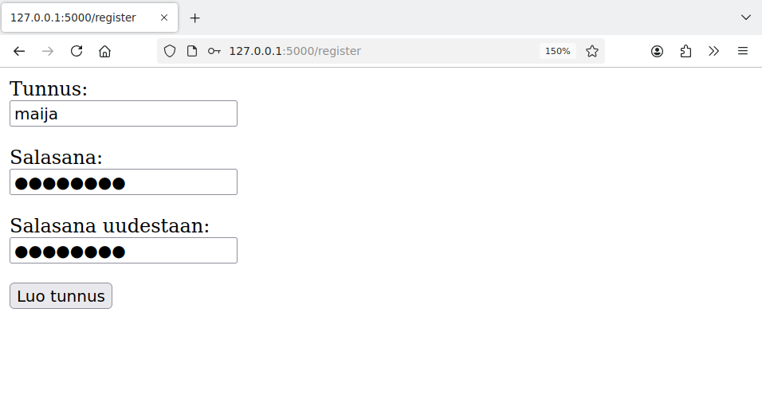

<style>
img {
    border-style: solid;
    border-color: black;
    border-width: 1px;
    width: 80%;
    margin-top: 40px;
    margin-bottom: 40px;    
}
</style>

# 3. Käyttäjän tunnistaminen

Monissa web-sovelluksissa on tarvetta tunnistaa sovelluksen käyttäjä. Tavallinen ratkaisu on vaatia halutuissa sovelluksen toiminnoissa, että käyttäjä kirjautuu sisään antamalla tunnuksen ja salasanan.

Tässä osassa käymme läpi, miten voimme toteuttaa sovelluksen niin, että käyttäjä voi luoda tunnuksen ja salasanan sovellukseen ja kirjautua myöhemmin niiden avulla sisään sovellukseen.

## Tunnuksen luonti

Luodaan käyttäjiä varten sovelluksen seuraava taulu `users`:

```sql
CREATE TABLE users (
    id INTEGER PRIMARY KEY,
    username TEXT UNIQUE,
    password TEXT
)
```

Taulussa sarakkeet `username` ja `password` sisältävät käyttäjän tunnuksen ja salasanan. Sarakkeessa `username` on lisäehto `UNIQUE`, mikä tarkoittaa, että kahdella käyttäjällä ei voi olla samaa tunnusta.

Käyttäjän salasanan tallentamineen sellaisenaan tietokantaan ei olisi hyvä ratkaisu. Tällöin jos joku pääsisi käsiksi tietokannan sisältöön, hän saisi heti selville käyttäjien salasanat. Parempi ratkaisu on tallentaa salasanat tietokantaan hash-muodossa, jolloin niiden selvittäminen on vaikeampaa.

Seuraavassa sovelluksessa käyttäjä pystyy luomaan sovellukseen tunnuksen, joka tallennetaan tietokantaan:

{: .code-title }
app.py
```python
from flask import Flask
from flask import redirect, render_template, request
from werkzeug.security import generate_password_hash
import db

app = Flask(__name__)

@app.route("/register")
def index():
    return render_template("register.html")

@app.route("/create", methods=["POST"])
def create():
    username = request.form["username"]
    password1 = request.form["password1"]
    password2 = request.form["password2"]
    if password1 != password2:
        return "VIRHE: salasanat eivät ole samat"
    password_hash = generate_password_hash(password1)

    try:
        db.execute("INSERT INTO users (username, password) VALUES (?, ?)",
                   [username, password_hash])
    except:
        return "VIRHE: tunnus on jo varattu"

    return "Tunnus luotu"
```

{: .code-title }
register.html
```jinja
<h1>Tunnuksen luonti</h2>
<form action="/create" method="post">
<p> Tunnus: <br>
<input type="text" name="username">
<p> Salasana: <br>
<input type="password" name="password1">
<p> Salasana uudestaan: <br>
<input type="password" name="password2">
<p>
<input type="submit" value="Luo tunnus">
</form>
```

Tunnuksen luonti voi näyttää seuraavalta:




Lomakkeessa käyttäjän tulee kirjoittaa salasana kahdesti, mikä vähentää väärin kirjoitetun salasanan riskiä. Jos käyttäjä antaa kaksi eri salasanaa, sovellus antaa tästä virheilmoituksen.

Koodissa käytetään salasanan hash-arvon luomiseen funktiota `generate_password_hash`, joka kuuluu Flaskin mukana tulevaan Werkzeug-kirjastoon. Tällä tavalla saatu hash-arvo tallennetaan tietokantaan.

Voimme katsoa tietokannasta, miltä salasanan hash-arvo näyttää:

```console
sqlite> SELECT * FROM users;
1|maija|scrypt:32768:8:1$dZXAZyabb4YyxUnu$aa28f00271ce049f6e59773bee70b4555b3d671c63dcbf9ec3e53c467196df1841f1f232aaf9b05788e73d5692e48707b2112b29a44cd3547cb917701b17fb91
```

Tästä näkee, että salasana on tallennettu satunnaiselta näyttävänä merkkijonona. Funktio `generate_password_hash` on toteutettu niin, että salasanan palauttaminen hash-arvon perusteella on vaikeaa.

Koodi hyödyntää sarakkeessa `username` olevaa `UNIQUE`-ehtoa. Jos käyttäjä koettaa luoda tunnuksen, joka on jo olemassa, tietokanta estää komennon `INSERT` suorittamisen. Koodi tunnistaa tämän tilanteen `try`-rakenteen avulla ja näyttää asiaan liittyvän virheilmoituksen.

## Istunnon käyttäminen

Flask toteuttaa istunnon `session`-oliona, jonka tiedot tallennetaan selaimelle lähetettävään _evästeeseen_ (_cookie_). Istuntoa voidaan käyttää samaan tapaan kuin sanakirjaa Pythonissa. Seuraava koodi antaa esimerkin asiasta:

{: .code-title }
app.py
```python
from flask import Flask
from flask import session

app = Flask(__name__)
app.secret_key = "change_this_later"

@app.route("/page1")
def page1():
    session["test"] = "aybabtu"
    return "Istunto asetettu"

@app.route("/page2")
def page2():
    return "Tieto istunnosta: " + session["test"]
```

Istunnon käyttäminen vaatii, että sovelluksessa on määritelty salainen avain (`app.secret_key`). Yllä olevassa koodissa on testailua varten väliaikainen salainen avain, jota ei tule käyttää todellisessa sovelluksessa. Palaamme myöhemmin tarkemmin tähän asiaan.

Sovelluksen ideana on, että ensimmäinen sivu asettaa istuntoon muuttujan `test` ja toinen sivu puolestaan näyttää muuttujan sisällön. Tästä näkee, miten tieto säilyy tallessa sivulta toiselle.


### Kirjautumisen toteutus

Seuraava sovellus antaa näytteen kirjautumisen toteuttamisesta:

```python
from flask import Flask
from flask import redirect, render_template, request, session
from os import getenv

app = Flask(__name__)
app.secret_key = getenv("SECRET_KEY")

@app.route("/")
def index():
    return render_template("index.html")

@app.route("/login",methods=["POST"])
def login():
    username = request.form["username"]
    password = request.form["password"]
    # TODO: check username and password
    session["username"] = username
    return redirect("/")

@app.route("/logout")
def logout():
    del session["username"]
    return redirect("/")
```

Sovellus käyttää seuraavaa sivupohjaa `index.html`, joka joko näyttää kirjautumislomakkeen tai kertoo, että käyttäjä on sisällä:

```jinja

<p>Olet kirjautunut nimellä {{ session.username }}</p>
<a href="/logout">Kirjaudu ulos</a>

<form action="/login" method="POST">
<p>Tunnus:<br>
<input type="text" name="username"></p>
<p>Salasana:<br>
<input type="password" name="password"></p>
<input type="submit" value="Kirjaudu">
</form>

```

Sovelluksen käyttäminen voi näyttää tältä:


Katsotaan nyt tarkemmin sovelluksen osia: 

```python
app.secret_key = getenv("SECRET_KEY")
```

Tällä rivillä sovellus hakee salaisen avaimen ympäristömuuttujasta `SECRET_KEY`. Istuntoa ei ole mahdollista käyttää ilman salaista avainta.

```jinja

<p>Olet kirjautunut nimellä {{ session.username }}</p>
<a href="/logout">Kirjaudu ulos</a>

```

Sivupohjassa `session`-olioon pääsee käsiksi yllä olevalla syntaksilla. Jos `username` on asetettu, käyttäjä näkee tunnuksensa ja linkin, josta painamalla voi kirjautua ulos. Muuten käyttäjä näkee lomakkeen, jonka avulla voi kirjautua sisään.


```python
@app.route("/login",methods=["POST"])
def login():
    username = request.form["username"]
    password = request.form["password"]
    # TODO: check username and password
    session["username"] = username
    return redirect("/")
```

Tämä funktio käsittelee kirjautumislomakkeen. Tällä hetkellä funktiosta puuttuu vielä osa (TODO-kohta), joka varmistaa, että käyttäjä antaa oikean tunnuksen ja salasanan. Niinpä sovellus hyväksyy minkä tahansa tunnuksen ja salasanan.

```python
@app.route("/logout")
def logout():
    del session["username"]
    return redirect("/")
```

Tämä funktio kirjaa käyttäjän ulos poistamalla `session`-rakenteesta avaimen `username`.
