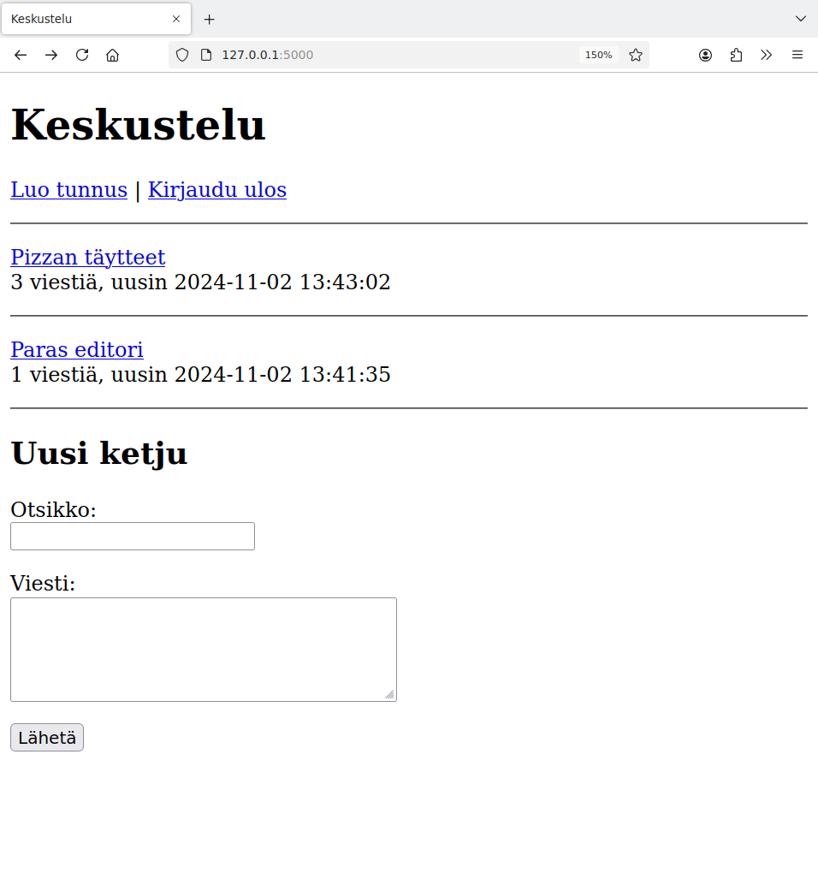

<style>
img {
    border-style: solid;
    border-color: black;
    border-width: 1px;
    width: 80%;
    margin-top: 40px;
    margin-bottom: 40px;    
}
</style>

# 4. Esimerkkisovellus

Tämä osa esittelee esimerkkisovelluksen, jonka aiheena on keskustelualue. Sovelluksessa käyttäjät voivat aloittaa keskusteluketjuja ja lähettää niihin viestejä. Käyttäjät voivat myös muokata ja poistaa viestejä.

Tällaisesta sovelluksesta voidaan käyttää nimeä CRUD-sovellus, missä CRUD tulee sanoista "create, read, update and delete". Sovellus näyttää, miten tiedon luominen, lukeminen, päivittäminen ja poistaminen voidaan toteuttaa.

Sovelluksen koko lähdekoodi on saatavilla GitHubissa:

* [https://github.com/hy-tikawe/keskustelu_v1](https://github.com/hy-tikawe/keskustelu_v1)

Sovellusta voi käyttää tällaisenaan, mutta siinä on vielä paljon parannettavaa. Kehitämmekin sovellusta eteenpäin materiaalin seuraavissa osissa.

## Tietokannan rakenne

Sovelluksen tietokannan rakenne on seuraavanlainen:

{: .code-title }
schema.sql
```sql
CREATE TABLE users (
    id INTEGER PRIMARY KEY,
    username TEXT UNIQUE,
    password_hash TEXT
);

CREATE TABLE threads (
    id INTEGER PRIMARY KEY,
    title TEXT,
    user_id INTEGER REFERENCES users
);

CREATE TABLE messages (
    id INTEGER PRIMARY KEY,
    content TEXT,
    sent_at TEXT,
    user_id INTEGER REFERENCES users,
    thread_id INTEGER REFERENCES threads
);
```

Taulu `users` sisältää sovelluksen käyttäjät kuten materiaalin osassa 3.

Taulu `threads` sisältää keskusteluketjut. Jokaisesta ketjusta tallennetaan otsikko ja ketjun aloittaneen käyttäjän id-numero.

Taulu `messages` sisältää viestit. Jokaisesta viestistä tallennetaan sisältö, lähetysaika, viestin lähettäneen käyttäjän id-numero sekä viestin ketjun id-numero.

Tietokannan rakenne on tallennettu tiedostoon `schema.sql`. Sen perusteella voidaan luoda tietokanta tiedostoon `database.db` seuraavasti:

```console
$ sqlite database.db < schema.sql
```

## Sovelluksen etusivu

Sovelluksen etusivulla on lista keskustelun ketjuista sekä lomake, jonka avulla kirjautunut käyttäjä pystyy luomaan uuden ketjun. Sovelluksen etusivu voi näyttää seuraavalta:



Sovellus on rakennettu niin, että tiedoston `app.py` funktiot käsittelevät sivupyynnöt ja tiedostossa `forum.py` on funktiot, jotka hakevat ja muuttavat tietokannan sisältöä.

Seuraava funktio käsittelee etusivun sivupyynnön:

{: .code-title }
app.py
```python
@app.route("/")
def index():
    threads = forum.get_threads()
    return render_template("index.html", threads=threads)
```

Funktio hakee ensin tietokannasta tiedot keskustelussa olevista ketjuista ja välittää tämän listan sivupohjalle. Funktio `get_threads` näyttää tältä:

{: .code-title }
forum.py
```python
def get_threads():
    sql = """SELECT t.id, t.title, COUNT(m.id) total, MAX(m.sent_at) last
             FROM threads t, messages m
             WHERE t.id = m.thread_id
             GROUP BY t.id
             ORDER BY t.id DESC"""
    return db.query(sql)
```

Funktion perustana on SQL-kysely, joka hakee yhdellä kertaa kaikki etusivun listassa tarvittavat tiedot. Tämä onnistuu kyselyllä, joka hakee tietoa tauluista `threads` ja `messages` ja ryhmittelee tiedon ketjun id-numeron mukaan. Näin saadaan kätevästi ketjun viestien määrä sekä viimeisen viestin lähetysaika.

Tämä on yleensäkin hyvä tapa toteuttaa tiedon hakeminen: jos kaiken tiedon voi hakea mielekkäästi yhdellä SQL-kyselyllä, niin kannattaa tehdä näin.

Sivupohjassa viestilista luodaan näin:

{: .code-title }
index.html
```jinja
  
  <p>
    <a href="/thread/{{ thread.id }}">{{ thread.title }}</a>
    <br />
    {{ thread.total }} viestiä, uusin {{ thread.last }}
  </p>
  <hr />
  
```

Tässä silmukka käy läpi listassa `threads` olevat ketjut. Jokaisen viestin kohdalla näytetään linkki muotoa `/thread/id`, jonka kautta ketjun pystyy lukemaan. Lisäksi näytetään viestien määrä ja uusimman viestin lähetysaika.

Uusi keskusteluketju luodaan seuraavan lomakkeen avulla:

{: .code-title }
index.html
```jinja
  
  <h2>Uusi ketju</h2>

  <form action="/new_thread" method="post">
    <p>
      Otsikko: <br />
      <input type="text" name="title">
    </p>
    <p>
      Viesti: <br />
      <textarea name="content" rows="5" cols="40"></textarea>
    </p>
    <input type="submit" value="Lähetä">
  </form>
  
```

Lomakkeen ympärillä on if-rakenne, jonka ansiosta lomake näytetään vain silloin, kun käyttäjä on kirjautunut sisään. Käyttäjä antaa lomakkeen kautta ketjun otsikon ja ensimmäisen viestin sisällön.

Seuraava funktio käsittelee yllä olevan lomakkeen lähettämisen:

{: .code-title }
app.py
```python
@app.route("/new_thread", methods=["POST"])
def new_thread():
    title = request.form["title"]
    content = request.form["content"]
    user_id = session["user_id"]

    thread_id = forum.add_thread(title, content, user_id)
    return redirect("/thread/" + str(thread_id))
```

Tässä kutsutaan funktiota `add_thread`, joka lisää ketjun tietokantaan sekä palauttaa lisätyn ketjun id-numeron. Ketjun lisäämisen jälkeen sovellus ohjaa osoitteeseen `/thread/id`, joka näyttää ketjun sisällön.

Seuraavia funktioita käytetään ketjun lisäämisessä tietokantaan:

{: .code-title }
forum.py
```python
def add_thread(title, content, user_id):
    sql = "INSERT INTO threads (title, user_id) VALUES (?, ?)"
    db.execute(sql, [title, user_id])
    thread_id = db.last_insert_id()
    add_message(content, user_id, thread_id)
    return thread_id
    
def add_message(content, user_id, thread_id):
    sql = """INSERT INTO messages (content, sent_at, user_id, thread_id) VALUES
             (?, datetime('now'), ?, ?)"""
    db.execute(sql, [content, user_id, thread_id])
```

Funktio `add_thread` lisää ensin ketjun tauluun `threads` ja hakee lisätyn ketjun id-numeron funktiolla `last_insert_id`. Tämän jälkeen funktio kutsuu vielä funktiota `add_message`, joka lisää ketjun ensimmäisen viestin tietokantaan. Tätä funktiota käytetään myöhemmin myös ketjun viestien lisäämisessä.
