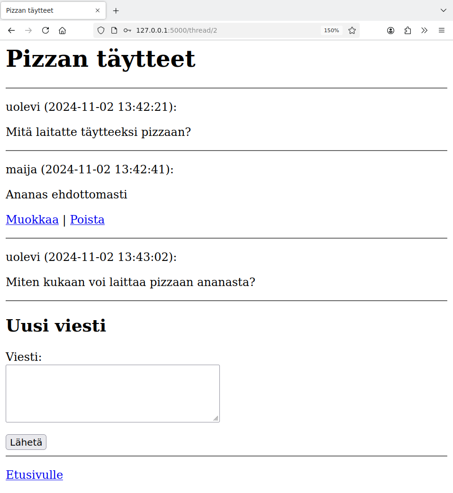

<style>
img {
    border-style: solid;
    border-color: black;
    border-width: 1px;
    width: 80%;
    margin-top: 40px;
    margin-bottom: 40px;    
}
</style>

# 4. Esimerkkisovellus

Tämä osa esittelee esimerkkisovelluksen, jonka aiheena on keskustelualue. Sovelluksessa käyttäjät voivat aloittaa keskusteluketjuja ja lähettää niihin viestejä. Käyttäjät voivat myös muokata ja poistaa viestejä.

Tällaisesta sovelluksesta voidaan käyttää nimeä CRUD-sovellus, missä CRUD tulee sanoista "create, read, update and delete". Sovellus näyttää, miten tiedon luominen, lukeminen, päivittäminen ja poistaminen voidaan toteuttaa.

Sovelluksen koko lähdekoodi on saatavilla GitHubissa:

* [https://github.com/hy-tikawe/keskustelu_v1](https://github.com/hy-tikawe/keskustelu_v1)

Sovellusta voi käyttää tällaisenaan, mutta siinä on vielä paljon parannettavaa. Kehitämmekin sovellusta eteenpäin materiaalin seuraavissa osissa.

## Tietokannan rakenne

Sovelluksen tietokannan rakenne on seuraavanlainen:

{: .code-title }
schema.sql
```sql
CREATE TABLE users (
    id INTEGER PRIMARY KEY,
    username TEXT UNIQUE,
    password_hash TEXT
);

CREATE TABLE threads (
    id INTEGER PRIMARY KEY,
    title TEXT,
    user_id INTEGER REFERENCES users
);

CREATE TABLE messages (
    id INTEGER PRIMARY KEY,
    content TEXT,
    sent_at TEXT,
    user_id INTEGER REFERENCES users,
    thread_id INTEGER REFERENCES threads
);
```

Taulu `users` sisältää sovelluksen käyttäjät kuten materiaalin osassa 3.

Taulu `threads` sisältää keskusteluketjut. Jokaisesta ketjusta tallennetaan otsikko ja ketjun aloittaneen käyttäjän id-numero.

Taulu `messages` sisältää viestit. Jokaisesta viestistä tallennetaan sisältö, lähetysaika, viestin lähettäneen käyttäjän id-numero sekä viestin ketjun id-numero.

Tietokannan rakenne on tallennettu tiedostoon `schema.sql`. Sen perusteella voidaan luoda tietokanta tiedostoon `database.db` seuraavasti:

```console
$ sqlite database.db < schema.sql
```

## Sovelluksen etusivu

Sovelluksen etusivulla on lista keskustelun ketjuista sekä lomake, jonka avulla kirjautunut käyttäjä pystyy luomaan uuden ketjun. Sovelluksen etusivu voi näyttää seuraavalta:


Sovellus on rakennettu niin, että tiedoston `app.py` funktiot käsittelevät sivupyynnöt ja tiedostossa `forum.py` on funktiot, jotka hakevat ja muuttavat tietokannan sisältöä.

Seuraava funktio käsittelee etusivun sivupyynnön:

{: .code-title }
app.py
```python
@app.route("/")
def index():
    threads = forum.get_threads()
    return render_template("index.html", threads=threads)
```

Funktio hakee ensin tietokannasta tiedot keskustelussa olevista ketjuista ja välittää tämän listan sivupohjalle. Funktio `get_threads` näyttää tältä:

{: .code-title }
forum.py
```python
def get_threads():
    sql = """SELECT t.id, t.title, COUNT(m.id) total, MAX(m.sent_at) last
             FROM threads t, messages m
             WHERE t.id = m.thread_id
             GROUP BY t.id
             ORDER BY t.id DESC"""
    return db.query(sql)
```

Funktion perustana on SQL-kysely, joka hakee yhdellä kertaa kaikki etusivun listassa tarvittavat tiedot. Tämä onnistuu kyselyllä, joka hakee tietoa tauluista `threads` ja `messages` ja ryhmittelee tiedon ketjun id-numeron mukaan. Näin saadaan kätevästi ketjun viestien määrä sekä viimeisen viestin lähetysaika.

Tämä on yleensäkin hyvä tapa toteuttaa tiedon hakeminen: jos kaiken tiedon voi hakea mielekkäästi yhdellä SQL-kyselyllä, niin kannattaa tehdä näin.

Sivupohjassa viestilista luodaan näin:

{: .code-title }
index.html
```jinja
  
  <p>
    <a href="/thread/{{ thread.id }}">{{ thread.title }}</a>
    <br />
    {{ thread.total }} viestiä, uusin {{ thread.last }}
  </p>
  <hr />
  
```

Tässä silmukka käy läpi listassa `threads` olevat ketjut. Jokaisen viestin kohdalla näytetään linkki muotoa `/thread/id`, jonka kautta ketjun pystyy lukemaan. Lisäksi näytetään viestien määrä ja uusimman viestin lähetysaika.

Uusi keskusteluketju luodaan seuraavan lomakkeen avulla:

{: .code-title }
index.html
```jinja
  
  <h2>Uusi ketju</h2>

  <form action="/new_thread" method="post">
    <p>
      Otsikko: <br />
      <input type="text" name="title" />
    </p>
    <p>
      Viesti: <br />
      <textarea name="content" rows="5" cols="40"></textarea>
    </p>
    <input type="submit" value="Lähetä" />
  </form>
  
```

Lomakkeen ympärillä on if-rakenne, jonka ansiosta lomake näytetään vain silloin, kun käyttäjä on kirjautunut sisään. Käyttäjä antaa lomakkeen kautta ketjun otsikon ja ensimmäisen viestin sisällön.

Seuraava funktio käsittelee yllä olevan lomakkeen lähettämisen:

{: .code-title }
app.py
```python
@app.route("/new_thread", methods=["POST"])
def new_thread():
    title = request.form["title"]
    content = request.form["content"]
    user_id = session["user_id"]

    thread_id = forum.add_thread(title, content, user_id)
    return redirect("/thread/" + str(thread_id))
```

Tässä kutsutaan funktiota `add_thread`, joka lisää ketjun tietokantaan sekä palauttaa lisätyn ketjun id-numeron. Ketjun lisäämisen jälkeen sovellus ohjaa osoitteeseen `/thread/id`, joka näyttää ketjun sisällön.

Seuraavia funktioita käytetään ketjun lisäämisessä tietokantaan:

{: .code-title }
forum.py
```python
def add_thread(title, content, user_id):
    sql = "INSERT INTO threads (title, user_id) VALUES (?, ?)"
    db.execute(sql, [title, user_id])
    thread_id = db.last_insert_id()
    add_message(content, user_id, thread_id)
    return thread_id
    
def add_message(content, user_id, thread_id):
    sql = """INSERT INTO messages (content, sent_at, user_id, thread_id) VALUES
             (?, datetime('now'), ?, ?)"""
    db.execute(sql, [content, user_id, thread_id])
```

Funktio `add_thread` lisää ensin ketjun tauluun `threads` ja hakee lisätyn ketjun id-numeron funktiolla `last_insert_id`. Tämän jälkeen funktio kutsuu vielä funktiota `add_message`, joka lisää ketjun ensimmäisen viestin tietokantaan. Tätä funktiota käytetään myöhemmin myös ketjun viestien lisäämisessä.

## Viestien käsittely

Keskusteluketjun katsominen näyttää seuraavalta:



Ketjussa olevat viestit näkyvät listassa. Jos kirjautunut käyttäjä on viestin kirjoittaja, hänellä on myös mahdollisuus muokata viestiä tai poistaa viesti. Sivun alalaidassa on lomake, jonka kautta voi lähettää uuden viestin.

Sivun käsittelijä näyttää seuraavalta:

{: .code-title }
app.py
```python
@app.route("/thread/<int:id>")
def show_thread(id):
    thread = forum.get_thread(id)
    messages = forum.get_messages(id)
    return render_template("thread.html", thread=thread, messages=messages)
```

Funktio hakee tiedot ketjusta ja siinä olevista viesteistä sekä välittää nämä tiedot sivupohjalle. Seuraavat funktiot hakevat tiedot tietokannasta:

{: .code-title }
forum.py
```python
def get_thread(id):
    sql = "SELECT id, title FROM threads WHERE id = ?"
    return db.query(sql, [id])[0]

def get_messages(thread_id):
    sql = """SELECT m.id, m.content, m.sent_at, m.user_id, u.username
             FROM messages m, users u
             WHERE m.user_id = u.id AND m.thread_id = ?
             ORDER BY m.id"""
    return db.query(sql, [thread_id])
```

Sivupohjassa viestilista luodaan näin:

{: .code-title }
thread.html
```jinja
  
  <p>
    {{ message.username }} ({{ message.sent_at }}):
  </p>
  <p>
    {{ message.content }}
  </p>
  
  <p>
    <a href="/edit/{{ message.id }}">Muokkaa</a> |
    <a href="/remove/{{ message.id }}">Poista</a>
  </p>
  
  <hr />
  
```

Tässä silmukka käy läpi listassa `messages` olevat viestit ja näyttää kunkin viestin tiedot ja sisällön. Jos käyttäjä on kirjautunut sisään, viestin yhteydessä näytetään myös linkit, joiden kautta voi muokata viestiä tai poistaa viestin.

Uusi viesti lähetetään seuraavan lomakkeen kautta:

{: .code-title }
thread.html
```jinja
  
  <h2>Uusi viesti</h2>

  <form action="/new_message" method="post">
    <p>
      Viesti:<br />
      <textarea name="content" rows="5" cols="40"></textarea>
    </p>
    <input type="hidden" name="thread_id" value="{{ thread.id }}" />
    <input type="submit" value="Lähetä" />
  </form>
  <hr />
  
```

Tässä lomakkeessa on piilokenttä (`input type="hidden"`), joka sisältää ketjun id-numeron. Tämä kenttä ei näy sivun käyttäjälle (paitsi katsomalla sivun lähdekoodia), mutta se välitetään lomakkeen käsittelijälle. Kentän ansiosta käsittelijä tietää, mihin ketjuun uusi viesti liittyy.

Seuraava funktio käsittelee uuden viestin:

{: .code-title }
forum.py
```python
@app.route("/new_message", methods=["POST"])
def new_message():
    content = request.form["content"]
    user_id = session["user_id"]
    thread_id = request.form["thread_id"]

    forum.add_message(content, user_id, thread_id)
    return redirect("/thread/" + str(thread_id))
```

Funktio lisää viestin tietokantaan kutsumalla funktiota `add_message`. Tämän jälkeen funktio ohjaa käyttäjän takaisin sivulle, joka näyttää ketjun viestit. Näissä molemmissa vaiheissa tarvitaan tietoa siitä, mikä on ketjun id-numero.

## Muokkaus ja poisto

Kun käyttäjä painaa viestin muokkauslinkistä, hän päätyy seuraavalle sivulle:


Sivulla on lomake, jossa näkyy viestin nykyinen sisältö ja jonka kautta voi muokata viestiä. Lomake on toteutettu seuraavasti:

{: .code-title }
edit.html
```jinja
  <form action="/edit/{{ message.id }}" method="post">
    <p>
      Viesti:<br />
      <textarea name="content" rows="5" cols="40">{{ message.content }}</textarea>
    </p>
    <input type="submit" value="Lähetä" />
  </form>
```

Aiemmissa lomakkeissa tekstialue on ollut tyhjä, mutta tässä lomakkeessa on valmiina viestin vanha sisältö. Tämä on käyttäjälle mukava tapa toteuttaa viestin muokkaaminen. Lomakkeen käsittelijä näyttää tältä:

{: .code-title }
app.py
```python
@app.route("/edit/<int:id>", methods=["GET", "POST"])
def edit_message(id):
    message = forum.get_message(id)

    if request.method == "GET":
        return render_template("edit.html", message=message)

    if request.method == "POST":
        content = request.form["content"]
        forum.update_message(message["id"], content)
        return redirect("/thread/" + str(message["thread_id"]))
```

Tässä käsittelijässä on kaksi osaa, koska sama osoite `/edit/id` sekä näyttää viestin muokkauslomakkeen että käsittelee lomakkeen lähetyksen.

Jos viestipyynnön metodi on `GET`, tämä tarkoittaa, että käyttäjä on sivulla `/edit/id` ja tulee näyttää muokkauslomake. Jos taas metodi on `POST`, lomake on lähetetty ja se tulee käsitellä. Jälkimmäisessä tapauksessa funktio `update_message` päivittää viestin sisällön:

{: .code-title }
forum.py
```python
def update_message(id, content):
    sql = "UPDATE messages SET content = ? WHERE id = ?"
    db.execute(sql, [content, id])
```

Kun käyttäjä painaa viestin poistolinkistä, hän päätyy seuraavalle sivulle:


Tämä sivu on toteutettu seuraavasti:

{: .code-title }
remove.html
```jinja
  <form action="/remove/{{ message.id }}" method="post">
    <p>
      Haluatko varmasti poistaa viestin?
    </p>
    <input type="submit" name="continue" value="Jatka" />
    <input type="submit" name="cancel" value="Peruuta" />
  </form>
```

Tämä on hieman tavallisesta poikkeava lomake, jossa käyttäjä ei voi kirjoittaa tai valita mitään. Lomakkeessa on kuitenkin _kaksi_ lähetysnappia. Jos käyttäjä painaa napista "Jatka", viesti poistetaan, ja jos käyttäjä painaa napista "Peruuta", ei tapahdu mitään. Lomakkeen käsittelijä on toteutettu näin:

{: .code-title }
app.py
```python
@app.route("/remove/<int:id>", methods=["GET", "POST"])
def remove_message(id):
    message = forum.get_message(id)

    if request.method == "GET":
        return render_template("remove.html", message=message)

    if request.method == "POST":
        if "continue" in request.form:
            forum.remove_message(message["id"])
        return redirect("/thread/" + str(message["thread_id"]))
```

Tässäkin tapauksessa sama funktio hoitaa sekä lomakkeen näyttämisen (metodi `GET`) että lähetetyn lomakkeen käsittelyn (metodi `POST`). Kun lomake on lähetetty, funktio tarkastaa, onko lähetetty kenttää nimeltä `"continue"` eli painoiko käyttäjä tämän nimisestä napista. Jos näin on, funktio `remove_message` poistaa viestin:

{: .code-title }
forum.py
```python
def remove_message(id):
    sql = "DELETE FROM messages WHERE id = ?"
    db.execute(sql, [id])
```

{: .note-title }
Poisto vai muokkaus?
<div class="note" markdown="1">
Vaihtoehto tietokannan rivin poistamiselle on vain _muokata_ riviä niin, että se näyttää poistetulta. Keskustelualueen tapauksessa voisimme lisätä tauluun `messages` uuden sarakkeen `status`, joka ilmaisee viestin tilan:

```sql
CREATE TABLE messages (
    id INTEGER PRIMARY KEY,
    content TEXT,
    sent_at TEXT,
    user_id INTEGER REFERENCES users,
    thread_id INTEGER REFERENCES threads,
    status INTEGER DEFAULT 1
);
```

Tässä sarakkeen `status` oletusarvo on 1, mikä tarkoittaa, että viesti näkyy tavallisesti. 
Arvo 0 puolestaan tarkoittaa, että viesti on poistettu.

Tämän muutoksen jälkeen kyselyitä täytyy muuttaa niin, että ne hakevat vain viestit, joissa status on 1. Esimerkiksi seuraava kysely hakisi ketjun viestit:

```sql
SELECT m.id, m.content, m.sent_at, m.user_id, u.username
FROM messages m, users u
WHERE m.user_id = u.id AND m.thread_id = ? AND m.status = 1
ORDER BY m.id
```

Sitten kun viesti tulee poistaa, sarakkeen arvoksi muutetaan 0:

```sql
UPDATE messages SET status = 0 WHERE id = ?
```

Tämän toteutustavan etuna on, että viestin poistaminen on helppoa peruuttaa, koska todellisuudessa viesti ei ole poistunut tietokannasta vaan sen pystyy palauttamaan helposti muuttamalla sarakkeen `status` arvoa. Toisaalta toteutus on hieman hankalampi ja poistetut viestit vievät tilaa tietokannassa.

</div>
