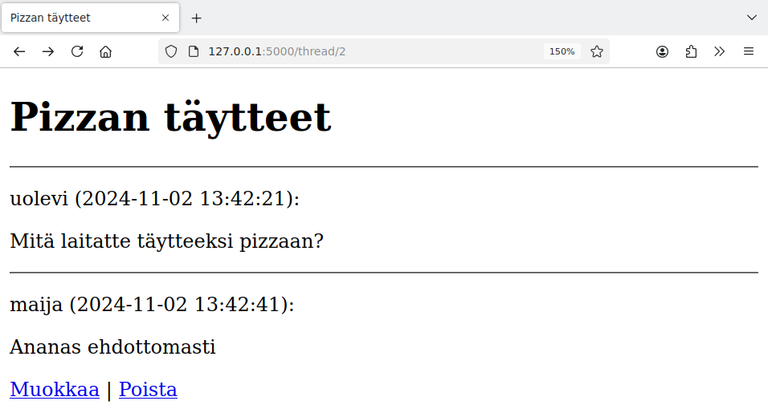
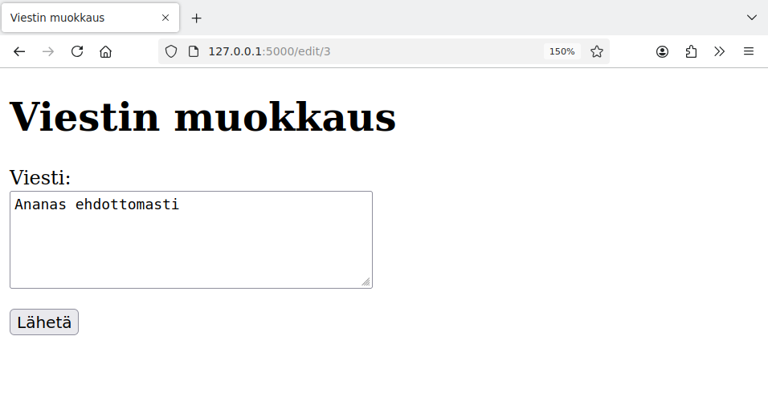
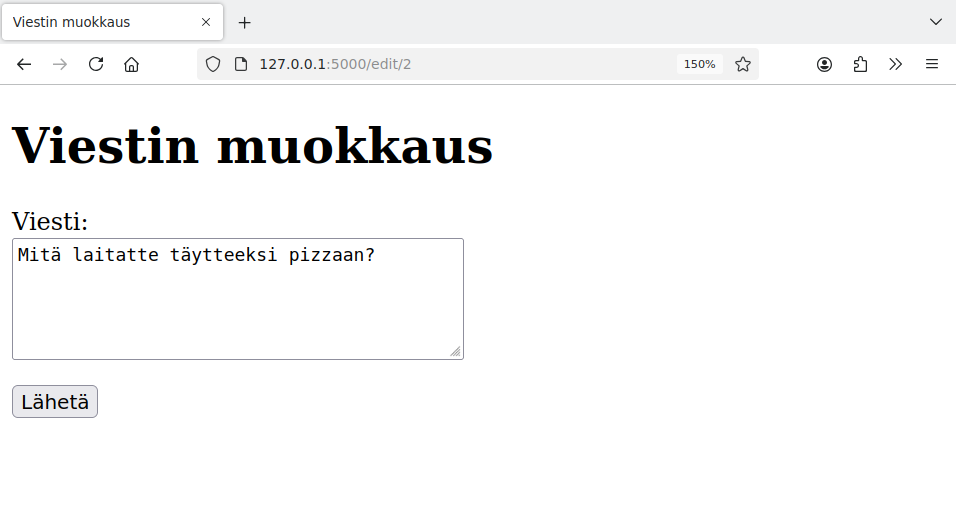
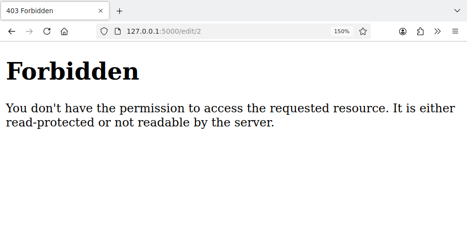
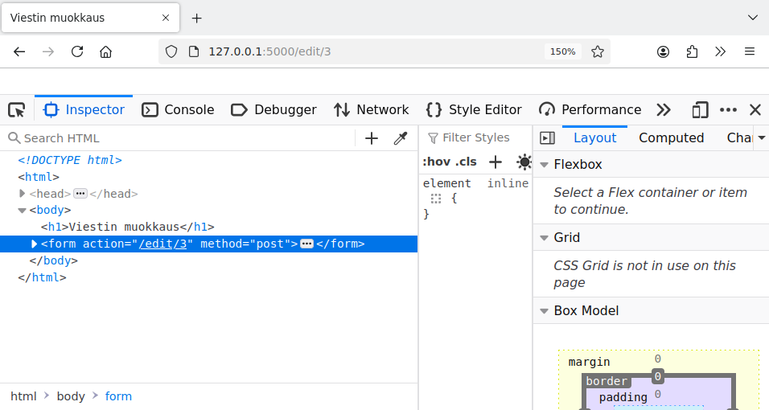
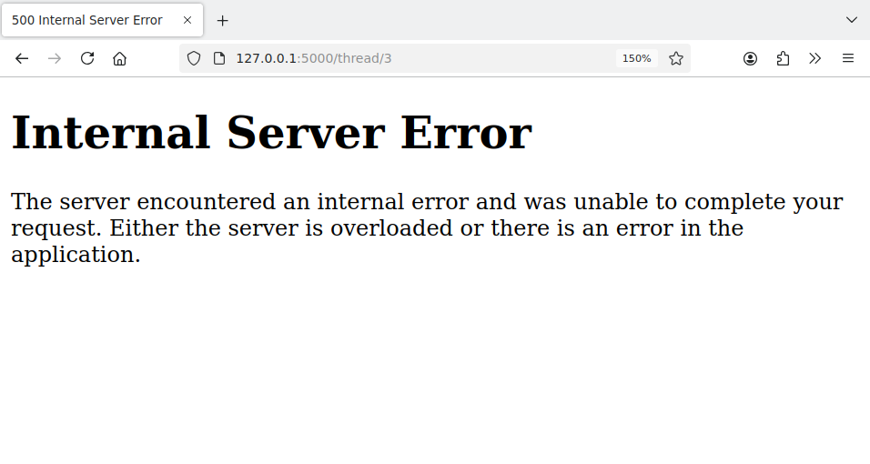
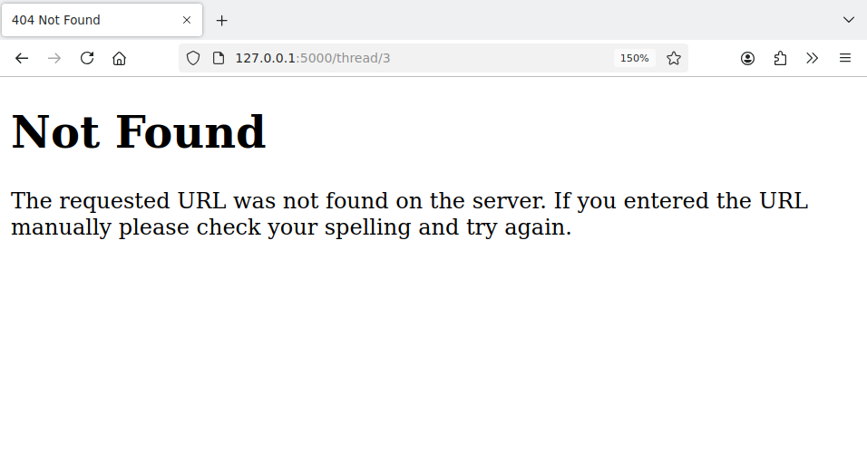
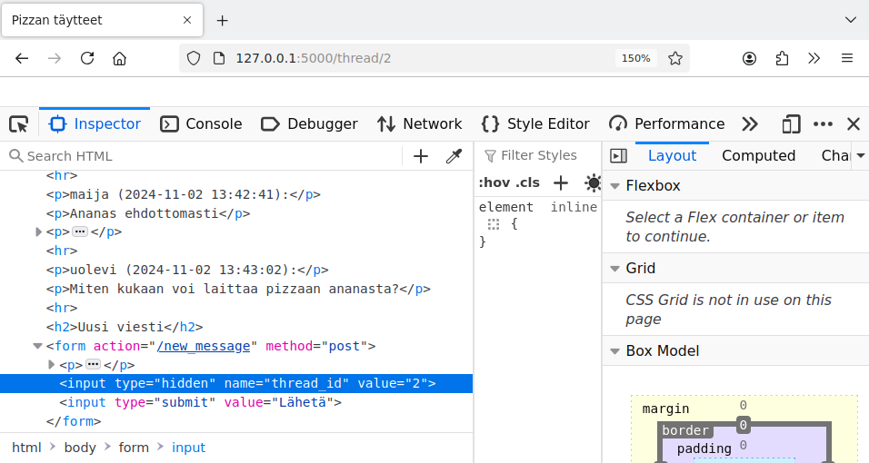
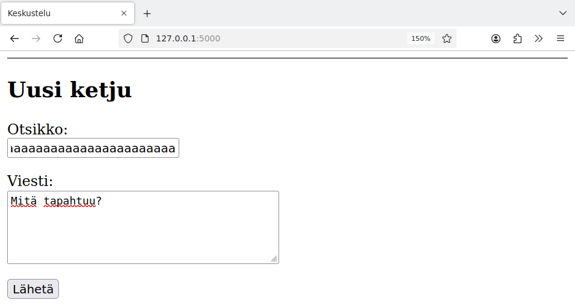
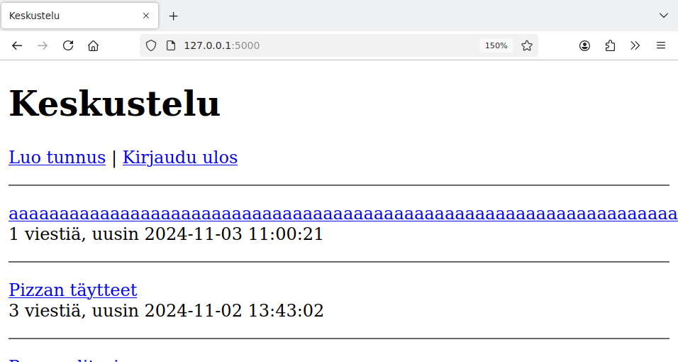

<style>
img {
    border-style: solid;
    border-color: black;
    border-width: 1px;
    width: 80%;
    margin-top: 40px;
    margin-bottom: 40px;    
}
</style>

# 5. Oikeudet ja syötteet

Edellisessä osassa tehty esimerkkisovellus vaikuttaa päältä päin toimivalta, mutta sovelluksessa on vielä vakavia puutteita.

Ongelmana on, että sovellus olettaa, että sitä käytetään tarkoitetulla tavalla: käyttäjä seuraa sovelluksen linkkejä, käyttää siinä olevia lomakkeita ja syöttää lomakkeisiin järkevää tietoa. Sovellus ei kuitenkaan ota huomioon sitä, että kaikki käyttäjät eivät välttämättä toimi tällä tavalla.

Käymme seuraavaksi läpi sovelluksessa olevia puutteita sekä tapoja, joiden avulla ongelmat voidaan korjata.

## Ongelma 1

Sovelluksessa on tarkoitus, että käyttäjä voi muokata tai poistaa viestejä, jotka hän on lähettänyt itse. Tätä varten sivupohja tarkastaa seuraavasti, milloin linkit muokkaamiseen ja poistamiseen näytetään käyttäjälle:

{: .code-title }
thread.html
```jinja
  
  <p>
    <a href="/edit/{{ message.id }}">Muokkaa</a> |
    <a href="/remove/{{ message.id }}">Poista</a>
  </p>
  
```

Tällainen tarkastus on kuitenkin riittämätön. Tarkastellaan tilannetta, jossa Maija on kirjautunut ja katsoo viestejä. Tässä näkyvät sinänsä oikein linkit viestin muokkaamiseen ja poistamiseen:



Muokkauslinkki vie seuraavalle sivulle:



Nyt kuitenkin ongelmana on, että Maija voi koettaa linkkien seuraamisen sijaan muuttaa itse sivun osoitetta. Tällä hetkellä Maija on sivulla `/edit/3` ja hän voi kokeilla, mitä tapahtuu muuttamalla id-numeroa. Esimerkiksi muuttamalla osoitteeksi `/edit/2` Maija päätyy muokkaamaan toista viestiä:



Tämä on vakava ongelma, koska Maija pääsee tällä tavalla muokkaamaan Uolevin lähettämää viestiä.

Korjaus ongelmaan on tarkastaa myös viestin muokkaamisen yhteydessä, että muokkaaja on tarkoitettu henkilö. Tarkastellaan koodia, joka näyttää muokkaussivun ja päivittää sivun kautta muokatun viestin tietokantaan:

{: .code-title }
app.py
```python
@app.route("/edit/<int:id>", methods=["GET", "POST"])
def edit_message(id):
    message = forum.get_message(id)

    if request.method == "GET":
        return render_template("edit.html", message=message)

    if request.method == "POST":
        content = request.form["content"]
        forum.update_message(message["id"], content)
```

Voimme täydentää funktion alkuosaa niin, että se tarkastaa käyttäjän oikeuden:

{: .code-title }
app.py
```python
from flask import abort

...

@app.route("/edit/<int:id>", methods=["GET", "POST"])
def edit_message(id):
    message = forum.get_message(id)
    if message["user_id"] != session["user_id"]:
        abort(403)
    ...
```

Nyt käsittelijä vertaa viestin lähettäjän ja kirjautuneen käyttäjän id-numeroa. Jos id-numerot eivät ole samat, käsittelijä kutsuu funktiota `abort(403)`, joka katkaisee sivupyynnön ja palauttaa HTTP-koodin 403 (Forbidden). Tämä kertoo käyttäjälle, että pääsy sivulle on kielletty:



Huomaa, että sama tarkastus estää sekä muokkaussivun näyttämisen (`GET`-metodi) että itse muokkauksen tekemisen lomakkeella (`POST`-metodi). Myös jälkimmäinen esto on tärkeä, koska käyttäjä voisi kiertää ensimmäisen eston muuttamalla lomakkeen käsittelijän osoitetta esimerkiksi selaimen kehittäjän työkalujen kautta:



Vastaava muutos tulee tehdä myös viestin poistamiseen. Siinä tarkastuksen voi toteuttaa samalla tavalla kuin viestin muokkaamisessa.

## Ongelma 2

Yleisemmin sovelluksen tulee varautua siihen, että käyttäjä muuttaa minkä tahansa sivun osoitetta. Esimerkiksi käyttäjä voi kokeilla mennä katsomaan keskusteluketjua, jota ei ole olemassa:



Tässä keskustelualueella on kaksi ketjua (id-numerot 1 ja 2), mutta käyttäjä menee sivulle `/thread/3`, jossa id-numero on 3. Tämän seurauksena sivupyyntö aiheuttaa seuraavan virheen:

```console
...
  File "/tmp/app.py", line 19, in show_thread
    thread = forum.get_thread(id)
  File "/tmp/forum.py", line 13, in get_thread
    return db.query(sql, [id])[0]
IndexError: list index out of range
```

Tämä virhe tulee funktiossa `get_thread`:

{: .code-title }
forum.py
```python
def get_thread(id):
    sql = "SELECT id, title FROM threads WHERE id = ?"
    return db.query(sql, [id])[0]
```

Tässä koodi olettaa, että tietokannasta löytyy ketju annetulla id-numerolla. Tässä tilanteessa kuitenkin käyttäjä on antanut väärän id-numeron eikä ketjua ole olemassa. Tämän takia kyselyn tuloksena oleva lista on tyhjä ja yritys viitata listan indeksiin 0 aiheuttaa virheen.

Koodin voi korjata esimerkiksi seuraavasti:

{: .code-title }
forum.py
```python
def get_thread(id):
    sql = "SELECT id, title FROM threads WHERE id = ?"
    result = db.query(sql, [id])
    return result[0] if result else None
```

Tämän korjauksen jälkeen funktio toimii muuten kuten ennenkin, mutta palauttaa `None`, jos haku tietokannasta antaa tyhjän tuloksen.

Katsotaan sitten sivupyynnön käsittelijää, joka kutsuu äskeistä funktiota:

{: .code-title }
app.py
```python
@app.route("/thread/<int:id>")
def show_thread(id):
    thread = forum.get_thread(id)
    messages = forum.get_messages(id)
    return render_template("thread.html", thread=thread, messages=messages)
```

Voimme muuttaa tätä funktiota seuraavasti:

{: .code-title }
app.py
```python
@app.route("/thread/<int:id>")
def show_thread(id):
    thread = forum.get_thread(id)
    if not thread:
        abort(404)
    messages = forum.get_messages(id)
    return render_template("thread.html", thread=thread, messages=messages)
```

Nyt jos ketjua ei ole olemassa, käsittelijä katkaisee sivupyynnön ja palauttaa HTTP-koodin 404 (Not Found). Tämä antaa käyttäjälle viestin, että sivua ei ole olemassa:



Vastaava korjaus tulee tehdä myös funktioon `get_message` sekä sitä kutsuviin käsittelijöihin viestin muokkauksen ja poiston yhteydessä.

## Ongelma 3

Sovelluksessa on vielä toinenkin toinen ongelma liittyen ketjujen id-numeroihin. Käyttäjä voi kokeilla muuttaa ketjun id-numeron sisältävää piilokenttää lomakkeessa, jolla lähetetään vastaus ketjuun:



Tässä tapauksessa käyttäjä voi esimerkiksi muuttaa kentän arvoksi 3 ja yrittää lähettää viestin olemattomaan ketjuun. Tämä aiheuttaa seuraavan virheen koodissa:

```console
...
  File "/tmp/app.py", line 40, in new_message
    forum.add_message(content, user_id, thread_id)
  File "/tmp/forum.py", line 37, in add_message
    db.execute(sql, [content, user_id, thread_id])
  File "/tmp/db.py", line 12, in execute
    result = db.execute(sql, params)
sqlite3.IntegrityError: FOREIGN KEY constraint failed
```

Tässä SQLite on havainnut, että tauluun `messages` yritetään lisätä rivi, jonka `thread_id` viittaa taulun `threads` olemattomaan riviin. Tietokanta valvoo viittausten eheyttä eikä rivin lisääminen onnistu.

Tämä estää sinänsä viestin lähetyksen, koska tulee "Internal Server Error". Ei ole kuitenkaan hyvä, että sovellus kaatuu hallitsemattomasti. Voimme käsitellä virheen seuraavasti viestin lähetyksen yhteydessä:

{: .code-title }
app.py
```python
@app.route("/new_message", methods=["POST"])
def new_message():
    ...
    try:
        forum.add_message(content, user_id, thread_id)
    except:
        abort(403)
    return redirect("/thread/" + str(thread_id))
```

Nyt jos viestin lisääminen ei onnistu, käsittelijä katkaisee sivupyynnön ja palauttaa HTTP-koodin 403 (Forbidden).

## Ongelma 4

Käyttäjä voi aloittaa viestin kirjoittamisen kirjautuneena mutta kirjautua ulos esimerkiksi selaimen toisessa välilehdessä ennen viestin lähettämistä. Mitä tapahtuu, kun käyttäjä tämän jälkeen lähettää viestin lomakkeella?

Viestin lähetyksen tuloksena on "Internal Server Error" ja lokiin ilmestyy seuraava virheilmoitus:

```console
...
  File "/tmp/app.py", line 37, in new_message
    user_id = session["user_id"]
...
KeyError: 'user_id'
```

Tämä virhe tulee koodissa rivillä, jossa luodaan muuttuja `user_id`:

{: .code-title }
app.py
```python
@app.route("/new_message", methods=["POST"])
def new_message():
    content = request.form["content"]
    user_id = session["user_id"]
    ...
```

Koska käyttäjä on kirjautunut ulos sovelluksesta, ei ole enää olemassa istuntoon liittyvää arvoa `session["user_id"]`.

Sovelluksessa olisi hyvä pystyä monessakin tilanteessa varmistamaan, että käyttäjä on kirjautuneena. Tähän tarkoitukseen soveltuu seuraava funktio, joka keskeyttää sivupyynnön, jos käyttäjä ei ole kirjautuneena:

{: .code-title }
app.py
```python
def require_login():
    if "user_id" not in session:
        abort(403)
```

Voimme kutsua tätä funktiota uuden viestin lähetyksessä näin:

{: .code-title }
app.py
```python
@app.route("/new_message", methods=["POST"])
def new_message():
    require_login()

    content = request.form["content"]
    user_id = session["user_id"]
    ...
```

Tämän jälkeen käyttäjä ei pysty enää lähettämään viestiä, jos hän ei ole kirjautuneena. Vastaava muutos tulee tehdä kaikkiin käsittelijöihin, joissa käyttäjän tulee olla kirjautuneena.

{: .note-title }
Dekoraattori
<div class="note" markdown="1">

Kirjautumisen vaatimisen voisi toteuttaa myös määrittelemällä funktion eteen tulevan dekoraattorin, joka tarkastaa kirjautumisen. Tällöin funktion voisi kirjoittaa tähän tapaan:

```python
@app.route("/new_message", methods=["POST"])
@require_login
def new_message():
    ...
```

Tässä `@require_login` on dekoraattori, joka tarkastaa kirjautumisen. Lisätietoa tällaisen dekoraattorin tekemisestä on [Flaskin dokumentaatiossa](https://flask.palletsprojects.com/en/stable/patterns/viewdecorators/).

</div>

## Ongelma 5

Tällä hetkellä käyttäjä voi kirjoittaa lomakkeisiin mitä tahansa ja käyttäjän lähettämät tiedot tallennetaan tietokantaan ja näytetään sovelluksessa. Tämä voi aiheuttaa ongelmia, jos tiedon määrä on poikkeavan suuri.

Käyttäjä voi esimerkiksi luoda uuden ketjun, jonka otsikossa on tuhat a-kirjainta:



Selkeästi ei ole järkevää, että ketjulla voi olla näin pitkä otsikko. Tämä sekoittaa myös koko sovelluksen ulkoasun:



Korjaus ongelmaan on rajoittaa syötteiden kokoa lomakkeissa. Voimme käyttää tähän `maxlength`-attribuuttia seuraavaan tapaan:

{: .code-title }
index.html
```jinja
    <p>
      Otsikko:<br />
      <input type="text" name="title" maxlength="100" />
    </p>
    <p>
      Viesti:<br />
      <textarea name="content" rows="5" cols="40" maxlength="5000"></textarea>
    </p>
```

Tämän muutoksen jälkeen lomake pyrkii rajoittamaan syötteen pituutta niin, että otsikossa on enintään 100 merkkiä ja viestissä on enintään 5000 merkkiä.

Tämä ei ole kuitenkaan vielä yksinään riittävä korjaus, koska käyttäjä voi jälleen esimerkiksi muuttaa rajoja selaimen kehittäjän työkalujen avulla. Rajat tulee tarkastaa myös sovelluksen koodissa ennen tiedon lisäämistä tietokantaan:

{: .code-title }
app.py
```python
@app.route("/new_thread", methods=["POST"])
def new_thread():
    ...
    title = request.form["title"]
    content = request.form["content"]
    if len(title) > 100 or len(content) > 5000:
        abort(403)
    ...
```

Vastaavat muutokset tulee tehdä kaikkiin sovelluksen lomakkeisiin, jossa tietokantaan tallennetaan käyttäjän antamaa tietoa.

---

Tämän osan muutosten jälkeen monta aukkoa sovelluksessa on tukittu ja sovellus toimii selvästi paremmin kuin ennen. Tässä on sovelluksen korjattu versio:

* [https://github.com/hy-tikawe/keskustelu_v2](https://github.com/hy-tikawe/keskustelu_v2)

Palaamme kuitenkin sovelluksen tietoturvaan vielä materiaalin osassa 8.
