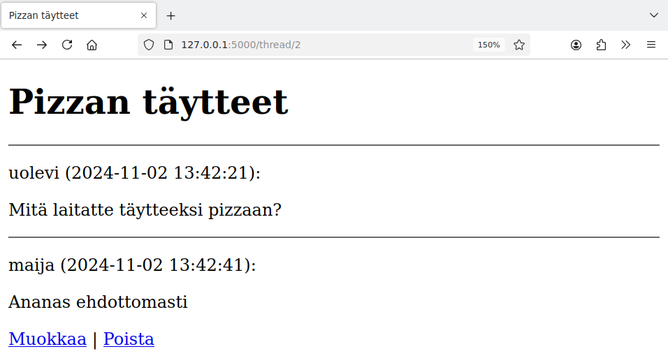
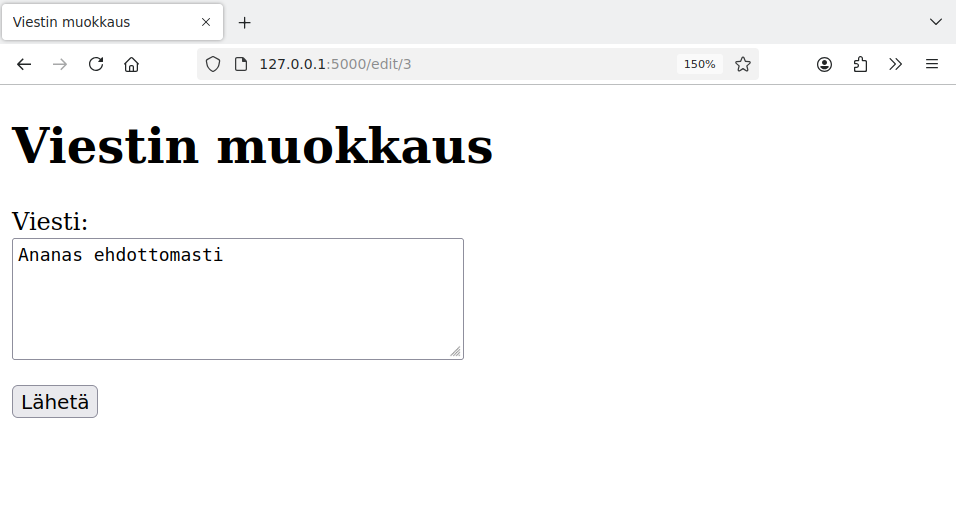
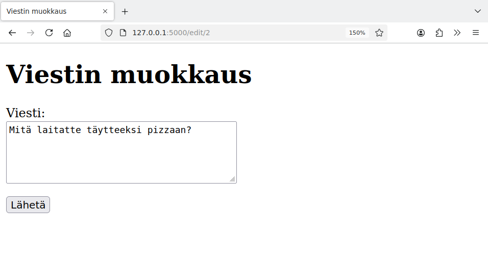
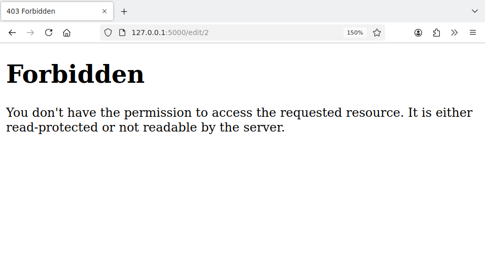

<style>
img {
    border-style: solid;
    border-color: black;
    border-width: 1px;
    width: 80%;
    margin-top: 40px;
    margin-bottom: 40px;    
}
</style>

# 5. Oikeudet ja syötteet

Edellisessä osassa tehty esimerkkisovellus vaikuttaa päältä päin toimivalta, mutta sovelluksessa on vielä vakavia puutteita.

Ongelmana on, että sovellus olettaa, että sitä käytetään tarkoitetulla tavalla: käyttäjä seuraa sovelluksen linkkejä, käyttää siinä olevia lomakkeita ja syöttää lomakkeisiin järkevää tietoa. Sovellus ei kuitenkaan ota huomioon sitä, että kaikki käyttäjät eivät välttämättä toimi tällä tavalla.

Käymme seuraavaksi läpi sovelluksessa olevia puutteita sekä tapoja, joiden avulla ongelmat voidaan korjata.

## Oikeuksien tarkastaminen

Sovelluksen on tarkoitus toimia niin, että käyttäjä voi muokata tai poistaa viestejä, jotka ovat hänen itse lähettämiään. Tätä varten sivupohja tarkastaa seuraavasti, milloin linkit muokkaamiseen ja poistamiseen näytetään käyttäjälle:

{: .code-title }
thread.html
```jinja
  
  <p>
    <a href="/edit/{{ message.id }}">Muokkaa</a> |
    <a href="/remove/{{ message.id }}">Poista</a>
  </p>
  
```

Tällainen tarkastus on kuitenkin riittämätön. Tarkastellaan tilannetta, jossa Maija on kirjautunut ja katsoo viestejä. Tässä näkyvät sinänsä oikein linkit viestin muokkaamiseen ja poistamiseen:



Viestin muokkaussivu näyttää tältä:



Nyt kuitenkin ongelmana on, että Maija voi koettaa linkkien seuraamisen sijaan muuttaa itse sivun osoitetta. Tällä hetkellä Maija on sivulla `/edit/3` ja hän voi kokeilla, mitä tapahtuu muuttamalla id-numeroa. Esimerkiksi muuttamalla osoitteeksi `/edit/2` Maija päätyy seuraavalle sivulle:



Tämä on vakava ongelma, koska Maija pääsee tällä tavalla muokkaamaan Uolevin lähettämää viestiä.

Korjaus ongelmaan on tarkastaa myös viestin muokkaamisen yhteydessä, että muokkaaja on tarkoitettu henkilö. Tämä voidaan toteuttaa seuraavasti:

{: .code-title }
app.py
```python
from flask import abort

...

@app.route("/edit/<int:id>", methods=["GET", "POST"])
def edit_message(id):
    message = forum.get_message(id)
    if message["user_id"] != session["user_id"]:
        abort(403)

    if request.method == "GET":
        return render_template("edit.html", message=message)

    if request.method == "POST":
        content = request.form["content"]
        forum.update_message(message["id"], content)
        return redirect("/thread/" + str(message["thread_id"]))        
```

Nyt käsittelijän alussa on tarkastus, joka vertaa viestin lähettäjän ja kirjautuneen käyttäjän id-numeroa. Jos id-numerot eivät ole samat, käsittelijä kutsuu funktiota `abort(403)`, joka katkaisee sivupyynnön ja palauttaa HTTP-koodin 403. Tämä antaa käyttäjälle viestin, että pääsy sivulle on kielletty:



Huomaa, että sama tarkastus estää sekä muokkaussivun näyttämisen väärälle käyttäjälle (`GET`-metodi) että itse muokkauksen tekemisen lomakkeella (`POST`-metodi). Myös jälkimmäinen esto on tärkeä, koska ilman sitä käyttäjä voisi kokeilla lähettää palvelimelle väärin tehdyn `POST`-pyynnön, vaikka hänellä ei ole pääsyä varsinaiselle muokkaussivulle.

Vastaava muutos tulee tehdä myös viestin poistamiseen. Siinä tarkastuksen voi toteuttaa samalla tavalla.
