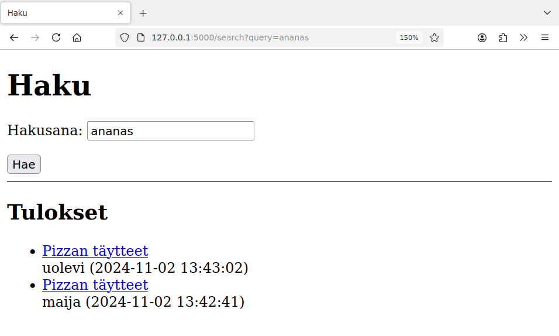
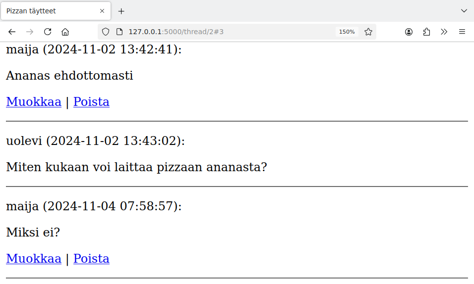
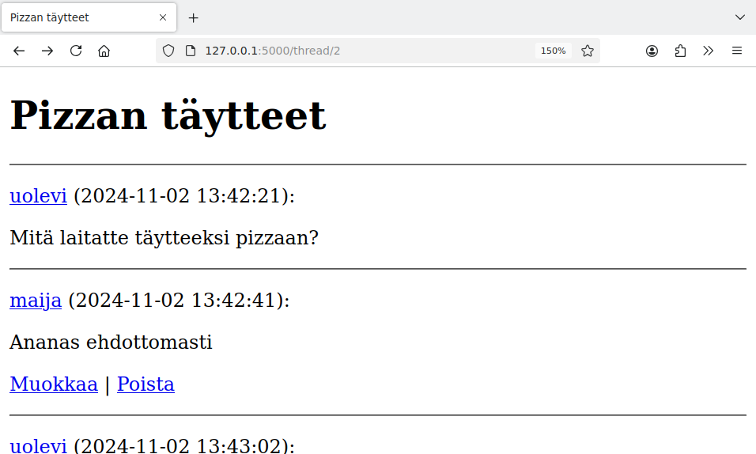
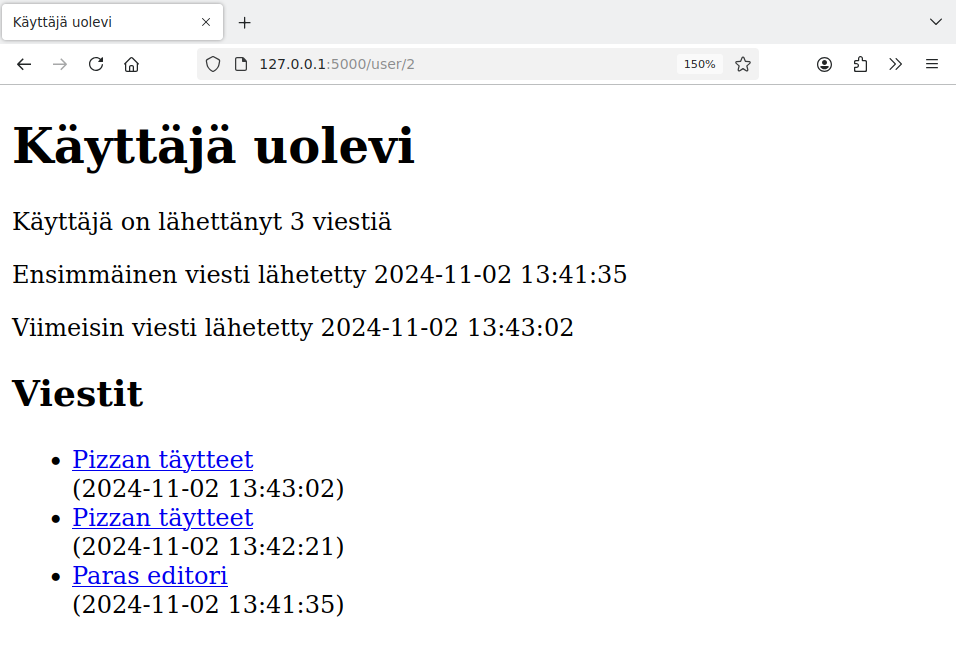
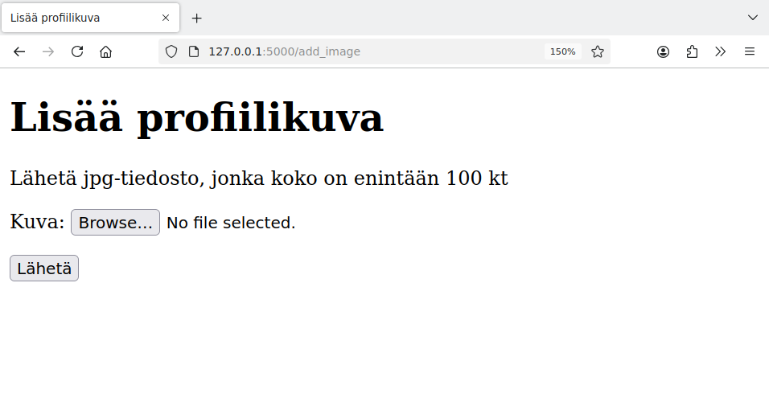
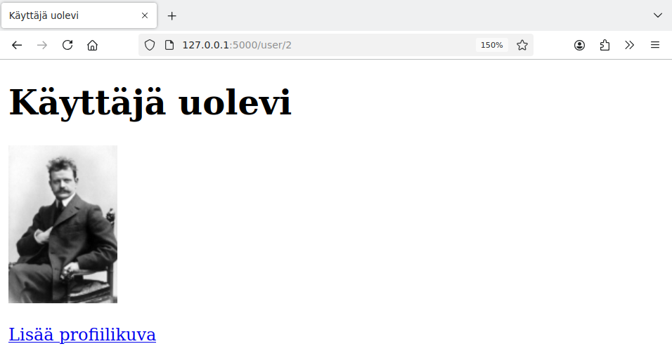

# 6. Lisää toimintoja

Tässä osassa toteutamme sovellukseen kaksi uutta toimintoa, jotka esittelevät lisää web-sovelluksiin liittyviä tekniikoita.

Toteutamme ensin hakutoiminnon, jonka avulla käyttäjä pystyy etsimään keskustelualueella olevia viestejä hakusanan avulla.

Tämän jälkeen toteutamme käyttäjäsivun, joka näyttää yhteenvedon käyttäjän lähettämistä viesteistä. Käyttäjä voi myös lisätä profiilikuvan.

## Hakutoiminto

Hakutoiminto tulee näyttämään tältä:



Tähän mennessä olemme toteuttaneet lomakkeiden lähetyksen `POST`-metodilla, mutta hakutoiminnossa käytämme `GET`-metodia. Tavallinen periaate on, että `POST`-metodia käytetään, kun lomake muuttaa tietokannan tietoa, ja `GET`-metodia käytetään, kun lomakkeella vain haetaan tietoa tietokannasta.

Metodi `GET` näkyy siinä, että lomakkeeseen kirjoitettu hakusana tulee näkyviin sivun osoitteeseen. Tässä lomakkeeseen on kirjoitettu sana "ananas", joka näkyy lomakkeen lähettämisen jälkeen sivun osoitteessa `search?query=ananas`. Itse asiassa haun voisi tehdä myös ilman lomaketta muuttamalla suoraan sivun osoitetta.

Seuraava funktio muodostaa sivun:

{: .code-title }
app.py
```python
@app.route("/search")
def search():
    query = request.args.get("query")
    results = forum.search(query) if query else []
    return render_template("search.html", query=query, results=results)
```

Koska käytössä on metodi `GET`, hakusana saadaan haettua metodilla `request.args.get`. Tässä `query` on samaan aikaan lomakkeen kentän nimi ja sivun osoitteessa olevan parametrin nimi.

Jos hakusana on annettu, suoritetaan haku tietokannasta:

{: .code-title }
forum.py
```python
def search(query):
    sql = """SELECT m.id message_id,
                    m.thread_id,
                    t.title thread_title,
                    m.sent_at,
                    u.username
             FROM threads t, messages m, users u
             WHERE t.id = m.thread_id AND
                   u.id = m.user_id AND
                   m.content LIKE ?
             ORDER BY m.sent_at DESC"""
    return db.query(sql, ["%" + query + "%"])
```

Tässä käytetään SQL:n operaattoria `LIKE`, jonka avulla voidaan etsiä tekstin osana olevaa sanaa. Merkki `%` hakusanan alussa ja lopussa tarkoittaa, että hakusanan ympärillä voi olla mitä tahansa tekstiä. Esimerkiksi `%ananas%` tarkoittaa, että tekstin osana tulee olla sana "ananas".

Sivupohjassa hakulomake näyttää seuraavalta:

{: .code-title }
index.html
```jinja
  <form action="/search" method="get">
    <p>
      Hakusana:
      
      <input type="text" name="query" value="{{ query }}" />
      
      <input type="text" name="query" />
      
    </p>
    <input type="submit" value="Hae" />
  </form>
```

Jos lomake on jo lähetetty ja hakusana on annettu, se näytetään tekstikentässä. Muussa tapauksessa tekstikenttä on tyhjä.

Seuraava koodi puolestaan näyttää haun tulokset:

{: .code-title }
index.html
```jinja
  
  <hr />
  <h2>Tulokset</h2>
  
  <ul>
  
    <li>
      <a href="/thread/{{ result.thread_id }}">
        {{ result.thread_title }}
      </a>
      <br />
      {{ result.username }} ({{ result.sent_at }})
    </li>  
  
  </ul>
  
```

## Sivun kohdistaminen

Tällä hetkellä hakutuloksessa on linkki keskusteluketjuun. Jos ketjussa on paljon viestejä, käyttäjän voi olla vaikeaa paikantaa, missä viestissä esiintyy haettu sana. Voimme parantaa asiaa lisäämällä kohdistuksen viestiin.

Lisäämme ensin ketjussa näkyviin viesteihin id-attribuutin:

{: .code-title }
thread.html
```jinja
  
  <p id="{{ message.id }}">
    {{ message.username }} ({{ message.sent_at }}):
  </p>
```

Tämän muutoksen jälkeen viestiin voi kohdistaa antamalla viestin id-numero sivun osoitteessa `#`-merkin jälkeen. Esimerkiksi osoite `/thread/2#3` tarkoittaa, että ketjun id-numero on 2 ja kohdistettavan viestin id-numero on 3. Sivun lähdekoodissa viestin id-numero näkyy näin:

```html
  <p id="3">
    maija (2024-11-02 13:42:41):
  </p>
  <p>
    Ananas ehdottomasti
  </p>
```

Kohdistus näyttää käytännössä tältä:



Koska linkissä on kohdistus viestiin, selain vierittää sivua alaspäin niin, että kyseinen viesti näkyy sivun ylälaidassa.

Nyt kun viesteihin on mahdollista kohdistaa, muutetaan vielä hakusivun koodia niin, että viestin id-numero lisätään hakutuloksen linkkiin:

{: .code-title }
index.html
```jinja
      <a href="/thread/{{ result.thread_id }}#{{ result.message_id }}">
        {{ result.thread_title }}
      </a>
```

## Käyttäjäsivu

Tehdään seuraavaksi sivu, joka näyttää yhteenvedon käyttäjän viesteistä. Ideana on, että käyttäjän nimi on tästä lähtien linkki käyttäjäsivulle:



Esimerkiksi Uolevin nimestä painamalla pääsee seuraavalle sivulle:



Seuraava funktio muodostaa sivun:

{: .code-title }
app.py
```python
@app.route("/user/<int:user_id>")
def show_user(user_id):
    user = users.get_user(user_id)
    if not user:
        abort(404)
    messages = users.get_messages(user_id)
    return render_template("user.html", user=user, messages=messages)
```

Tässä kutsutaan kahta uutta funktiota, jotka hakevat käyttäjän nimen sekä viestihistorian tietokannasta:

{: .code-title }
users.py
```python
def get_user(user_id):
    sql = "SELECT username FROM users WHERE id = ?"
    result = db.query(sql, [user_id])
    return result[0] if result else None

def get_messages(user_id):
    sql = """SELECT m.id,
                    m.thread_id,
                    t.title thread_title,
                    m.sent_at
             FROM threads t, messages m
             WHERE t.id = m.thread_id AND
                   m.user_id = ?
             ORDER BY m.sent_at DESC"""
    return db.query(sql, [user_id])
```

Seuraava koodi näyttää käyttäjän nimen ja tiedot viesteistä:

{: .code-title }
user.html
```jinja
  <h1>Käyttäjä {{ users.username }}</h1>

  <p>
    Käyttäjä on lähettänyt {{ messages | count }} viestiä
  </p>

  
  <p>
    Ensimmäinen viesti lähetetty {{ messages[-1].sent_at }}
  </p>
  <p>
    Viimeisin viesti lähetetty {{ messages[0].sent_at }}
  </p>
  
```

Jinja muistuttaa syntaksiltaan Pythonia, mutta kuitenkaan syntaksi `{{ len(messages) }}` ei toimi viestien määrän laskemiseen. Jinjassa on tähän oma syntaksi `{{ messages | count }}`. Sen sijaan ensimmäisen ja viimeisen viestin hakeminen `[]`-syntaksilla toimii samalla tavalla kuin Pythonissa.

Seuraava koodi muodostaa listan käyttäjän viesteistä samaan tapaan kuin hakusivulla:

{: .code-title }
user.html
```python
  <ul>
  
    <li>
      <a href="/thread/{{ message.thread_id }}#{{ message.id }}">
        {{ message.thread_title }}
      </a>
      <br />
      ({{ message.sent_at }})
    </li>  
  
  </ul>
```

## Profiilikuva

Tehdään vielä toiminto, jonka avulla käyttäjä pystyy lähettämään profiilikuvan. Kuvan voi lähettää seuraavan lomakkeen kautta:



Lähettämisen jälkeen kuva tulee näkyville käyttäjäsivulle:



Muutetaan käyttäjän kuvaa varten tietokantaa niin, että taulussa `users` on uusi sarake `image`. Sarakkeeseen tallennetaan kuvatiedoston sisältö binääridatana, jolloin sopiva tyyppi on `BLOB`.

```sql
CREATE TABLE users (
    id INTEGER PRIMARY KEY,
    username TEXT UNIQUE,
    password_hash TEXT,
    image BLOB
);
```

Olemassa olevaan tauluun sarakkeen voi lisätä näin:

```sql
ALTER TABLE users ADD COLUMN image BLOB;
```

Seuraava käsittelijä hoitaa kuvan lisäämisen:

{: .code-title }
app.py
```python
@app.route("/add_image", methods=["GET", "POST"])
def add_image():
    require_login()

    if request.method == "GET":
        return render_template("add_image.html")

    if request.method == "POST":
        file = request.files["image"]
        if not file.filename.endswith(".jpg"):
            return "VIRHE: väärä tiedostomuoto"

        image = file.read()
        if len(image) > 100 * 1024:
            return "VIRHE: liian suuri kuva"

        user_id = session["user_id"]
        users.update_image(user_id, image)
        return redirect("/user/" + str(user_id))
```

Jos metodi on `GET`, koodi näyttää sivun, jonka kautta käyttäjä voi lähettää kuvan.

Jos metodi on `POST`, koodi käsittelee käyttäjän lähettämän kuvan. Koodi tarkastaa ensin, että kuvatiedoston pääte on `.jpg` ja koko on enintään 100 kt. Tämän jälkeen koodi tallentaa kuvadatan tietokantaan:

{: .code-title }
users.py
```python
def update_image(user_id, image):
    sql = "UPDATE users SET image = ? WHERE id = ?"
    db.execute(sql, [image, user_id])
```

Käyttäjä lähettää kuvan seuraavan lomakkeen kautta:

{: .code-title }
add_image.html
```jinja
  <form action="/add_image" method="post" enctype="multipart/form-data">
    <p>
      Kuva: <input type="file" name="image" accept=".jpg" />
    </p>
    <input type="submit" value="Lähetä" />
  </form>
```

Koska lomakkeen kautta lähetetään tiedosto, `form`-elementillä tulee olla attribuutti `enctype="multipart/form-data"`. Lomakkeessa on tiedoston lähetyskenttä (`input type="file"`), jonka kautta käyttäjä voi valita haluamansa tiedoston tietokoneeltaan. Attribuutti `accept` ohjaa käyttäjää valitsemaan tiedoston, jonka pääte on `.jpg`, mutta tämä asia tulee tarkastaa myös palvelimella.

Lähetetyn kuvan pystyy katsomaan sivulta `/image/id`, jossa `id` on käyttäjän id-numero. Seuraava koodi muodostaa sivun:

{: .code-title }
app.py
```python
from flask import make_response

...

@app.route("/image/<int:user_id>")
def show_image(user_id):
    image = users.get_image(user_id)
    if not image:
        abort(404)

    response = make_response(bytes(image))
    response.headers.set("Content-Type", "image/jpeg")
    return response
```

Koodi hakee kuvadatan tietokannasta ja lähettää sen selaimelle. Tässä käytetään Flaskin funktiota `make_response`, joka muodostaa kuvadatasta sivupyynnön vastauksen. Sisällön tyypiksi asetetaan `image/jpeg`, jotta selain osaa käsitellä datan kuvana.

Muutetaan vielä funktiota `get_user` niin, että se palauttaa myös käyttäjän id-numeron sekä tiedon siitä, onko sarake `image` asetettu:

{: .code-title }
users.py
```python
def get_user(user_id):
    sql = """SELECT id, username, image IS NOT NULL has_image
             FROM users
             WHERE id = ?"""
    result = db.query(sql, [user_id])
    return result[0] if result else None
```

Tässä kyselyssä tulostaulun kolmas sarake `has_image` kertoo, onko sarakkeen `image` arvo jotain muuta kuin `NULL` eli onko käyttäjä lisännyt kuvansa.

Tämän jälkeen voimme näyttää kuvan käyttäjäsivulla näin:

{: .code-title }
user.html
```python
  
  
  
```

---

Tässä on sovelluksen uusin versio, johon on lisätty tämän osan muutokset:

* [https://github.com/hy-tikawe/keskustelu_v3](https://github.com/hy-tikawe/keskustelu_v3)
