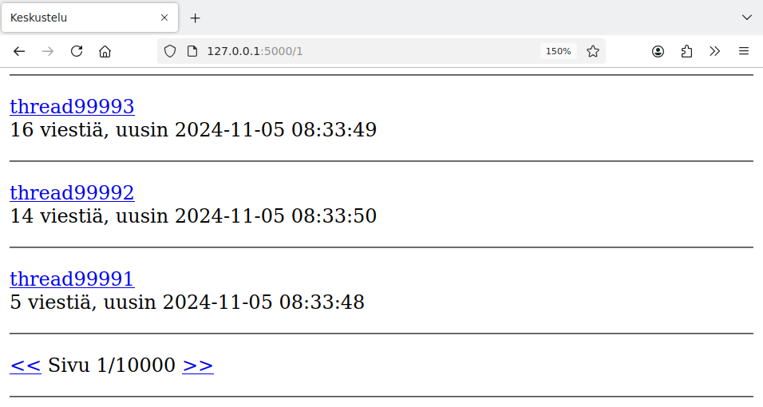

# 7. Suuri tietomäärä

Usein web-sovelluksen kehityksen aikana sovelluksen tietokannassa on vain vähän tietoa. Esimerkiksi tähän mennessä olemme testanneet keskustelualuetta niin, että siinä on vain muutamia käyttäjiä, ketjuja ja viestejä.

Vaikka sovellus toimisi hyvin pienellä tietomäärällä, tilanne saattaa muuttua suurella tietomäärällä. Tavallinen ongelma on, että sovelluksen toiminta muuttuu hitaaksi, kun tietokannassa on paljon tietoa.

Yksi tapa testata sovelluksen toimintaa suurella tietomäärällä on luoda testidataa, jossa tietokannan tauluissa on paljon rivejä. Tässä osassa testaamme keskustelualueen toimintaa tällaisella datalla.

## Testidatan luominen

Seuraava Python-skripti luo tietokantaan testiaineiston, jossa on seuraavat ominaisuudet:

* Käyttäjien määrä on tuhat
* Ketjujen määrä on sata tuhatta
* Viestien määrä on miljoona
* Jokaiselle viestille valitaan satunnaisesti käyttäjä ja ketju

{: .code-title }
seed.py
```python
import random
import sqlite3

db = sqlite3.connect("database.db")

db.execute("DELETE FROM users")
db.execute("DELETE FROM threads")
db.execute("DELETE FROM messages")

user_count = 1000
thread_count = 10**5
message_count = 10**6

for i in range(1, user_count + 1):
    db.execute("INSERT INTO users (username) VALUES (?)",
               ["user" + str(i)])

for i in range(1, thread_count + 1):
    db.execute("INSERT INTO threads (title) VALUES (?)",
               ["thread" + str(i)])

for i in range(1, message_count + 1):
    user_id = random.randint(1, user_count)
    thread_id = random.randint(1, thread_count)
    db.execute("""INSERT INTO messages (content, sent_at, user_id, thread_id)
                  VALUES (?, datetime('now'), ?, ?)""",
               ["message" + str(i), user_id, thread_id])

db.commit()
db.close()
```

## Sivutus

Testidatan luomisen jälkeen ensimmäinen havainto sovelluksesta on, että yritys mennä etusivulle saa selaimen jumiutumaan. Syynä on, että sovellus yrittää näyttää kaikki tietokannassa olevat sata tuhatta ketjua etusivulla.

Kun tietokannassa on paljon tietoa, sovelluksen sivut kannattaa toteuttaa niin, että yhdellä sivulla näkyvän sisällön määrä on rajoitettu. Etusivulla hyvä ratkaisu on lisätä ketjulistaan sivutus, joka näyttää kerrallaan vain osan ketjuista.

Voimme lisätä sivutuksen etusivun käsittelijään seuraavasti:

{: .code-title }
app.py
```python
@app.route("/")
@app.route("/<int:page>")
def index(page=1):
    page_size = 10
    thread_count = forum.thread_count()
    page_count = math.ceil(thread_count / page_size)
    page_count = max(page_count, 1)

    if page < 1:
        return redirect("/1")
    if page > page_count:
        return redirect("/" + str(page_count))

    threads = forum.get_threads(page, page_size)
    return render_template("index.html", page=page, page_count=page_count, threads=threads)
```

Tässä etusivun osoitteessa on uusi valinnainen parametri `page`, joka ilmaisee sivunumeron. Esimerkiksi osoite `/5` tarkoittaa sivua 5. Jos sivua ei anneta, se on oletuksena 1 eli osoitteet `/` ja `/1` tarkoittavat samaa.

Muuttuja `page_size` ilmaisee, montako ketjua näytetään yhdellä sivulla. Muuttujaan `thread_count` haetaan tietokannasta ketjujen yhteismäärä. Näiden tietojen avulla lasketaan sivujen yhteismäärä muuttujaan `page_count`. Tässä on pyöristys ylöspäin (`math.ceil`), jotta kaava toimii oikein, kun viestit eivät jakaudu tasan sivuille. Lisäksi halutaan, että sivujen määrä on aina vähintään 1.

Jos parametrina annettu sivu on alle 1, käyttäjä ohjataan ensimmäiselle sivulle. Vastaavasti jos parametrina annettu sivu on suurempi kuin sivujen määrä, käyttäjä ohjataan viimeiselle sivulle.

Funktio `get_threads` ottaa huomioon sivunumeron näin:

{: .code-title }
forum.py
```python
def get_threads(page, page_size):
    sql = """SELECT t.id, t.title, COUNT(m.id) total, MAX(m.sent_at) last
             FROM threads t, messages m
             WHERE t.id = m.thread_id
             GROUP BY t.id
             ORDER BY t.id DESC
             LIMIT ? OFFSET ?"""
    limit = page_size
    offset = page_size * (page - 1)
    return db.query(sql, [limit, offset])
```

Tämän SQL-kyselyn lopussa `LIMIT` ja `OFFSET` valitsevat halutut rivit tulostauluun. Sana `LIMIT` määrittelee, montako riviä haetaan, ja sana `OFFSET` määrittelee, mikä on ensimmäisen haettavan rivin kohta alkuperäisessä tulostaulussa.

Esimerkiksi jos sivu on 3, kyselyssä `LIMIT` on 10 ja `OFFSET` on 20. Tämä tarkoittaa, että alkuperäisestä tulostaulusta haetaan rivit kohdista 20, 21, ..., 29.

Sivupohjassa sivutus näkyy siinä, että ketjulistan alla näytetään sivunumero sekä linkit, joiden avulla käyttäjä voi siirtyä edelliselle ja seuraavalle sivulle:

{: .code-title }
index.html
```jinja
  <p>
    <a href="/{{ page - 1 }}">&lt;&lt;</a>
    Sivu {{ page }}/{{ page_count }}
    <a href="/{{ page + 1 }}">&gt;&gt;</a>
  </p>
  <hr />
```

Tässä `&lt;` ja `&gt;` ovat HTML-entiteettejä, jotka vastaavat merkkejä `<` ja `>`. Koska näitä merkkejä käytetään myös HTML-elementeissä, on hyvä tapa kirjoittaa merkit entiteetteinä, jotta selain tulkitsee ne varmasti oikein.

Sivutus näyttää käytännössä tältä:



## Ajanmittaus

Sivutuksen lisäämisen jälkeen etusivun pystyy lataamaan hyvin, mutta sen toiminta tuntuu melko hitaalta. Kun etsimme ketjuja sivujen kautta, jokaisen sivun kohdalla on selkeä viive ennen sivun sisällön näyttämistä.

Asian tutkimista varten voimme lisätä sovellukseen seuraavan koodin, joka mittaa, kuinka nopeasti sovellus vastaa sivupyyntöihin:

{: .code-title }
app.py
```python
import time
from flask import g

...

@app.before_request
def before_request():
    g.start_time = time.time()

@app.after_request
def after_request(response):
    elapsed_time = round(time.time() - g.start_time, 2)
    print("elapsed time:", elapsed_time, "s")
    return response
```

Funktiot `before_request` ja `after_request` suoritetaan sivupyynnön käsittelyn alussa ja lopussa. Funktio `before_request` tallentaa muistiin ajanhetken alussa, ja funktio `after_request` laskee kuluneen ajan ja tulostaa sen lokiin.

Kun lataamme ketjulistan viisi ensimmäistä sivua, lokiin tulevat seuraavat rivit:

```console
elapsed time: 0.87 s
127.0.0.1 - - [04/Nov/2024 17:07:49] "GET /1 HTTP/1.1" 200 -
elapsed time: 0.87 s
127.0.0.1 - - [04/Nov/2024 17:07:52] "GET /2 HTTP/1.1" 200 -
elapsed time: 0.87 s
127.0.0.1 - - [04/Nov/2024 17:07:53] "GET /3 HTTP/1.1" 200 -
elapsed time: 0.86 s
127.0.0.1 - - [04/Nov/2024 17:07:55] "GET /4 HTTP/1.1" 200 -
elapsed time: 0.86 s
127.0.0.1 - - [04/Nov/2024 17:07:57] "GET /5 HTTP/1.1" 200 -
```

Tästä näkee, että jokaisen sivupyynnön käsittely vie lähes sekunnin aikaa. Tästä syntyy viive, joka aiheuttaa häiritsevän kokemuksen käyttäjälle.

## Tietokannan indeksit

Tyypillinen syy web-sovelluksen hitauteen on, että sovellus suorittaa raskaita tietokantakyselyjä. Usein helppo korjaus ongelmaan on lisätä tietokantaan indeksejä, jotka tehostavat kyselyjä.

Tässä tapauksessa sovellus suorittaa seuraavan kyselyn etusivulla:

```sql
SELECT t.id, t.title, COUNT(m.id) total, MAX(m.sent_at) last
FROM threads t, messages m
WHERE t.id = m.thread_id
GROUP BY t.id
ORDER BY t.id DESC
LIMIT ? OFFSET ?
```

Tässä kyselyssä tietokanta kokoaa yhteen tietoa tauluista `threads` ja `messages`, koska jokaisen ketjun kohdalla ilmoitetaan viestien määrä sekä uusimman viestin lähetysaika. Kysely toimii tällä hetkellä hitaasti, koska tietokannassa ei ole tehokasta tapaa selvittää ketjun id-numeron perusteella, mitä viestejä ketjussa on.

Voimme korjata asian lisäämällä tietokantaan seuraavan indeksin:

```sql
CREATE INDEX idx_thread_messages ON messages (thread_id);
```

Tämä indeksi liittyy tauluun `messages` ja sen avulla voidaan tehokkaasti löytää taulusta rivit, joilla on tietty `thread_id`. Toisin sanoen indeksin avulla voidaan löytää tehokkaasti viestit, jotka kuuluvat tiettyyn ketjuun.

Tässä `idx_thread_messages` on indeksin nimi, joka kuvaa sen käyttötarkoitusta. Nimellä ei ole kuitenkaan vaikutusta siihen, miten indeksi toimii.

Indeksin lisäämisen jälkeen sovellus nopeutuu huomattavasti:

```console
elapsed time: 0.02 s
127.0.0.1 - - [04/Nov/2024 17:18:18] "GET /1 HTTP/1.1" 200 -
elapsed time: 0.01 s
127.0.0.1 - - [04/Nov/2024 17:18:20] "GET /2 HTTP/1.1" 200 -
elapsed time: 0.01 s
127.0.0.1 - - [04/Nov/2024 17:18:21] "GET /3 HTTP/1.1" 200 -
elapsed time: 0.01 s
127.0.0.1 - - [04/Nov/2024 17:18:21] "GET /4 HTTP/1.1" 200 -
elapsed time: 0.01 s
127.0.0.1 - - [04/Nov/2024 17:18:21] "GET /5 HTTP/1.1" 200 -
```

Ennen indeksin lisäämistä sivun lataaminen vei aikaa melkein sekunnin, mutta nyt sivupyynnöt ovat salamannopeita.

Lisätään vielä haastetta luomalla uusi suurempi testidata:

{: .code-title }
seed.py
```python
thread_count = 10**6
message_count = 10**7
```

Uudessa testidatassa on miljoona ketjua ja kymmenen miljoonaa viestiä, eli ketjujen ja viestien määrä on kymmenkertainen aiempaan verrattuna.

Tämän testidatan avulla indeksin hyöty näkyy vielä paremmin. Tehdään ensin mittaukset ilman indeksiä:

```console
elapsed time: 17.06 s
127.0.0.1 - - [04/Nov/2024 17:23:57] "GET /1 HTTP/1.1" 200 -
elapsed time: 16.99 s
127.0.0.1 - - [04/Nov/2024 17:24:18] "GET /2 HTTP/1.1" 200 -
elapsed time: 16.97 s
127.0.0.1 - - [04/Nov/2024 17:24:38] "GET /3 HTTP/1.1" 200 -
elapsed time: 16.88 s
127.0.0.1 - - [04/Nov/2024 17:24:57] "GET /4 HTTP/1.1" 200 -
elapsed time: 16.93 s
127.0.0.1 - - [04/Nov/2024 17:25:16] "GET /5 HTTP/1.1" 200 -
```

Tehdään sitten mittaukset indeksin kanssa:

```console
elapsed time: 0.02 s
127.0.0.1 - - [04/Nov/2024 17:26:11] "GET /1 HTTP/1.1" 200 -
elapsed time: 0.01 s
127.0.0.1 - - [04/Nov/2024 17:26:13] "GET /2 HTTP/1.1" 200 -
elapsed time: 0.01 s
127.0.0.1 - - [04/Nov/2024 17:26:14] "GET /3 HTTP/1.1" 200 -
elapsed time: 0.01 s
127.0.0.1 - - [04/Nov/2024 17:26:14] "GET /4 HTTP/1.1" 200 -
elapsed time: 0.01 s
127.0.0.1 - - [04/Nov/2024 17:26:15] "GET /5 HTTP/1.1" 200 -
```

Tällä testidatalla sivun lataaminen ilman indeksiä vie aikaa noin 17 sekuntia, mutta indeksin kanssa sivupyynnöt ovat edelleen salamannopeita.

---

Tässä on sovelluksen uusin versio, johon on lisätty tämän osan muutokset:

* [https://github.com/hy-tikawe/keskustelu_v4](https://github.com/hy-tikawe/keskustelu_v4)
