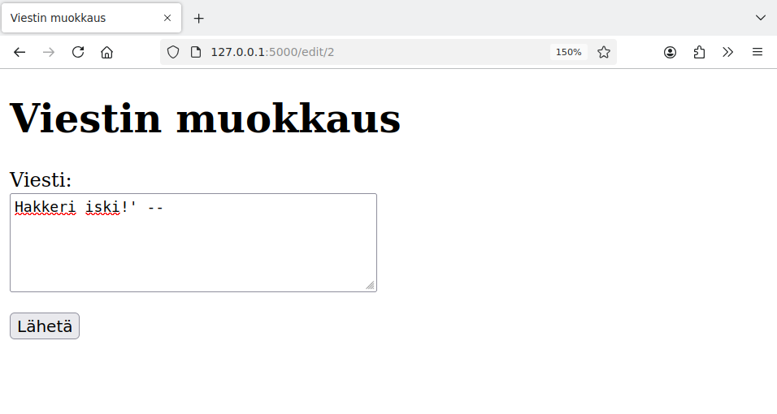
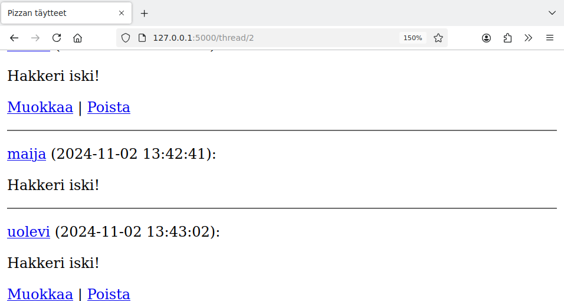
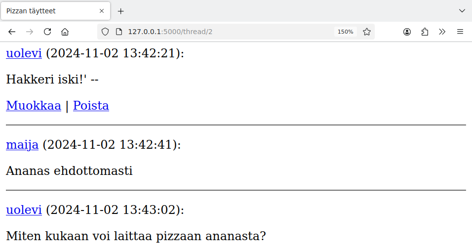
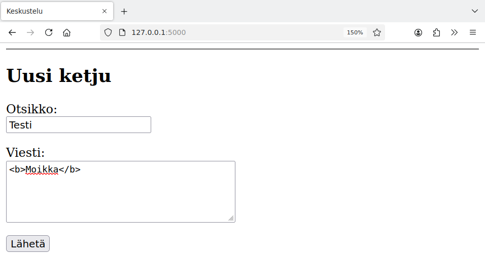
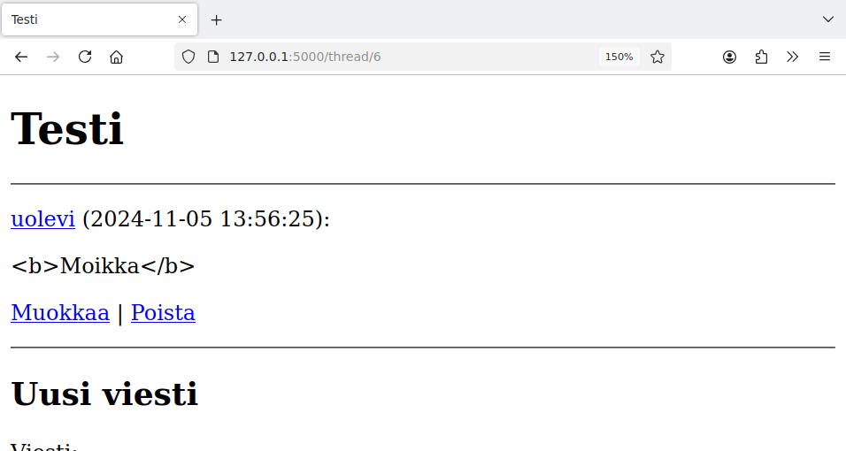
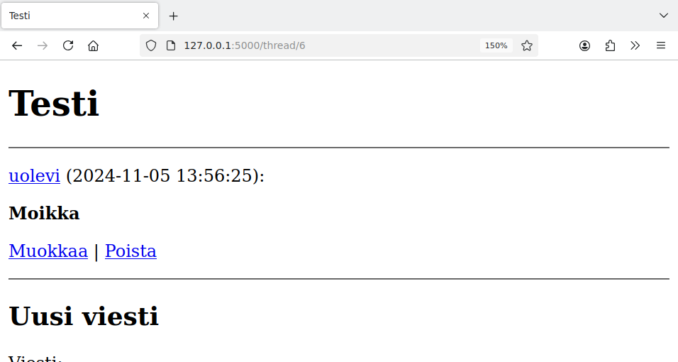
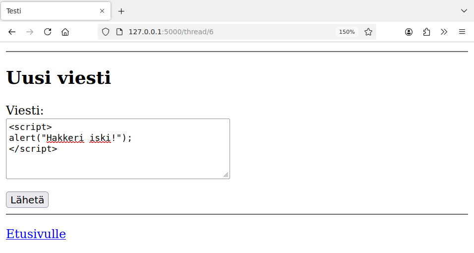
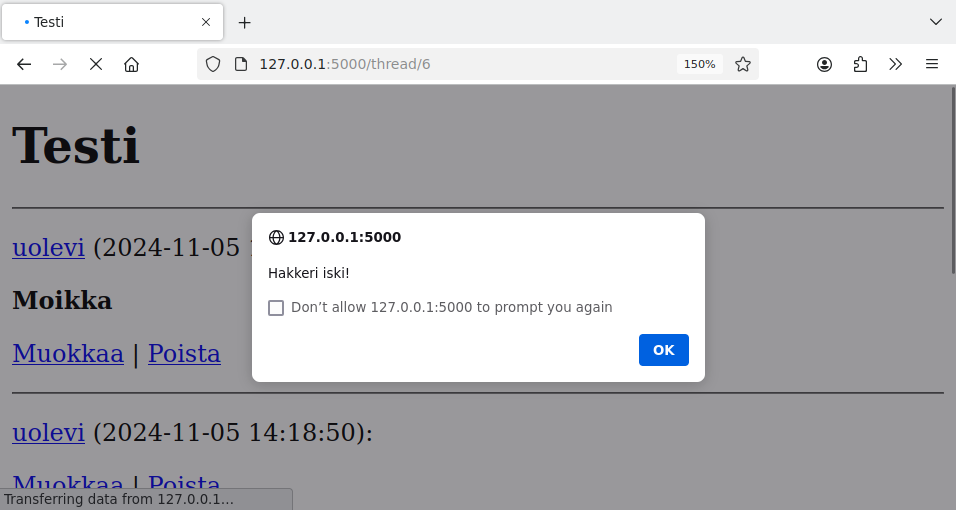
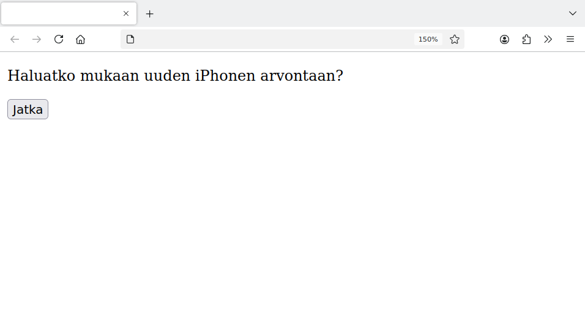
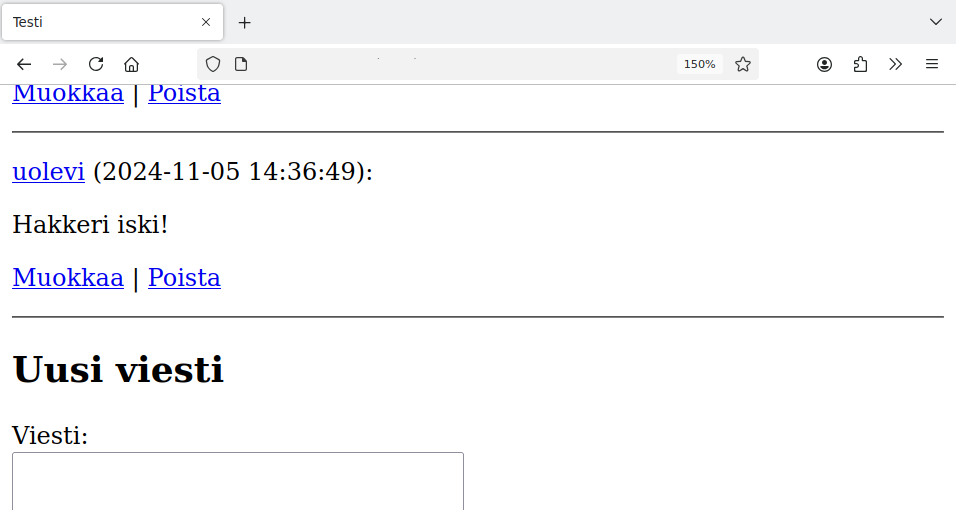

<style>
img {
    border-style: solid;
    border-color: black;
    border-width: 1px;
    width: 80%;
    margin-top: 40px;
    margin-bottom: 40px;    
}
</style>

# 8. Tietoturva

Tämä osa esittelee kolme yleistä web-sovellusten tietoturvaongelmaa ja kertoo, miten näiltä ongelmilta voi suojautua.

* SQL-injektiossa hyökkääjä pystyy muuttamaan tietokantaa käsittelevän SQL-komennon rakennetta.
* XSS-aukossa hyökkääjä pystyy lähettämään sovellukseen HTML-koodia, joka suoritetaan käyttäjän selaimessa.
* CSRF-aukossa hyökkääjä pystyy lähettämään sovellukseen tietoa toisen kirjautuneen käyttäjän nimissä omalta sivulta.

## SQL-injektio

SQL-injektio on tietoturva-aukko, jossa hyökkääjän antama syöte muuttaa SQL-komennon rakennetta. Tämän avulla hyökkääjä pystyy hakemaan tai muuttamaan tietoa, johon hänellä ei pitäisi olla oikeutta.

Hyvä tapa estää SQL-injektio on käyttää SQL-komennoissa parametreja, kuten on tehty kaikissa tämän kurssin esimerkeissä. Esimerkiksi seuraavassa SQL-komennossa on kaksi parametria, joihin sijoitetaan muuttujien `content` ja `id` arvot:

{: .code-title }
forum.py
```python
def update_message(id, content):
    sql = "UPDATE messages SET content = ? WHERE id = ?"
    db.execute(sql, [content, id])
```

Esimerkiksi kun `content` on `"Hei"` ja `id` on `2`, SQL-komennosta tulee:

```sql
UPDATE messages SET content = 'Hei' WHERE id = 2
```

Katsotaan sitten, mitä tapahtuu, kun ei käytetä parametreja ja muuttujien arvot sijoitetaan suoraan SQL-komennon osaksi:

{: .code-title }
forum.py
```python
def update_message(id, content):
    sql = "UPDATE messages SET content = '" + content + "' WHERE id = " + str(id)
    db.execute(sql)
```

Tässä tilanteessa hyökkääjä pystyy tekemään SQL-injektion, joka muuttaa SQL-komennon rakennetta. Hyökkääjä voi esimerkiksi lähettää viestin, mennä sitten muokkaussivulle ja kirjoittaa lomakkeeseen seuraavan viestin:



Kun hyökkääjä lähettää lomakkeen, tämän seurauksena _jokaisen_ tietokannassa olevan viestin sisällöksi tulee "Hakkeri iski!":



Hyökkäys perustuu siihen, että viestissä on merkki `'`, joka on SQL:ssä merkkijonon lopetusmerkki. Tämän jälkeen viestissä on vielä merkit `--`, jotka tarkoittavat SQL:ssä kommenttia. Tämän takia SQL-komennosta tulee:

```sql
UPDATE messages SET content = 'Hakkeri iski!' --' WHERE id = 2
```

Tämä tarkoittaa samaa kuin seuraava komento:

```sql
UPDATE messages SET content = 'Hakkeri iski!'
```

Komennosta siis katoaa lopussa oleva ehto `WHERE id = 2` ja komento muuttaa _jokaisen_ tietokannassa olevan viestin sisällön.

Palataan sitten tilanteeseen, jossa SQL-komennossa on käytetty parametreja:

{: .code-title }
forum.py
```python
def update_message(id, content):
    sql = "UPDATE messages SET content = ? WHERE id = ?"
    db.execute(sql, [content, id])
```

Nyt hyökkäys epäonnistuu:



Kun muuttuja liitetään parametriksi, siinä olevat `'`-merkit muutetaan automaattisesti muotoon `''`, jolloin ne eivät lopeta merkkijonoa vaan tulevat merkkijonon osaksi. Tässä tapauksessa SQL-komennosta tulee:

```sql
UPDATE messages SET content = 'Hakkeri iski!'' --' WHERE id = 2
```

Lisäämällä tietokantayhteyden avaamisen jälkeen metodin `set_trace_callback` kutsun voimme tarkastella käytännössä, miten parametrit toimivat:

{: .code-title }
db.py
```python
def get_connection():
    ...
    db.set_trace_callback(print)
    ...
```

Nyt kaikki SQL-komennot tulostetaan sovelluksen lokiin niiden lopullisessa muodossa. Esimerkiksi äskeisessä hyökkäysyrityksessä lokiin tulevat seuraavat rivit:

```console
BEGIN 
UPDATE messages SET content = 'Hakkeri iski!'' --' WHERE id = 2
COMMIT
127.0.0.1 - - [05/Nov/2024 15:44:19] "POST /edit/2 HTTP/1.1" 302 -
```

Tästä näkee, miten tärkeää on käyttää parametreja SQL-komennoissa. Jos yhdessäkin komennossa ei ole käytetty parametreja, hyökkääjä voi koettaa hyödyntää tätä.

## XSS-aukko

XSS-aukko antaa hyökkääjälle mahdollisuuden lähettää sovellukseen HTML-koodia, joka käsitellään toisen käyttäjän selaimessa. Tämä on erityisen vaarallista, koska mukana voi olla myös suoritettavaa JavaScript-koodia.

Flaskissa sivupohjien ja funktion `render_template` käyttäminen estää oletuksena automaattisesti XSS-aukon. Esimerkiksi jos käyttäjä kirjoittaa keskusteluun viestin, jossa on HTML-koodia, selain ei käsittele koodia:





Katsomalla selaimesta sivun lähdekoodia näkee, miten viesti on muuttunut:

```html
  <p>
    &lt;b&gt;Moikka&lt;/b&gt;
  </p>
```

Funktio `render_template` on muuttanut merkit `<` ja `>` entiteeteiksi `&lt;` ja `&gt;`, minkä ansiosta merkkejä ei tulkita HTML-komennon osaksi vaan ne näytetään sellaisenaan sivulla.

Automaattinen HTML-koodin käsittelyn estäminen voidaan ottaa pois lisäämällä sivupohjaan filtteri `safe` halutun parametrin kohdalle:

{: .code-title }
thread.html
```jinja
  <p>
    {{ message.content | safe }}
  </p>
```

Tässä filtteri `safe` tarkoittaa, että parametrin sisältö tiedetään turvalliseksi ja siinä olevan HTML:n saa käsitellä. Tämän muutoksen jälkeen muotoilu näkyy viestissä:



Tässä on vielä toinen esimerkki, jossa hyökkääjä lähettää JavaScript-koodia:



Nyt kun kuka tahansa käyttäjä menee lukemaan ketjua, näkyviin tulee ikkuna, jossa on hyökkääjän viesti:



Selvästikään ei ole hyvä ratkaisu sallia HTML:n käyttämistä viesteissä. Hyvä tapa suojautua XSS-aukolta on käyttää aina Flaskin sivupohjia eikä käyttää `safe`-filtteriä muuten kuin hyvästä syystä.

## CSRF-aukko

CSRF-aukon avulla hyökkääjä pystyy lähettämään sovellukseen tietoa toisen sovellukseen kirjautuneen käyttäjän nimissä. Tämä vaatii, että kirjautunut käyttäjä menee ensin hyökkääjän laatimalle sivulle.

Tarkastellaan esimerkkinä lomaketta, jonka kautta kirjautunut käyttäjä voi lähettää uuden viestin keskusteluun:

```html
  <form action="/new_message" method="post">
    <p>
      Viesti:<br />
      <textarea name="content" rows="5" cols="40" maxlength="5000"></textarea>
    </p>
    <input type="hidden" name="thread_id" value="6">
    <input type="submit" value="Lähetä">
  </form>
```

Oletetaan lisäksi, että keskustelualue on verkossa osoitteessa `https://tikawe-keskustelu.fi`. Nyt hyökkääjä voi rakentaa omalle sivulleen lomakkeen, jonka sisältö on seuraava: 

```html
<form action="https://tikawe-keskustelu.fi/new_message" method="post">
  <p>
    Haluatko mukaan uuden iPhonen arvontaan?
  </p>
  <input type="hidden" name="content" value="Hakkeri iski!">
  <input type="hidden" name="thread_id" value="6">
  <input type="submit" value="Jatka">
</form>
```

Lomake näyttää käyttäjälle seuraavalta:



Kuitenkin kun keskustelualueelle kirjautunut käyttäjä painaa napista, hän tulee lähettäneeksi seuraavan viestin:



Tämä hyökkäys perustuu siihen, että hyökkääjän sivulla olevan lomakkeen käsittelijän osoitteena on sivu, jonka kautta voi lähettää uuden viestin keskusteluun. Lisäksi lomakkeessa on piilokenttinä haluttu viestin sisältö sekä ketjun id-numero.

CSRF-hyökkäys voidaan estää lisäämällä sovelluksen lomakkeisiin käyttäjäkohtaista tietoa, jota hyökkääjällä ei ole. Voimme lisätä kirjautumisen yhteydessä istuntoon uuden satunnaisen arvon `csrf_token`:

{: .code-title }
app.py
```python
@app.route("/login", methods=["GET", "POST"])
def login():
    ...
            session["user_id"] = user_id
            session["csrf_token"] = secrets.token_hex(16)

    ...
```

Tämä arvo lisätään lomakkeeseen piilokentäksi:

{: .code-title }
thread.html
```jinja
  <form action="/new_message" method="post">
    <p>
      Viesti:<br />
      <textarea name="content" rows="5" cols="40" maxlength="5000"></textarea>
    </p>
    <input type="hidden" name="thread_id" value="{{ thread.id }}">
    <input type="hidden" name="csrf_token" value="{{ session.csrf_token }}">
    <input type="submit" value="Lähetä">
  </form>
```

Sitten lomakkeen käsittelyssä tarkastetaan, että lomakkeen kautta tullut `csrf_token` on sama kuin istunnossa oleva `csrf_token`. Tähän voidaan käyttää funktiota `check_csrf` seuraavasti:

{: .code-title }
app.py
```python
def check_csrf():
    if request.form["csrf_token"] != session["csrf_token"]:
        abort(403)

...

@app.route("/new_message", methods=["POST"])
def new_message():
    check_csrf()
    ...
```

Koska hyökkääjällä ei ole tiedossa, mikä on käyttäjän `csrf_token`, hän ei voi lisätä sitä omaan lomakkeeseensa eikä viestin lähetys onnistu.

Nämä muutokset tulee tehdä kaikkiin lomakkeisiin, jotka saa lähettää vain sovellukseen kirjautunut käyttäjä.

---

Web-sovelluksen tietoturva on laaja aihe. Hyvä lähde, jonka avulla voi tutustua aiheeseen syvällisemmin, on [OWASP Cheat Sheet Series](https://cheatsheetseries.owasp.org/).

Tässä on sovelluksen uusin versio, johon on lisätty tämän osan muutokset:

* [https://github.com/hy-tikawe/keskustelu_v5](https://github.com/hy-tikawe/keskustelu_v5)
