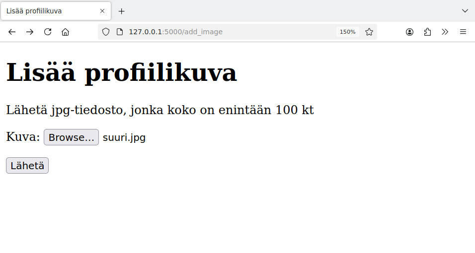
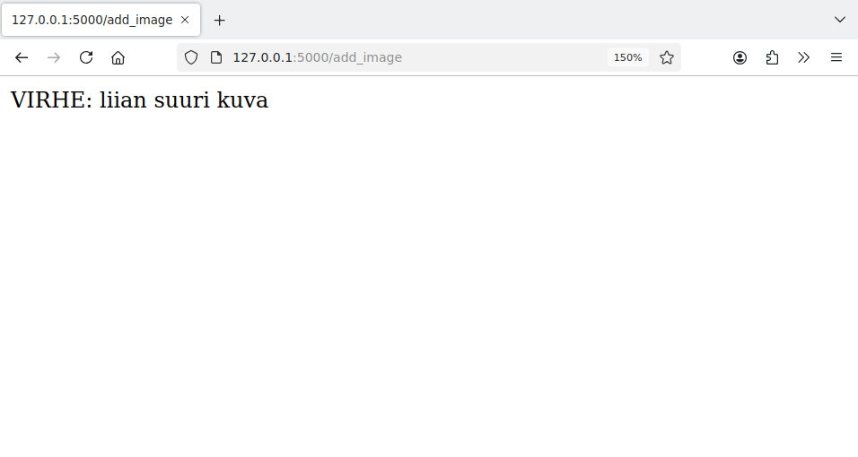
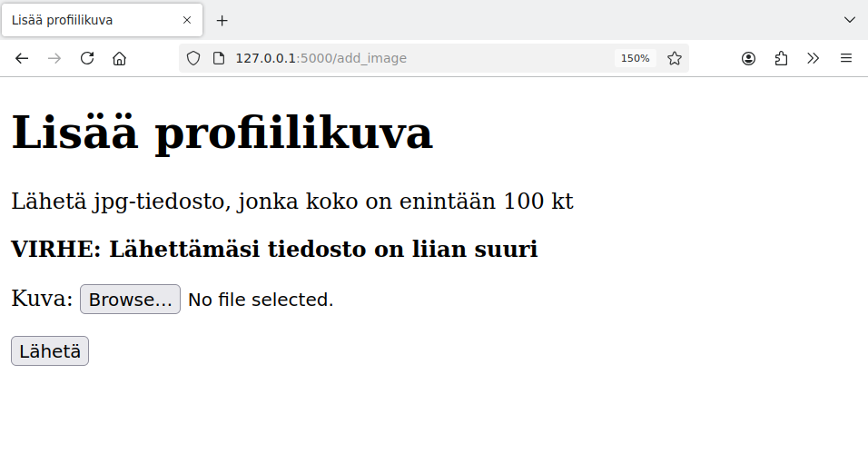
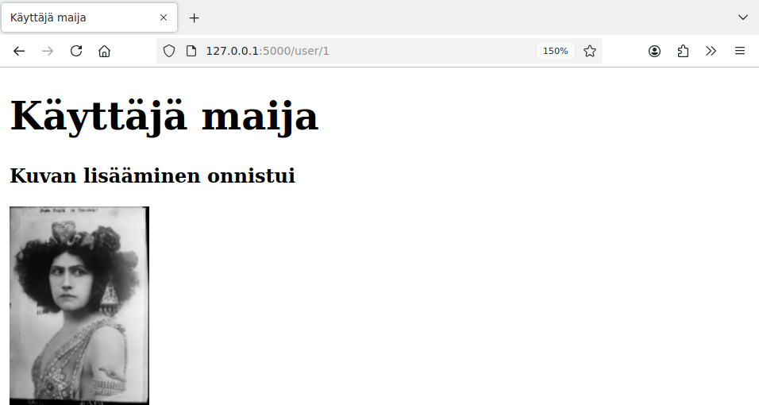
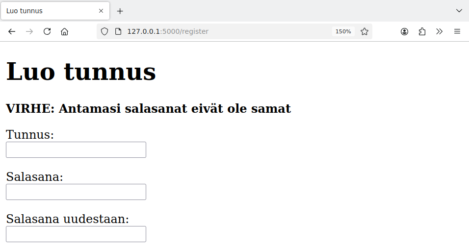
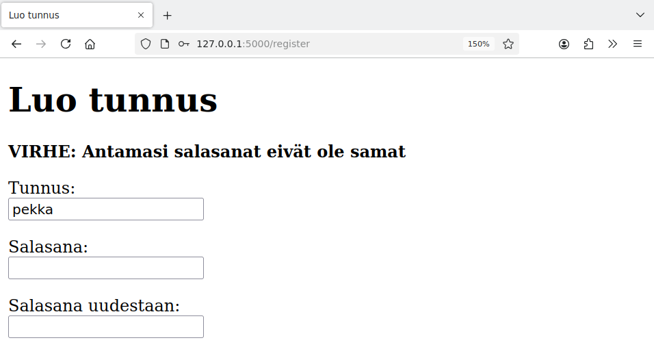

<style>
img {
    border-style: solid;
    border-color: black;
    border-width: 1px;
    width: 80%;
    margin-top: 40px;
    margin-bottom: 40px;    
}
</style>

# 9. Käytettävyys

Sovelluksen toimivuuden ja turvallisuuden lisäksi on tärkeää, että sovellusta on mukavaa käyttää. Tähän kuuluu muun muassa seuraavia asioita:

* Sovellusta on helppo käyttää ja se toimii käyttäjän odottamalla tavalla.
* Sovellus ilmaisee selkeästi, että toiminto onnistui, tai näyttää ymmärrettävän virheilmoituksen.
* Käyttäjä pystyy liikkumaan sujuvasti sovelluksessa eikä joudu umpikujaan.
* Sovellus toimii eri selaimilla ja eri laitteissa ja olettaa mahdollisimman vähän käyttäjän ympäristöstä.

Verkossa on paljon sekä hyvin että huonosti toimivia sovelluksia. Hyvin toimivat sovellukset soveltuvat omien sovellusten esikuviksi, kun taas huonosti toimivat sovellukset muistuttavat, mitä ei kannata tehdä.

## Ilmoitukset

Tällä hetkellä sovelluksemme tapa ilmoittaa virheistä ei ole käyttäjälle mukava. Esimerkiksi kun käyttäjä lähettää profiilikuvan, virheet käsitellään näin:

{: .code-title }
app.py
```python
        file = request.files["image"]
        if not file.filename.endswith(".jpg"):
            return "VIRHE: väärä tiedostomuoto"

        image = file.read()
        if len(image) > 100 * 1024:
            return "VIRHE: liian suuri kuva"
```

Tarkastellaan tilannetta, jossa käyttäjä koettaa lähettää liian suuren tiedoston profiilikuvaksi:



Tämän seurauksena käyttäjä saa seuraavan virheilmoituksen:



Ei ole hyvä ratkaisu, että sovellus näyttää virheilmoituksen erillisellä sivulla, josta käyttäjän täytyy itse palata lähetyssivulle. Voimme parantaa asiaa seuraavasti:

{: .code-title }
app.py
```python
from flask import flash

...

        file = request.files["image"]
        if not file.filename.endswith(".jpg"):
            flash("VIRHE: Lähettämäsi tiedosto ei ole jpg-tiedosto")
            return redirect("/add_image")

        image = file.read()
        if len(image) > 100 * 1024:
            flash("VIRHE: Lähettämäsi tiedosto on liian suuri")
            return redirect("/add_image")
```

Nyt sovellus määrittelee virheilmoituksen Flaskin `flash`-funktiolla sekä ohjaa käyttäjän takaisin lähetyssivulle. Tällä sivulla edellisen sivupyynnön virheet saadaan kutsumalla funktiota `get_flashed_messages`:

{: .code-title }
add_image.html
```jinja
  
  <p>
    <b>{{ message }}</b>
  </p>
  
```

Nyt virhe näkyy käyttäjälle selkeästi mukavammalla tavalla:



Tämän lisäksi voimme näyttää myös ilmoituksen käyttäjäsivulla siinä tilanteessa, jossa kuvan lisääminen onnistuu:

{: .code-title }
app.py
```python
        user_id = session["user_id"]
        users.update_image(user_id, image)
        flash("Kuvan lisääminen onnistui")
        return redirect("/user/" + str(user_id))
```

Kuvan lisääminen voi näyttää seuraavalta:



## Lomakkeen kentät

Vastaavalla tavalla voimme muuttaa tunnuksen luontisivua niin, että se näyttää virheilmoitukset. Käyttökokemus ei ole kuitenkaan vielä hyvä:



Virheilmoitus näkyy sinänsä hyvin, mutta ongelmana on, että lomake on unohtanut käyttäjän syöttämät tiedot.

Voimme toteuttaa lomakkeen paremmin seuraavasti:

{: .code-title }
app.py
```python
@app.route("/register", methods=["GET", "POST"])
def register():
    if request.method == "GET":
        return render_template("register.html", filled={})

    if request.method == "POST":
        username = request.form["username"]
        if len(username) > 16:
            abort(403)
        password1 = request.form["password1"]
        password2 = request.form["password2"]

        if password1 != password2:
            flash("VIRHE: Antamasi salasanat eivät ole samat")
            filled = {"username": username}
            return render_template("register.html", filled=filled)

        if users.create_user(username, password1):
            flash("Tunnuksen luominen onnistui, voit nyt kirjautua sisään")
            return redirect("/")
        else:
            flash("VIRHE: Valitsemasi tunnus on jo varattu")
            filled = {"username": username}
            return render_template("register.html", filled=filled)
```

Nyt sivupohjalle annetaan parametri `filled`, jonka kautta voi välittää lomakkeen kentissä valmiiksi olevia arvoja. Oletuksena `filled` on tyhjä, mutta virheen sattuessa sen kautta välitetään käyttäjänimi.

Sivupohjassa muutos näyttää seuraavalta:

{: .code-title }
register.html
```jinja
  <form action="/register" method="post">
    <p>
      Tunnus: <br />
      <input type="text" name="username" value="{{ filled.username }}" maxlength="16">
    </p>
```

Jos `filled` on tyhjä, sivupohja tulkitsee, että `filled.username` on myös tyhjä eikä näytä kentässä mitään.

Nyt sivu näyttää aiemmin syötetyn käyttäjänimen näin:



Yleensä tämän tyyppisissä lomakkeissa on hyvä näyttää virheen sattuessa kaikki syötetyt tiedot salasanaa lukuun ottamatta.

## Käyttäjän kirjaaminen

## Viestin näyttäminen

## Saavutettavuus
