<style>
img {
    border-style: solid;
    border-color: black;
    border-width: 1px;
    width: 80%;
    margin-top: 40px;
    margin-bottom: 40px;    
}
</style>

# 10. Ulkoasu

HTML:n avulla määritellään verkkosivun elementit, kuten otsikot, kappaleet, listat, taulukot ja kuvat. HTML ei kuitenkaan ota kantaa siihen, miten nämä elementit näytetään tarkalleen käyttäjän selaimessa.

CSS on HTML:n yhteydessä käytettävä kieli, jonka avulla voidaan määritellä HTML-elementtien tyylit eli miltä elementit näyttävät. CSS:n avulla voidaan määritellä esimerkiksi elementtien asettelu, värit ja fontit.

Tässä osassa tutustumme CSS:n perusteisiin ja luomme sovellukselle yhtenäisen ulkoasun, joka on käytössä sovelluksen kaikilla sivuilla.

## CSS:n määrittely

CSS-tyylit kirjoitetaan yleensä erilliseen tyylitiedostoon, johon on viittaus HTML-sivun `head`-osiossa. Luodaan nyt projektiamme varten tyylitiedosto `main.css`. Flaskia käytettäessä hyvä paikka tyylitiedostolle on hakemisto `static`, jolloin tiedostoon voidaan viitata näin:

{: .code-title }
index.html
```html
  <link rel="stylesheet" href="/static/main.css">
```

Lisätään tiedostoon aluksi `body`-elementin tyylejä:

{: .code-title }
main.css
```css
body {
  margin: auto;
  max-width: 50em;
  font-family: sans-serif;
  background-color: lightblue;
}
```

CSS-tiedosto koostuu yllä olevan kaltaisista osioista, joissa määritellään tietyn elementin tai elementtien tyylit. Tässä tapauksessa määritellään, että `body`-elementin tyylit ovat:

* `margin: auto`: sivun sisältö keskitetään
* `max-width: 50em`: sivun sisällön maksimileveys on `50em` (`em` on tavallinen CSS:ssä käytettävä mittayksikkö)
* `font-family: sans-serif`: sivulla käytetään sans-serif-tyyppistä fonttia
* `background-color: lightblue`: sivun taustaväri on vaaleansininen

Tämän seurauksena sovelluksen etusivu näyttää tältä:

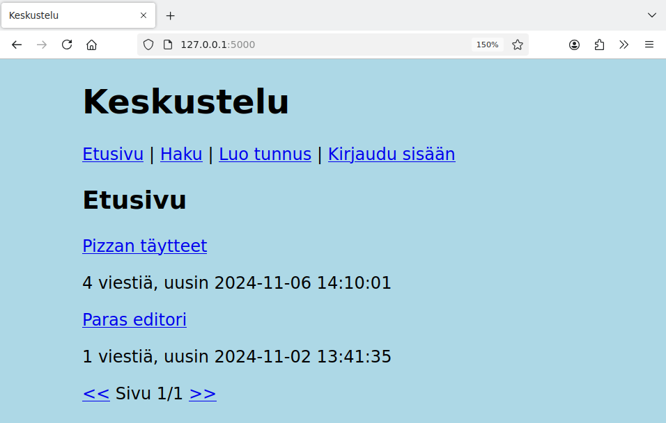

Muutetaan seuraavaksi sivun rakennetta niin, että siinä on kolme osiota: otsikko, navigointi ja sisältö. Jokainen osio on `div`-elementin sisällä. Attribuutti `class` sisältää tyyliluokan, jonka avulla elementtiin voidaan viitata CSS:ssä.

{: .code-title }
index.html
```html
<body>
  <div class="header">
    <h1>Keskustelu</h1>
  </div>
  <div class="nav">
    ...
  </div>
  <div class="content">
    ...
  </div>
</body>
```

Tämän jälkeen voimme määritellä näiden elementtien tyylit seuraavasti:

{: .code-title }
main.css
```css
.header {
  background-color: black;
  color: red;
}

.nav {
  background-color: lightgrey;
}

.content {
  background-color: white;
}  
```

Tässä asetetaan jokaiselle osiolle taustaväri (`background-color`) ja lisäksi otsikolle tekstin väri (`color`). Tuloksena sivu näyttää seuraavalta:

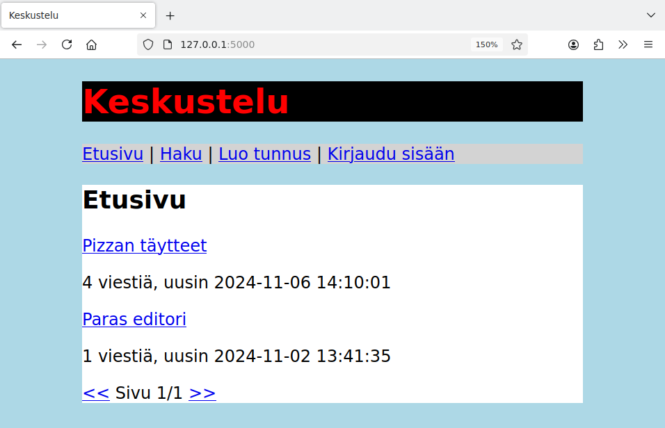

## Tyhjä tila

Keskeisiä CSS:n ominaisuuksia ovat `padding` ja `margin`, joiden avulla voidaan asettaa tyhjän tilan määrä elementin sisäpuolella ja ulkopuolella. Voimme käyttää ominaisuuksia näin:

{: .code-title }
main.css
```css
header {
  background-color: black;
  color: red;
  padding: 1em;
  margin: 0.5em 0;
}

.nav {
  background-color: lightgrey;
  padding: 0.5em;
  margin: 0.5em 0;
}

.content {
  background-color: white;
  padding: 1em;
  margin: 0.5em 0;
}
```

Jos tyhjän tilan määrä annetaan yhtenä lukuna, tämä tarkoittaa tyhjän tilan määrää kaikissa suunnissa. Esimerkiksi `padding: 1em` tarkoittaa, että tyhjän tilan määrä elementin sisäpuolella on kaikissa suunnissa `1em`.

Jos tyhjän tilan määrä annetaan kahtena lukuna, ensimmäinen luku tarkoittaa pystysuuntaa ja toinen luku vaakasuuntaa. Esimerkiksi `margin: 0.5em 0` tarkoittaa, että tyhjän tilan määrä elementin ulkopuolella on pystysuunnassa `0.5em` ja vaakasuunnassa `0`. Kun määrä on 0, ei ole tapana antaa yksikköä.

Sivu näyttää nyt seuraavalta:

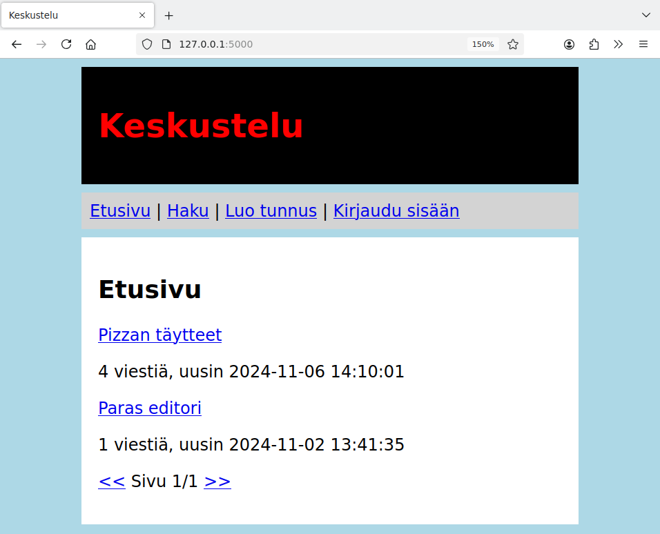

Tulos ei ole vielä odotusten mukainen, koska esimerkiksi otsikossa on liikaa tyhjää tilaa pystysuunnassa. Hyvä keino tutkia CSS:n toimintaa on käyttää selaimen kehittäjän työkaluja. Tässä tapauksessa selviää, että `h1`-elementillä on oletuksena suuri pystysuuntainen `margin`-arvo, joka venyttää otsikkoa:

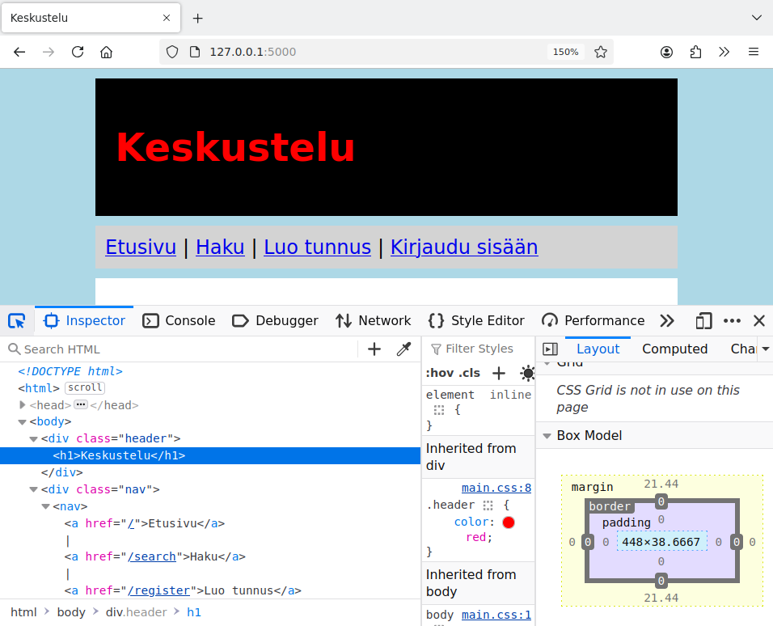

Voimme poistaa ylimääräisen tyhjän tilan otsikoista näin:

{: .code-title }
main.css
```css
h1, h2 {
  margin: 0;
}
```

Tämän jälkeen sivu näyttää siltä kuin halusimmekin:

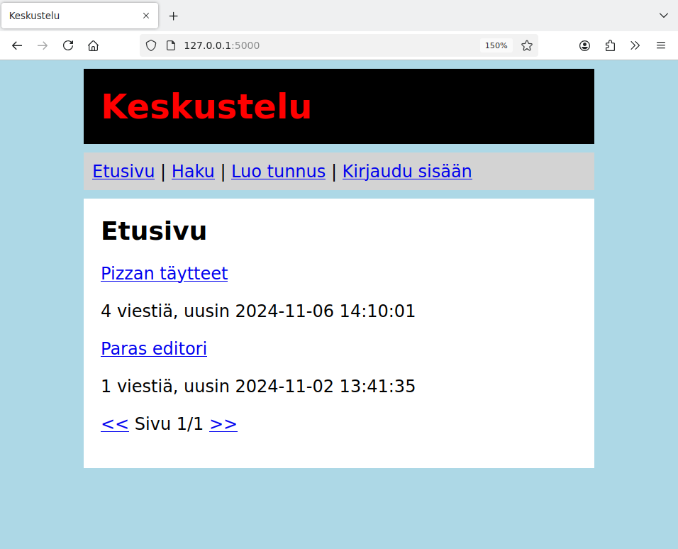

## Reunukset

Muutetaan seuraavaksi HTML:ää niin, että jokainen viestiketju on `div`-elementti, jonka tyyliluokka on `thread`:

{: .code-title }
index.html
```html
  
  <div class="thread">
    <p>
      <a href="/thread/{{ thread.id }}">{{ thread.title }}</a>
    </p>
    <p>
      {{ thread.total }} viestiä, uusin {{ thread.last }}
    </p>
  </div>
  
```

Lisätään sitten seuraavat tyylit:

{: .code-title }
main.css
```css
.thread {
  border: 2px solid black;
  margin: 1em;
  padding: 0.2em 0.5em;
}
```

Tässä `border`-ominaisuus määrittelee elementin reunuksen. Ensimmäinen arvo on reunuksen paksuus (tässä paksuus on `2px`), toinen arvo on reunuksen tyyppi (`solid` on yhtenäinen reunus) ja kolmas arvo on reunuksen väri.

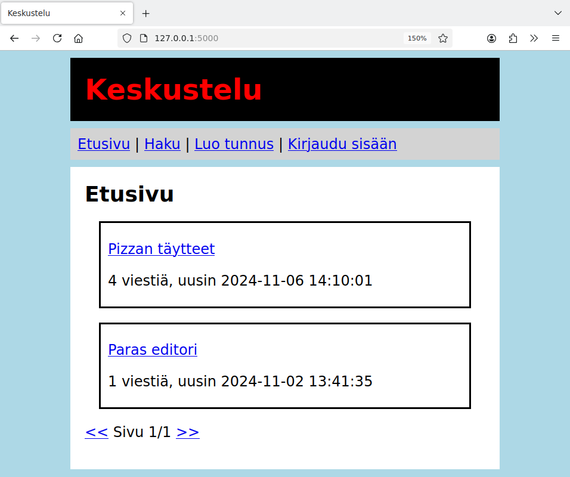

Muutetaan vastaavasti ilmoituksia niin, että niissä on tyyliluokka `info`:

{: .code-title }
index.html
```html
  
  <p class="info">
    {{ message }}
  </p>
  
```

Nyt voimme lisätä ilmoitukseen reunuksen ja värejä näin:

{: .code-title }
main.css
```css
.info {
  border: 2px solid black;
  margin: 1em;
  padding: 0.5em;
  background-color: blue;
  color: white;
}
```

Lopputulos näyttää seuraavalta:

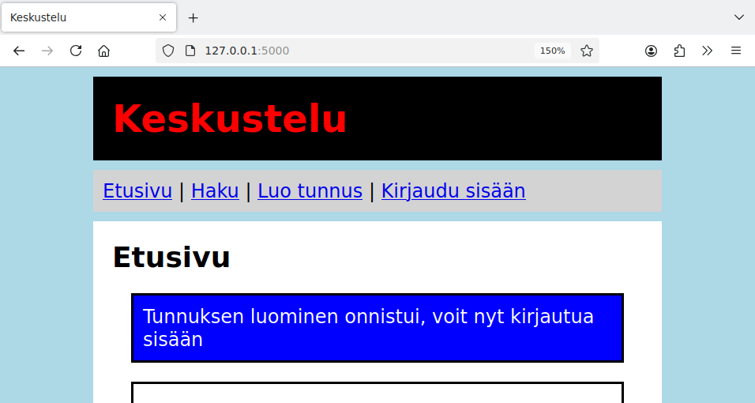

## Navigointi

Muutetaan vielä sivun navigoinnin toteutustapaa:

{: .code-title }
index.html
```html
  <div class="nav">
    <nav>
      <ul>
        <li><a href="/">Etusivu</a></li>
        <li><a href="/search">Haku</a></li>
        <li><a href="/register">Luo tunnus</a></li>
        
        <li><a href="/logout">Kirjaudu ulos</a></li>
        
        <li><a href="/login">Kirjaudu sisään</a></li>
        
      </ul>
    </nav>
  </div>
```

Nyt käytössä on elementti `nav`, joka on tarkoitettu nimenomaan navigaation esittämiseen. Lisäksi navigoinnin linkit on annettu listana, mikä on hyvä ratkaisu, koska tämä kuvaa paremmin navigoinnin rakennetta.

Voimme CSS:n avulla määritellä listan tyylit niin, että linkit asettuvat samalle riville ja niiden välissä on pystyviivat:

{: .code-title }
main.css
```css
nav {
  text-align: center;
}

nav ul {
  padding: 0;
  margin: 0;
}

nav li {
  display: inline-block;
  padding: 0 1em;
  margin: 0;
}

nav li:not(:last-of-type) {
  border-right: 1px solid black;
}
```

Kun CSS:ssä on peräkkäin useita elementtejä, tämä rajaa tyylin tilanteeseen, jossa elementit ovat sisäkkäin. Esimerkiksi `nav ul` määrittelee elementin `ul` tyylin tilanteessa, jossa se on elementin `nav` sisällä.

Tässä `li`-elementillä on tyyli `display: inline-block`, mikä tarkoittaa, että listan kohdat asettuvat vierekkäin. Lisäksi listan kohtien välissä on tyhjää tilaa, joka on toteutettu `padding`-ominaisuuden avulla.

Kaikissa listan kohdissa viimeistä kohtaa lukuun ottamatta on oikean reunan reunus, josta tulee vaikutelma pystyviivasta. Tässä `not(:last-of-type)` tarkoittaa, että ominaisuus asetetaan kaikille elementeille viimeistä lukuun ottamatta.

Navigointi näyttää nyt tältä:

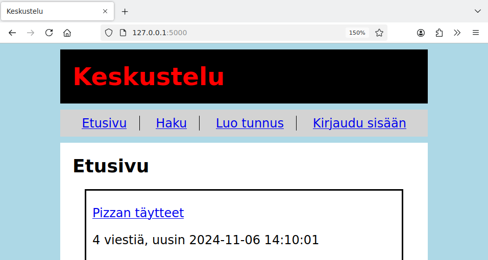

Tarkasti katsomalla huomaa, että tässä on vielä pieni puute: pystyviivan vasemmalla puolella on vähemmän tyhjää tilaa kuin oikealla puolella.

Selaimen kehittäjän työkalujen avulla selviää, että `li`-elementtien välissä on jonkin verran tyhjää tilaa. Tämä johtuu pohjimmiltaan siitä, että `li`-elementit ovat HTML-koodissa eri riveillä ja rivinvaihdot tuovat tyhjää tilaa listan kohtien väliin.

Saamme tyhjän tilan pois lisäämällä listan kohtiin _negatiivista_ tyhjää tilaa:

{: .code-title }
main.css
```css
nav li:not(:first-of-type) {
  margin-left: -0.25em;
} 
```

Nyt navigointi näyttää hyvältä:


## Sivupohja

Ulkoasu on nyt valmis ja haluamme liittää sen sovelluksen kaikille sivuille. Hyvä ratkaisu tähän on määritellä ulkoasun pohja yhteen tiedostoon ja käyttää tätä yhteistä pohjaa kaikilla sivuilla.

Voimme määritellä ulkoasun seuraavasti tiedostossa `layout.html`:

{: .code-title }
layout.html
```html
<!DOCTYPE html>
<html>

<head>
  <title></title>
  <link rel="stylesheet" href="/static/main.css">
</head>

<body>
  <div class="header">
    <h1>Keskustelu</h1>
  </div>

  <div class="nav">
    <nav>
      <ul>
        <li><a href="/">Etusivu</a></li>
        <li><a href="/search">Haku</a></li>
        <li><a href="/register">Luo tunnus</a></li>
        
        <li><a href="/logout">Kirjaudu ulos</a></li>
        
        <li><a href="/login">Kirjaudu sisään</a></li>
        
      </ul>
    </nav>
  </div>

  <div class="content">
    
  </div>
</body>

</html>
```

Tässä pohjassa on paikka sivun otsikolle (``) sekä sivun sisällölle (``). Kun pohjaa käytetään tietyllä sivulla, sivu määrittelee näihin paikkoihin tulevat sisällöt.

Esimerkiksi pohjaa voidaan käyttää etusivulla näin:

{: .code-title }
index.html
```html


Keskustelu


<h2>Etusivu</h2>


<p class="info">
  {{ message }}
</p>



<div class="thread">
  <p>
    <a href="/thread/{{ thread.id }}">{{ thread.title }}</a>
  </p>
  <p>
    {{ thread.total }} viestiä, uusin {{ thread.last }}
  </p>
</div>


...

```

Voimme ottaa vastaavalla tavalla pohjan käyttöön kaikilla sivuilla, jolloin sovelluksella on yhtenäinen ulkoasu. Sovelluksen sivut näyttävät tältä:

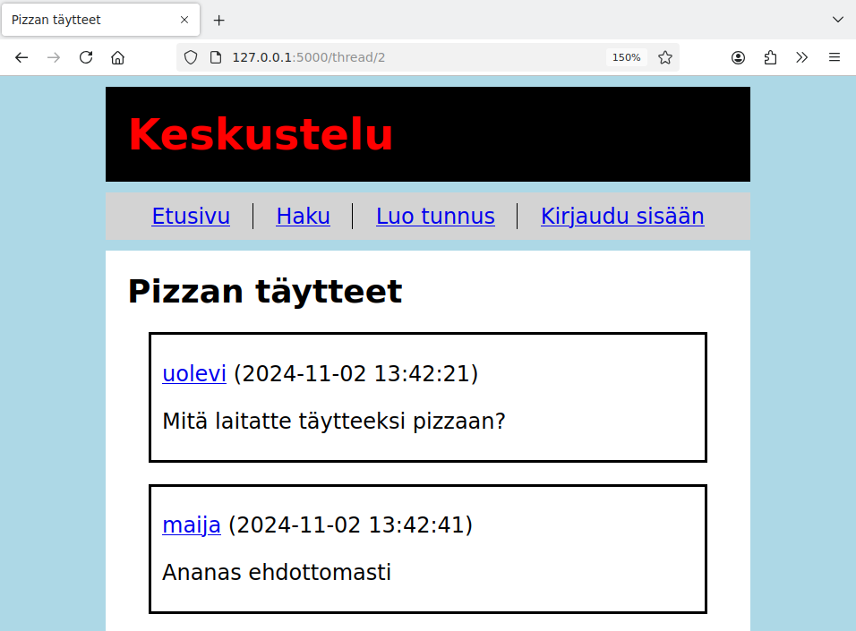

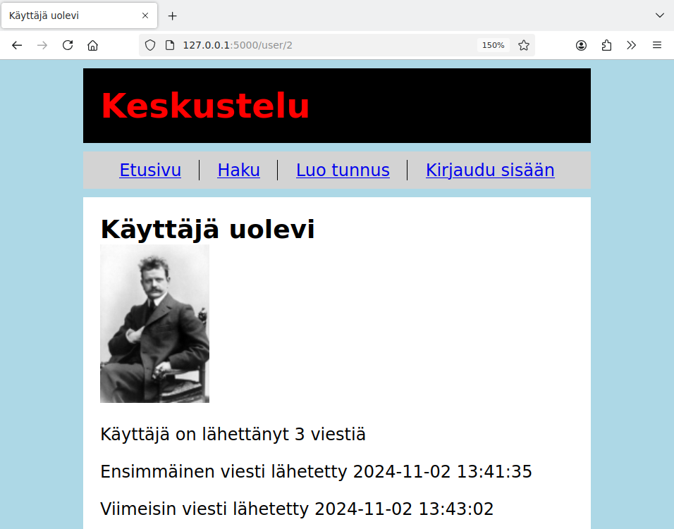

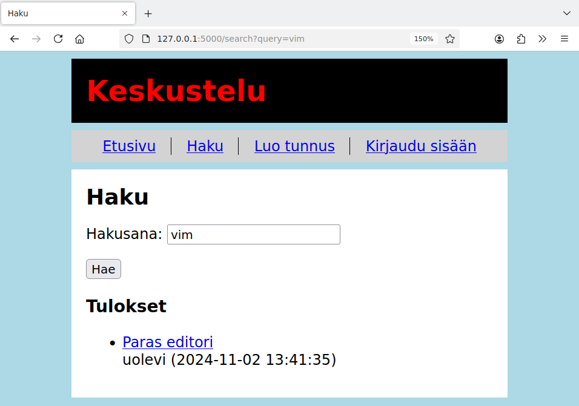

---

Hyvä lähde perehtyä tarkemmin CSS:n käyttämiseen on [MDN:n CSS-osio](https://developer.mozilla.org/en-US/docs/Web/CSS), jossa on sekä oppimateriaalia että kattava dokumentaatio CSS:stä.

Sovellus on nyt valmis! Tässä on sovelluksen lopullinen versio, johon on lisätty tässä osassa tehty ulkoasu:

* [https://github.com/hy-tikawe/keskustelu_v7](https://github.com/hy-tikawe/keskustelu_v7)
